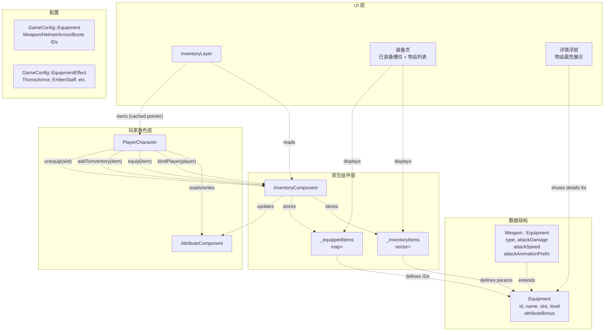
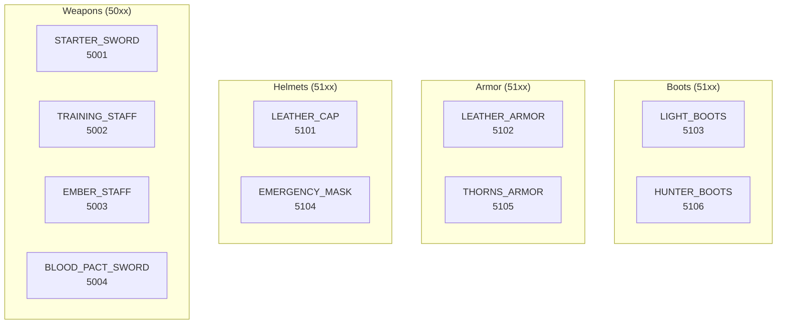
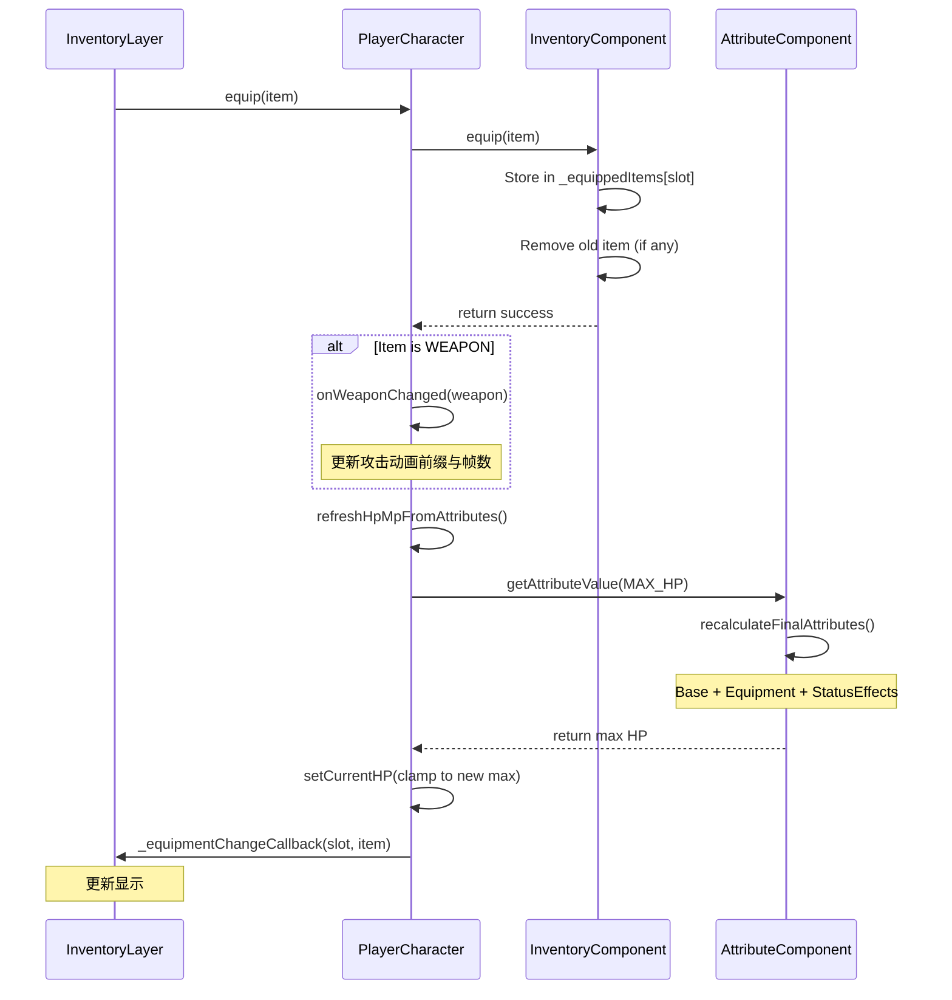
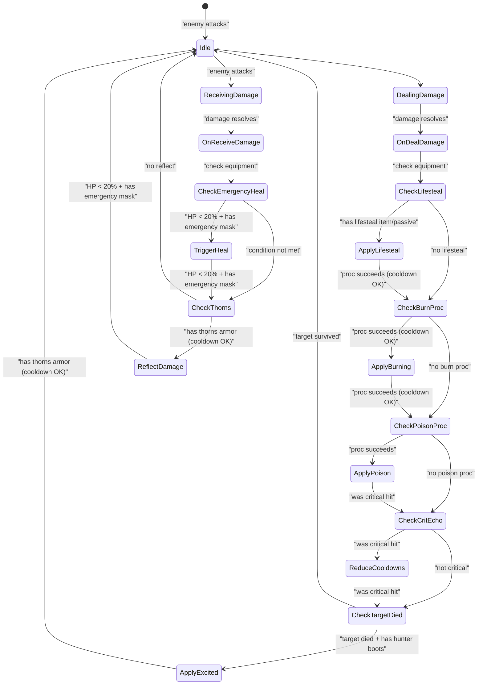
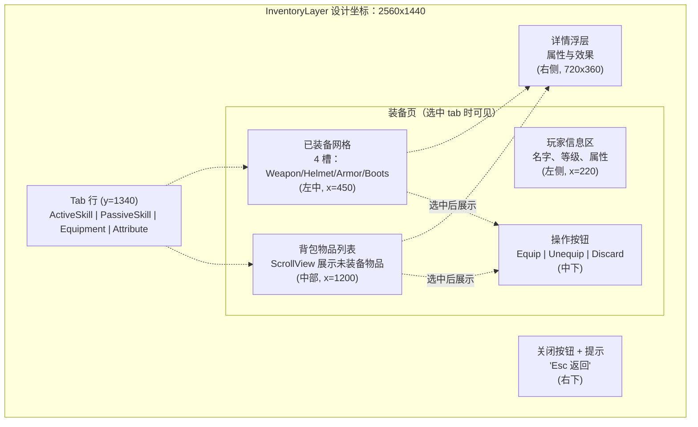
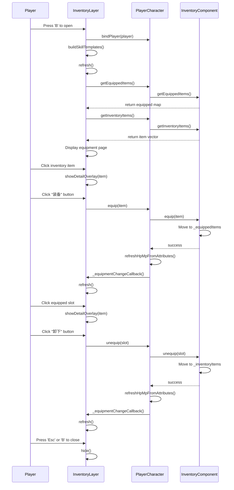
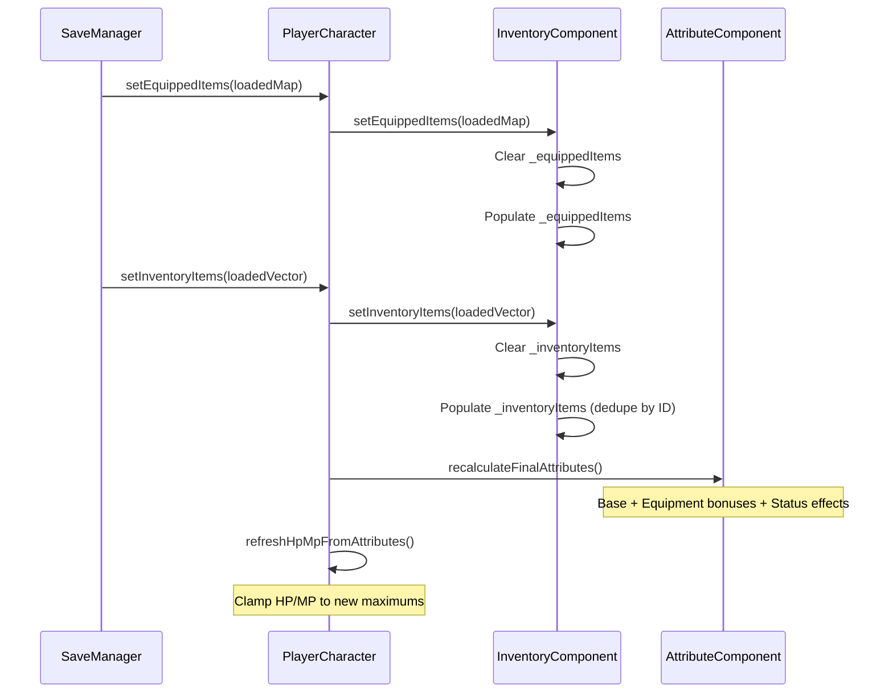

# 装备与背包（Equipment and Inventory）

> **相关源文件**
> * [Adventure-King/Classes/Character/Player/PlayerCharacter.cpp](https://github.com/lilong555/Adventure-King/blob/60df0f40/Adventure-King/Classes/Character/Player/PlayerCharacter.cpp)
> * [Adventure-King/Classes/Character/Player/PlayerCharacter.h](https://github.com/lilong555/Adventure-King/blob/60df0f40/Adventure-King/Classes/Character/Player/PlayerCharacter.h)
> * [Adventure-King/Classes/Character/Player/SkillSets/AssassinSkillSet.cpp](https://github.com/lilong555/Adventure-King/blob/60df0f40/Adventure-King/Classes/Character/Player/SkillSets/AssassinSkillSet.cpp)
> * [Adventure-King/Classes/Character/Player/SkillSets/WarriorSkillSet.cpp](https://github.com/lilong555/Adventure-King/blob/60df0f40/Adventure-King/Classes/Character/Player/SkillSets/WarriorSkillSet.cpp)
> * [Adventure-King/Classes/Configs/GameConfig.h](https://github.com/lilong555/Adventure-King/blob/60df0f40/Adventure-King/Classes/Configs/GameConfig.h)
> * [Adventure-King/Classes/Scenes/CombatContactHelper.cpp](https://github.com/lilong555/Adventure-King/blob/60df0f40/Adventure-King/Classes/Scenes/CombatContactHelper.cpp)
> * [Adventure-King/Classes/UI/InventoryLayer.cpp](https://github.com/lilong555/Adventure-King/blob/60df0f40/Adventure-King/Classes/UI/InventoryLayer.cpp)
> * [Adventure-King/Classes/UI/InventoryLayer.h](https://github.com/lilong555/Adventure-King/blob/60df0f40/Adventure-King/Classes/UI/InventoryLayer.h)
> * [Adventure-King/Classes/UI/SkillBar.cpp](https://github.com/lilong555/Adventure-King/blob/60df0f40/Adventure-King/Classes/UI/SkillBar.cpp)

## 目的与范围

本页文档介绍玩家角色的装备与背包系统，涵盖装备数据结构、背包管理、装备效果，以及用于管理物品的 UI 层。该系统负责物品存储、装备/卸下机制、装备带来的属性修改，以及在战斗中触发的特殊装备效果。

关于装备属性如何与角色最终属性集成，请参见 [Component Architecture](<组件架构.md>)。关于技能物品（与装备分开管理），请参见 [Skill System](<技能系统.md>)。

---

## 系统架构

装备系统由四个主要层次组成：数据结构、组件逻辑、玩家接口、UI 展示。

### 装备系统组件图



**来源：**

* [Classes/Character/Player/PlayerCharacter.h L74-L109](https://github.com/lilong555/Adventure-King/blob/60df0f40/Classes/Character/Player/PlayerCharacter.h#L74-L109)
* [Classes/Character/Player/PlayerCharacter.cpp L738-L911](https://github.com/lilong555/Adventure-King/blob/60df0f40/Classes/Character/Player/PlayerCharacter.cpp#L738-L911)
* [Classes/UI/InventoryLayer.h L34-L160](https://github.com/lilong555/Adventure-King/blob/60df0f40/Classes/UI/InventoryLayer.h#L34-L160)
* [Classes/UI/InventoryLayer.cpp L353-L827](https://github.com/lilong555/Adventure-King/blob/60df0f40/Classes/UI/InventoryLayer.cpp#L353-L827)
* [Classes/Configs/GameConfig.h L72-L153](https://github.com/lilong555/Adventure-King/blob/60df0f40/Classes/Configs/GameConfig.h#L72-L153)

---

## 装备数据模型

### 装备槽位

游戏定义了 4 个装备槽位，每个槽位限制可装备的物品类型：

| 槽位 | 枚举值 | 作用 | 示例物品 |
| --- | --- | --- | --- |
| WEAPON | `EquipmentSlot::WEAPON` | 主要攻击来源 | Starter Sword、Ember Staff、Blood Pact Sword |
| HELMET | `EquipmentSlot::HELMET` | 头部防护 | Leather Cap、Emergency Mask |
| ARMOR | `EquipmentSlot::ARMOR` | 身体防护 | Leather Armor、Thorns Armor |
| BOOTS | `EquipmentSlot::BOOTS` | 鞋子 | Light Boots、Hunter Boots |

### 装备基础结构

所有装备共享通用属性：

* `id`：唯一整型 ID（在 `GameConfig::Equipment` 中定义）
* `name`：显示名称
* `description`：风味文本或效果说明
* `slot`：`EquipmentSlot` 枚举值
* `level`：装备等级（某些效果会按等级缩放）
* `attributeBonus`：`Attributes`，记录属性加成

### 武器特化

武器在基础 `Equipment` 之上增加战斗相关属性：

* `type`：`WeaponType` 枚举（SWORD、STAFF 等）
* `attackDamage`：基础伤害
* `attackSpeed`：攻击动画速度倍率
* `attackAnimationPrefix`：攻击帧贴图路径前缀
* `attackFrameCount`：攻击动画帧数

当装备武器时，`PlayerCharacter::onWeaponChanged()` 会更新玩家的攻击动画设置 [PlayerCharacter.cpp L887-L901](https://github.com/lilong555/Adventure-King/blob/60df0f40/PlayerCharacter.cpp#L887-L901)。

**来源：**

* [Classes/Character/Player/PlayerCharacter.h L12-L14](https://github.com/lilong555/Adventure-King/blob/60df0f40/Classes/Character/Player/PlayerCharacter.h#L12-L14)
* [Classes/UI/InventoryLayer.cpp L158-L173](https://github.com/lilong555/Adventure-King/blob/60df0f40/Classes/UI/InventoryLayer.cpp#L158-L173)
* [Classes/Character/Player/PlayerCharacter.cpp L887-L901](https://github.com/lilong555/Adventure-King/blob/60df0f40/Classes/Character/Player/PlayerCharacter.cpp#L887-L901)

---

## 装备配置

### 装备 ID

所有装备在 `GameConfig::Equipment` 中都被分配了唯一 ID：



### 装备效果参数

带特殊效果的装备，其参数定义在 `GameConfig::EquipmentEffect` 中：

#### Thorns Armor（反伤）

* 基础反伤率：受到伤害的 15%
* 每级成长：装备等级每 +1，反伤率 +1%
* 反伤率上限：35%
* 触发冷却：0.5 秒
* 公式：`getReflectRate(level)` [GameConfig.h L112-L117](https://github.com/lilong555/Adventure-King/blob/60df0f40/GameConfig.h#L112-L117)

#### Emergency Mask（低血量救援）

* 触发阈值：低于最大 HP 的 20%
* 目标血量：恢复到最大 HP 的 35%
* 触发冷却：45 秒

#### Hunter Boots（击杀加速）

* 效果：击杀敌人后获得移速 buff
* 移速加成：+60
* 持续时间：2.0 秒

#### Ember Staff（附加燃烧）

* 触发概率：命中 25%
* 触发冷却：0.2 秒
* 施加燃烧状态效果

#### Blood Pact Sword（吸血）

* 基础吸血：造成伤害的 3%
* 每级成长：装备等级每 +1，吸血率 +0.2%
* 吸血率上限：10%
* 公式：`getLifestealRate(level)` [GameConfig.h L146-L151](https://github.com/lilong555/Adventure-King/blob/60df0f40/GameConfig.h#L146-L151)

**来源：**

* [Classes/Configs/GameConfig.h L72-L99](https://github.com/lilong555/Adventure-King/blob/60df0f40/Classes/Configs/GameConfig.h#L72-L99)
* [Classes/Configs/GameConfig.h L102-L153](https://github.com/lilong555/Adventure-King/blob/60df0f40/Classes/Configs/GameConfig.h#L102-L153)

---

## 背包管理

### InventoryComponent 接口

`PlayerCharacter` 会把所有背包操作委托给 `InventoryComponent`，并通过缓存指针访问 [PlayerCharacter.h L324](https://github.com/lilong555/Adventure-King/blob/60df0f40/PlayerCharacter.h#L324-L324)。

该组件在玩家初始化阶段被挂载 [PlayerCharacter.cpp L230](https://github.com/lilong555/Adventure-King/blob/60df0f40/PlayerCharacter.cpp#L230-L230)。

#### 核心操作

| 方法 | 作用 | 备注 |
| --- | --- | --- |
| `equip(item)` | 把物品装备到对应槽位 | 会触发属性重算 |
| `unequip(slot)` | 卸下已装备物品 | 会把物品放回背包 |
| `addToInventory(item)` | 添加到未装备列表 | 按物品 ID 去重 |
| `clearInventory()` | 清空所有未装备物品 | 用于存取档 |
| `setInventoryItems(items)` | 替换背包内容 | 用于存取档 |
| `setEquippedItems(items)` | 替换已装备物品 | 用于存取档 |

#### 查询操作

| 方法 | 返回类型 | 作用 |
| --- | --- | --- |
| `getEquipment(slot)` | `shared_ptr<Equipment>` | 获取指定槽位的物品 |
| `getEquippedWeapon()` | `shared_ptr<Weapon>` | 获取武器（便捷方法） |
| `getEquippedItems()` | `map<EquipmentSlot, shared_ptr<Equipment>>` | 获取全部已装备物品 |
| `getInventoryItems()` | `vector<shared_ptr<Equipment>>` | 获取全部未装备物品 |

### 装备变化流程



**来源：**

* [Classes/Character/Player/PlayerCharacter.cpp L805-L859](https://github.com/lilong555/Adventure-King/blob/60df0f40/Classes/Character/Player/PlayerCharacter.cpp#L805-L859)
* [Classes/Character/Player/PlayerCharacter.cpp L709-L715](https://github.com/lilong555/Adventure-King/blob/60df0f40/Classes/Character/Player/PlayerCharacter.cpp#L709-L715)

---

## 装备效果系统

装备效果会在战斗事件中通过 `CharacterBase` 的回调 hook 触发。`PlayerCharacter` 实现这些回调：检查当前装备并应用相应效果。

### 战斗事件 Hook



### 效果实现细节

#### 吸血效果（Lifesteal）

吸血可能来自两种来源：

1. **被动技能**（BLOODTHIRST）：5% 吸血 [GameConfig.h L50](https://github.com/lilong555/Adventure-King/blob/60df0f40/GameConfig.h#L50-L50)
2. **Blood Pact Sword**：3–10%（随装备等级缩放）[GameConfig.h L141-L151](https://github.com/lilong555/Adventure-King/blob/60df0f40/GameConfig.h#L141-L151)

两者都会在 `onDealDamage()` 中被检查 [PlayerCharacter.cpp L1259-L1319](https://github.com/lilong555/Adventure-King/blob/60df0f40/PlayerCharacter.cpp#L1259-L1319)：

```
If hasPassiveEquipped(BLOODTHIRST):
    lifestealRate += 5%

If hasEquipped(BLOOD_PACT_SWORD):
    lifestealRate += getLifestealRate(weapon.level)

lifestealRate = clamp(lifestealRate, 0, LIFESTEAL_TOTAL_MAX)
healAmount = finalDamage * lifestealRate
setCurrentHP(currentHP + healAmount)
```

#### 燃烧触发（Burn Proc）

燃烧可能由以下来源触发：

1. **被动技能**（EMBER_MARK）：20% 概率，0.25s 冷却 [GameConfig.h L55-L56](https://github.com/lilong555/Adventure-King/blob/60df0f40/GameConfig.h#L55-L56)
2. **Ember Staff 武器**：25% 概率，0.2s 冷却 [GameConfig.h L135-L136](https://github.com/lilong555/Adventure-King/blob/60df0f40/GameConfig.h#L135-L136)

触发会使用 `_burnProcCooldownRemaining` 避免刷屏 [PlayerCharacter.cpp L1321-L1356](https://github.com/lilong555/Adventure-King/blob/60df0f40/PlayerCharacter.cpp#L1321-L1356)。

#### 紧急治疗（Emergency Heal）

Emergency Mask 会在每次受到伤害后检查血量阈值 [PlayerCharacter.cpp L1448-L1478](https://github.com/lilong555/Adventure-King/blob/60df0f40/PlayerCharacter.cpp#L1448-L1478)：

```
If HP < maxHP * 0.20 AND cooldown expired:
    targetHP = maxHP * 0.35
    setCurrentHP(targetHP)
    resetCooldown(45 seconds)
```

#### 反伤（Thorns Reflect）

Thorns Armor 会把一定比例的受击伤害反弹给攻击者 [PlayerCharacter.cpp L1480-L1520](https://github.com/lilong555/Adventure-King/blob/60df0f40/PlayerCharacter.cpp#L1480-L1520)：

```
If hasEquipped(THORNS_ARMOR) AND cooldown expired:
    reflectRate = getReflectRate(armor.level)
    reflectDamage = finalDamage * reflectRate
    attacker->takeDamage(reflectDamage)
    resetCooldown(0.5 seconds)
```

**来源：**

* [Classes/Character/Player/PlayerCharacter.cpp L1259-L1446](https://github.com/lilong555/Adventure-King/blob/60df0f40/Classes/Character/Player/PlayerCharacter.cpp#L1259-L1446)
* [Classes/Character/Player/PlayerCharacter.cpp L1448-L1536](https://github.com/lilong555/Adventure-King/blob/60df0f40/Classes/Character/Player/PlayerCharacter.cpp#L1448-L1536)
* [Classes/Configs/GameConfig.h L48-L68](https://github.com/lilong555/Adventure-King/blob/60df0f40/Classes/Configs/GameConfig.h#L48-L68)
* [Classes/Configs/GameConfig.h L102-L153](https://github.com/lilong555/Adventure-King/blob/60df0f40/Classes/Configs/GameConfig.h#L102-L153)

---

## 背包 UI 层

### InventoryLayer 结构

`InventoryLayer` 是一个模态 UI 覆盖层，用于展示并管理玩家背包。它采用 tab 布局，包含四个页面：

1. **主动技能**（参见 [Skill System](<技能系统.md>)）
2. **被动技能**（参见 [Skill System](<技能系统.md>)）
3. **装备**（本节重点）
4. **属性**（参见 [Leveling and Progression](<升级与成长.md>)）

### 装备页布局



该 UI 使用固定设计分辨率 2560×1440，然后按实际屏幕尺寸缩放 [InventoryLayer.cpp L25-L492](https://github.com/lilong555/Adventure-King/blob/60df0f40/InventoryLayer.cpp#L25-L492)。

### 装备槽位显示

每个装备槽位会显示：

* **图标**：按槽位类型着色的占位 sprite
* **物品信息**：若已装备，则显示名称、等级、属性加成
* **空状态**：灰显并显示“空”

已装备物品通过 `PlayerCharacter::getEquippedItems()` 获取 [InventoryLayer.cpp L870-L881](https://github.com/lilong555/Adventure-King/blob/60df0f40/InventoryLayer.cpp#L870-L881)。

### 背包列表显示

背包列表展示所有未装备物品，来自 `PlayerCharacter::getInventoryItems()` [InventoryLayer.cpp L913-L1099](https://github.com/lilong555/Adventure-King/blob/60df0f40/InventoryLayer.cpp#L913-L1099)：

* 物品以可点击按钮形式展示
* 显示物品名称、等级、槽位类型
* 高亮当前选择项
* 双击快速装备 [InventoryLayer.cpp L42-L123](https://github.com/lilong555/Adventure-King/blob/60df0f40/InventoryLayer.cpp#L42-L123)

### 详情浮层

当选中物品时，详情浮层显示完整信息 [InventoryLayer.cpp L1251-L1422](https://github.com/lilong555/Adventure-King/blob/60df0f40/InventoryLayer.cpp#L1251-L1422)：

**显示区块：**

1. 物品名称与等级
2. 装备槽位
3. 属性加成（格式为 “+X 属性名”）
4. 特殊效果（由装备 ID 解析生成）

特殊效果描述会根据物品 ID 动态生成 [InventoryLayer.cpp L243-L330](https://github.com/lilong555/Adventure-King/blob/60df0f40/InventoryLayer.cpp#L243-L330)，其配置来自 `GameConfig::EquipmentEffect`。

### 用户交互流程



**来源：**

* [Classes/UI/InventoryLayer.h L34-L160](https://github.com/lilong555/Adventure-King/blob/60df0f40/Classes/UI/InventoryLayer.h#L34-L160)
* [Classes/UI/InventoryLayer.cpp L353-L459](https://github.com/lilong555/Adventure-King/blob/60df0f40/Classes/UI/InventoryLayer.cpp#L353-L459)
* [Classes/UI/InventoryLayer.cpp L804-L1249](https://github.com/lilong555/Adventure-King/blob/60df0f40/Classes/UI/InventoryLayer.cpp#L804-L1249)

---

## 与战斗系统的集成

### 武器伤害计算

玩家攻击力会把武器伤害与力量属性合并计算 [PlayerCharacter.cpp L1078-L1094](https://github.com/lilong555/Adventure-King/blob/60df0f40/PlayerCharacter.cpp#L1078-L1094)：

```
weaponDamage = equippedWeapon ? weapon.attackDamage : DEFAULT_WEAPON_DAMAGE
strength = AttributeComponent.getAttributeValue(STRENGTH)
baseAttack = weaponDamage + strength * STRENGTH_DAMAGE_MULTIPLIER
finalAttack = baseAttack * outgoingDamageMultiplier
```

* `DEFAULT_WEAPON_DAMAGE`：5.0 [GameConfig.h L213](https://github.com/lilong555/Adventure-King/blob/60df0f40/GameConfig.h#L213-L213)
* `STRENGTH_DAMAGE_MULTIPLIER`：1.5 [GameConfig.h L214](https://github.com/lilong555/Adventure-King/blob/60df0f40/GameConfig.h#L214-L214)

### 武器动画系统

装备武器后，玩家的攻击动画会随之适配 [PlayerCharacter.cpp L887-L901](https://github.com/lilong555/Adventure-King/blob/60df0f40/PlayerCharacter.cpp#L887-L901)：

```yaml
If weapon has custom attackAnimationPrefix:
    Use weapon's animation prefix
Else:
    Use defaultAttackAnimationPrefix

If weapon has custom attackFrameCount:
    Use weapon's frame count
Else:
    Use default (3 frames)
```

攻击动画由 `PlayerCharacter::attackAnimated()` 播放 [PlayerCharacter.cpp L1018-L1050](https://github.com/lilong555/Adventure-King/blob/60df0f40/PlayerCharacter.cpp#L1018-L1050)，其会基于动画前缀与帧数拼出 sprite 路径。

### 命中框生成

玩家近战会生成临时 PhysicsBody 用于命中检测。伤害值与暴击标记编码在 physics body 的 tag 中 [PlayerCharacter.cpp L1569-L1637](https://github.com/lilong555/Adventure-King/blob/60df0f40/PlayerCharacter.cpp#L1569-L1637)：

```yaml
If isCritical:
    body.tag = -damage  (negative encodes critical)
Else:
    body.tag = damage

body.categoryBitmask = PLAYER_ATTACK
body.contactTestBitmask = MONSTER
```

发生接触时，`CombatContactHelper::handleContactBegin()` 会解析 tag [CombatContactHelper.cpp L168-L211](https://github.com/lilong555/Adventure-King/blob/60df0f40/CombatContactHelper.cpp#L168-L211)：

```
rawDamage = abs(attackBody.tag)
isCritical = (attackBody.tag < 0)
```

**来源：**

* [Classes/Character/Player/PlayerCharacter.cpp L1078-L1094](https://github.com/lilong555/Adventure-King/blob/60df0f40/Classes/Character/Player/PlayerCharacter.cpp#L1078-L1094)
* [Classes/Character/Player/PlayerCharacter.cpp L887-L901](https://github.com/lilong555/Adventure-King/blob/60df0f40/Classes/Character/Player/PlayerCharacter.cpp#L887-L901)
* [Classes/Character/Player/PlayerCharacter.cpp L1018-L1050](https://github.com/lilong555/Adventure-King/blob/60df0f40/Classes/Character/Player/PlayerCharacter.cpp#L1018-L1050)
* [Classes/Scenes/CombatContactHelper.cpp L163-L212](https://github.com/lilong555/Adventure-King/blob/60df0f40/Classes/Scenes/CombatContactHelper.cpp#L163-L212)
* [Classes/Configs/GameConfig.h L213-L214](https://github.com/lilong555/Adventure-King/blob/60df0f40/Classes/Configs/GameConfig.h#L213-L214)

---

## 存档/读档集成

装备状态会作为 `SaveManager` 的 `PlayerSaveData` 的一部分被持久化。存档格式包含：

1. **已装备映射**：序列化 `EquipmentSlot` → `Equipment` 的 map
2. **背包列表**：序列化 `Equipment` 的 vector

读取存档时：



游戏过程中若装备发生变化，会立即请求存档 [PlayerCharacter.cpp L656-L660](https://github.com/lilong555/Adventure-King/blob/60df0f40/PlayerCharacter.cpp#L656-L660)，避免异常退出导致背包状态丢失。

**来源：**

* [Classes/Character/Player/PlayerCharacter.cpp L765-L803](https://github.com/lilong555/Adventure-King/blob/60df0f40/Classes/Character/Player/PlayerCharacter.cpp#L765-L803)
* [Classes/Character/Player/PlayerCharacter.cpp L656-L660](https://github.com/lilong555/Adventure-King/blob/60df0f40/Classes/Character/Player/PlayerCharacter.cpp#L656-L660)

---

## 默认背包初始化

为了方便调试与初期测试，`PlayerCharacter::ensureDefaultInventory()` 会用占位物品填充背包 [PlayerCharacter.cpp L903-L911](https://github.com/lilong555/Adventure-King/blob/60df0f40/PlayerCharacter.cpp#L903-L911)。

该方法委托给 `InventoryComponent::ensureDefaultInventory()`：它会先检查是否已有物品，再添加默认项，以防止重复。

默认物品定义在 `GameConfig::Equipment` 中，包含每个槽位的初始装备。初始化发生在 `PlayerCharacter::init()` 阶段 [PlayerCharacter.cpp L272](https://github.com/lilong555/Adventure-King/blob/60df0f40/PlayerCharacter.cpp#L272-L272)。

**来源：**

* [Classes/Character/Player/PlayerCharacter.cpp L272](https://github.com/lilong555/Adventure-King/blob/60df0f40/Classes/Character/Player/PlayerCharacter.cpp#L272-L272)
* [Classes/Character/Player/PlayerCharacter.cpp L903-L911](https://github.com/lilong555/Adventure-King/blob/60df0f40/Classes/Character/Player/PlayerCharacter.cpp#L903-L911)
