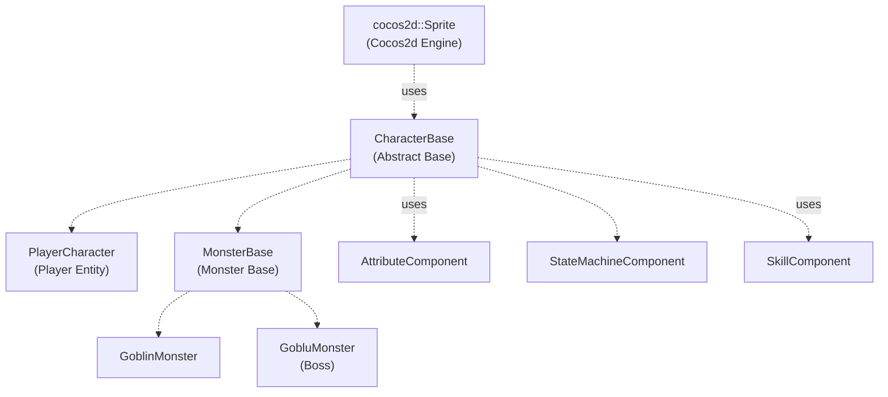
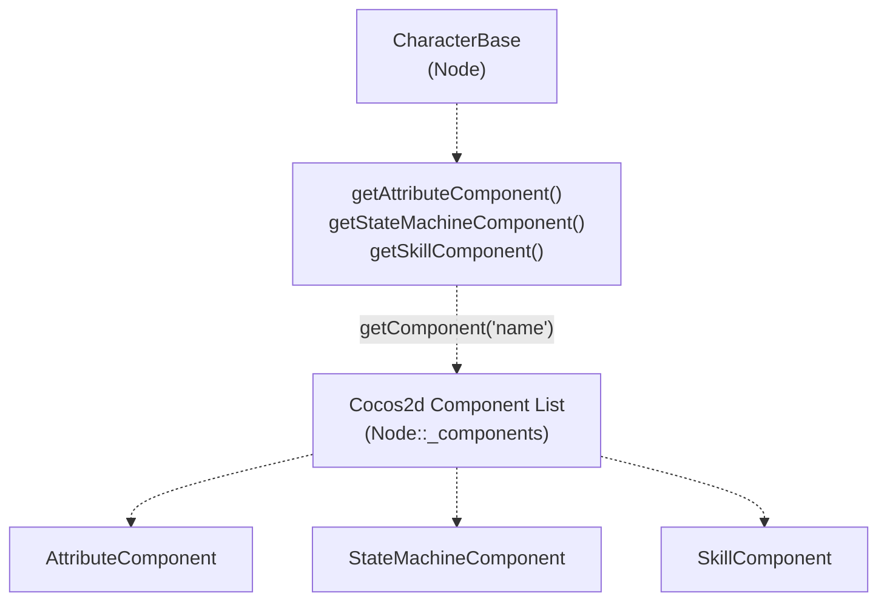
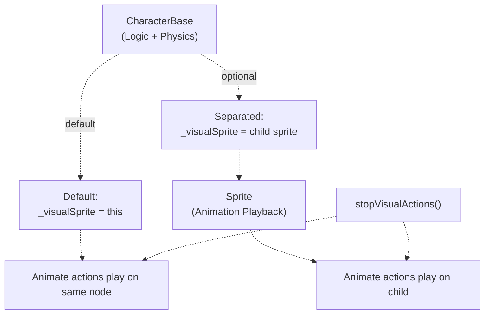
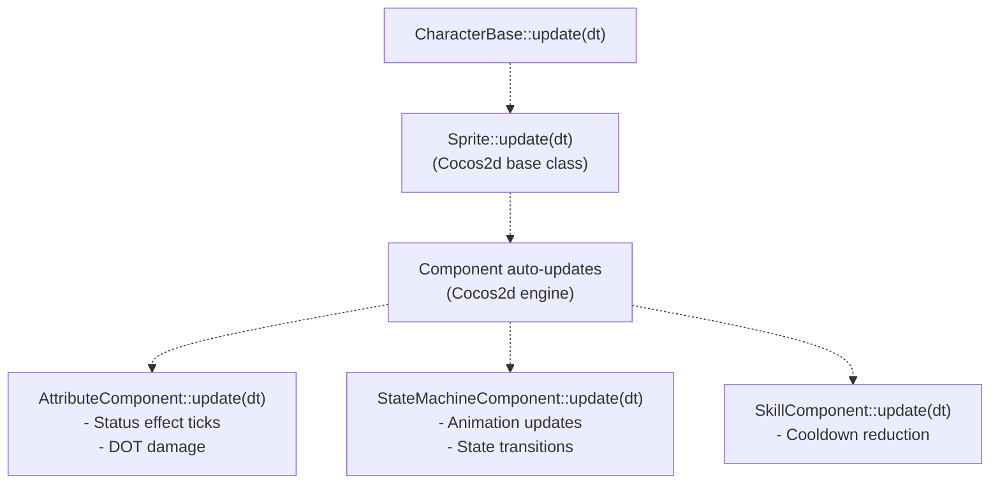

# 角色基类（CharacterBase）

> **相关源文件**
> * [Adventure-King/Classes/Character/Base/CharacterBase.cpp](https://github.com/lilong555/Adventure-King/blob/60df0f40/Adventure-King/Classes/Character/Base/CharacterBase.cpp)
> * [Adventure-King/Classes/Character/Base/CharacterBase.h](https://github.com/lilong555/Adventure-King/blob/60df0f40/Adventure-King/Classes/Character/Base/CharacterBase.h)
> * [Adventure-King/Classes/Character/Monster/Monsters/GobluMonster.cpp](https://github.com/lilong555/Adventure-King/blob/60df0f40/Adventure-King/Classes/Character/Monster/Monsters/GobluMonster.cpp)
> * [Adventure-King/Classes/Character/Monster/Monsters/GobluMonster.h](https://github.com/lilong555/Adventure-King/blob/60df0f40/Adventure-King/Classes/Character/Monster/Monsters/GobluMonster.h)
> * [Adventure-King/Classes/UI/BossHealthBar.cpp](https://github.com/lilong555/Adventure-King/blob/60df0f40/Adventure-King/Classes/UI/BossHealthBar.cpp)
> * [Adventure-King/Classes/UI/BossHealthBar.h](https://github.com/lilong555/Adventure-King/blob/60df0f40/Adventure-King/Classes/UI/BossHealthBar.h)

**用途**：`CharacterBase` 是抽象基类，定义了 Adventure-King 中所有战斗实体（玩家角色与怪物）共享的能力。它提供基于组件的架构、伤害计算、视觉反馈系统，以及死亡处理逻辑。本页用于记录所有角色都会继承的通用机制。

具体实现可参考：

* 玩家特有能力：[PlayerCharacter](<玩家角色（PlayerCharacter）.md>)
* 怪物 AI 与行为：[MonsterBase](<怪物基类（MonsterBase）.md>)
* 伤害计算细节：[Damage System](<伤害系统.md>)
* Boss 特有机制：[Boss Mechanics](<Boss 机制.md>)

---

## 类架构概览

`CharacterBase` 充当 Cocos2d-x 的 `Sprite` 类与游戏角色逻辑之间的桥梁：它继承自 `cocos2d::Sprite`，并被 `PlayerCharacter` 与 `MonsterBase` 共同继承，是角色层级结构的基础。

### 继承层级

**来源**：[Classes/Character/Base/CharacterBase.h L1-L202](https://github.com/lilong555/Adventure-King/blob/60df0f40/Classes/Character/Base/CharacterBase.h#L1-L202)

 [Classes/Character/Base/CharacterBase.cpp L1-L558](https://github.com/lilong555/Adventure-King/blob/60df0f40/Classes/Character/Base/CharacterBase.cpp#L1-L558)

---

## 基于组件的架构

`CharacterBase` 并不会把组件指针保存为成员变量；它使用 Cocos2d-x 的组件系统，将组件动态挂载到节点上，并在需要时通过名字检索得到组件。这样可以降低耦合，并允许在运行时增删组件。

### 组件访问模式

**组件 Getter 方法**：

| 方法 | 返回类型 | 用途 |
| --- | --- | --- |
| `getAttributeComponent()` | `AttributeComponent*` | 访问属性、装备特效、状态效果 |
| `getStateMachineComponent()` | `StateMachineComponent*` | 管理动画状态（IDLE、WALKING、ATTACKING 等） |
| `getSkillComponent()` | `SkillComponent*` | 处理技能冷却与技能槽位管理 |
| `getVisualSprite()` | `cocos2d::Sprite*` | 获取用于播放动画的精灵（默认是 `this`） |

**实现细节**：这些 getter 通过 `getComponent(name)` 按注册名获取组件。代码同时提供 const 与非 const 的重载；由于 Cocos2d-x 没有提供 const 安全的组件访问接口，const 版本会使用 `const_cast` 的变通方式。

**来源**：[Classes/Character/Base/CharacterBase.h L31-L57](https://github.com/lilong555/Adventure-King/blob/60df0f40/Classes/Character/Base/CharacterBase.h#L31-L57)

 [Classes/Character/Base/CharacterBase.cpp L31-L62](https://github.com/lilong555/Adventure-King/blob/60df0f40/Classes/Character/Base/CharacterBase.cpp#L31-L62)

---

## 初始化模式

子类通常使用两种初始化方式之一来设置角色精灵：

### 初始化方法

| 方法 | 输入 | 用途 |
| --- | --- | --- |
| `initWithSpriteFrameName()` | 缓存中的 SpriteFrame 名称 | 正式资源（预缓存帧） |
| `initWithFile()` | 文件路径 | 缓存不可用时用于调试/兜底加载 |

**初始化顺序**：

1. 加载/创建 SpriteFrame
2. 初始化 Cocos2d 的 `Sprite` 基类
3. 设置 `_visualSprite = this`
4. 将 HP/MP/等级初始化为默认值
5. 以优先级 1 调度 update

**SpriteFrame 辅助工具**：使用 `SpriteFrameCacheHelper::getOrCreateSpriteFrame()`，当帧不在缓存中时会自动回退到文件加载，并将其缓存以便后续复用。

**来源**：[Classes/Character/Base/CharacterBase.cpp L80-L127](https://github.com/lilong555/Adventure-King/blob/60df0f40/Classes/Character/Base/CharacterBase.cpp#L80-L127)

---

## 视觉精灵分离

角色可以通过 `setVisualSprite()` 将“逻辑节点”与“视觉精灵节点”分离。

### 视觉精灵模式

**适用场景**：

* 在不影响物理刚体的前提下叠加视觉效果（抖动、缩放等）
* 实现多层渲染（角色主体 + 装备精灵）
* 在击退/位移期间将逻辑位置与视觉位置解耦

**辅助方法**：`stopVisualActions()` 会停止视觉精灵上的所有动作，并把缩放重置到基础值，常用于中断攻击动画等表现。

**来源**：[Classes/Character/Base/CharacterBase.h L56](https://github.com/lilong555/Adventure-King/blob/60df0f40/Classes/Character/Base/CharacterBase.h#L56-L56)

 [Classes/Character/Base/CharacterBase.cpp L461-L480](https://github.com/lilong555/Adventure-King/blob/60df0f40/Classes/Character/Base/CharacterBase.cpp#L461-L480)

---

## 更新循环

`update(float dt)` 会以优先级 1 被调度执行，并自动触发组件的更新逻辑。

### update 的职责

**重要提示**：子类不应该手动调用组件的 `update()` 方法。Cocos2d-x 引擎会在宿主节点的 update 被调度后，自动对所有挂载组件调用 `update(dt)`。

**来源**：[Classes/Character/Base/CharacterBase.cpp L129-L145](https://github.com/lilong555/Adventure-King/blob/60df0f40/Classes/Character/Base/CharacterBase.cpp#L129-L145)

---

## 与配置系统的集成

`CharacterBase` 在战斗公式与特效参数上高度依赖 `GameConfig`。

### 配置依赖

| 配置命名空间 | 用途 |
| --- | --- |
| `GameConfig::Combat::ARMOR_CONST` | 防御减伤公式 |
| `GameConfig::Material::MONSTER` | 物理材质属性 |
| `GameConfig::Monster::<Type>::*` | 怪物特定的属性（HP、伤害、速度等） |

**编译期耦合**：所有平衡参数都在 `GameConfig.h` 里以 `constexpr` 形式定义，这意味着修改需要重新编译。这样的取舍以运行时性能优先，而不是热更新的灵活性。

**来源**：[Classes/Character/Base/CharacterBase.cpp L5](https://github.com/lilong555/Adventure-King/blob/60df0f40/Classes/Character/Base/CharacterBase.cpp#L5-L5)

 [Classes/Configs/GameConfig.h](https://github.com/lilong555/Adventure-King/blob/60df0f40/Classes/Configs/GameConfig.h)

---

## 总结

`CharacterBase` 为 Adventure-King 中所有战斗实体提供了关键基础能力：

* **组件访问**：使用 Cocos2d 的组件系统实现属性/技能/状态机的模块化管理
* **伤害管线**：实现防御减伤、暴击、随机波动、以及 hook 回调执行
* **视觉反馈**：自动生成伤害数字、按方向生成受击粒子、以及治疗效果
* **死亡管理**：可配置的自动移除，并支持回调
* **Boss 接口**：提供与破韧/破甲条相关的虚方法
* **UI 集成**：记录非 DOT 伤害以支持连击显示等

玩家与怪物的所有行为都构建在这些共享机制之上；子类通常通过重写 `attack()` 与伤害相关回调来实现各自的战斗模式。
