# 角色系统（Character Systems）

> **相关源文件**
> * [Adventure-King/Classes/Character/Base/CharacterBase.cpp](https://github.com/lilong555/Adventure-King/blob/60df0f40/Adventure-King/Classes/Character/Base/CharacterBase.cpp)
> * [Adventure-King/Classes/Character/Base/CharacterBase.h](https://github.com/lilong555/Adventure-King/blob/60df0f40/Adventure-King/Classes/Character/Base/CharacterBase.h)
> * [Adventure-King/Classes/Character/Base/CharacterData.h](https://github.com/lilong555/Adventure-King/blob/60df0f40/Adventure-King/Classes/Character/Base/CharacterData.h)
> * [Adventure-King/Classes/Character/Monster/MonsterBase.cpp](https://github.com/lilong555/Adventure-King/blob/60df0f40/Adventure-King/Classes/Character/Monster/MonsterBase.cpp)
> * [Adventure-King/Classes/Character/Monster/MonsterBase.h](https://github.com/lilong555/Adventure-King/blob/60df0f40/Adventure-King/Classes/Character/Monster/MonsterBase.h)
> * [Adventure-King/Classes/Character/Monster/Monsters/GoblinMonster.cpp](https://github.com/lilong555/Adventure-King/blob/60df0f40/Adventure-King/Classes/Character/Monster/Monsters/GoblinMonster.cpp)
> * [Adventure-King/Classes/Character/Monster/Monsters/GoblinMonster.h](https://github.com/lilong555/Adventure-King/blob/60df0f40/Adventure-King/Classes/Character/Monster/Monsters/GoblinMonster.h)
> * [Adventure-King/Classes/Character/Monster/Monsters/GobluMonster.cpp](https://github.com/lilong555/Adventure-King/blob/60df0f40/Adventure-King/Classes/Character/Monster/Monsters/GobluMonster.cpp)
> * [Adventure-King/Classes/Character/Monster/Monsters/GobluMonster.h](https://github.com/lilong555/Adventure-King/blob/60df0f40/Adventure-King/Classes/Character/Monster/Monsters/GobluMonster.h)
> * [Adventure-King/Classes/Character/Player/PlayerCharacter.cpp](https://github.com/lilong555/Adventure-King/blob/60df0f40/Adventure-King/Classes/Character/Player/PlayerCharacter.cpp)
> * [Adventure-King/Classes/Character/Player/PlayerCharacter.h](https://github.com/lilong555/Adventure-King/blob/60df0f40/Adventure-King/Classes/Character/Player/PlayerCharacter.h)
> * [Adventure-King/Classes/UI/BossHealthBar.cpp](https://github.com/lilong555/Adventure-King/blob/60df0f40/Adventure-King/Classes/UI/BossHealthBar.cpp)
> * [Adventure-King/Classes/UI/BossHealthBar.h](https://github.com/lilong555/Adventure-King/blob/60df0f40/Adventure-King/Classes/UI/BossHealthBar.h)
> * [Adventure-King/Classes/UI/InventoryLayer.cpp](https://github.com/lilong555/Adventure-King/blob/60df0f40/Adventure-King/Classes/UI/InventoryLayer.cpp)
> * [Adventure-King/Classes/UI/InventoryLayer.h](https://github.com/lilong555/Adventure-King/blob/60df0f40/Adventure-King/Classes/UI/InventoryLayer.h)
> * [Adventure-King/Classes/UI/SkillBar.cpp](https://github.com/lilong555/Adventure-King/blob/60df0f40/Adventure-King/Classes/UI/SkillBar.cpp)

## 目的与范围

角色系统覆盖 Adventure-King 中所有具备生命值、会受到伤害、并参与战斗的实体，包括玩家角色、普通怪物与 Boss。本篇文档包含：

* **CharacterBase**：基础类，提供共享的战斗机制、生命/魔法管理与组件集成
* **PlayerCharacter**：玩家实体，采用组件化架构管理属性、背包、技能与成长
* **MonsterBase**：以 AI 驱动的敌人系统，包含寻路/仇恨/攻击逻辑等
* **具体怪物类型**：例如 `GoblinMonster` 与 `GobluMonster`（Boss）等具体实现

关于场景层面的编排，以及角色如何生成/管理，请参见 [GameScene](<GameScene（游戏场景）.md>)。关于展示角色状态的 UI 组件（血条、技能冷却等），请参见 [User Interface](<用户界面.md>)。关于角色数据的存取档，请参见 [SaveManager](<存档管理器（SaveManager）.md>)。

---

## 架构概览

角色系统采用 **三层继承结构**，并结合 **组件化架构**：

### 类层级

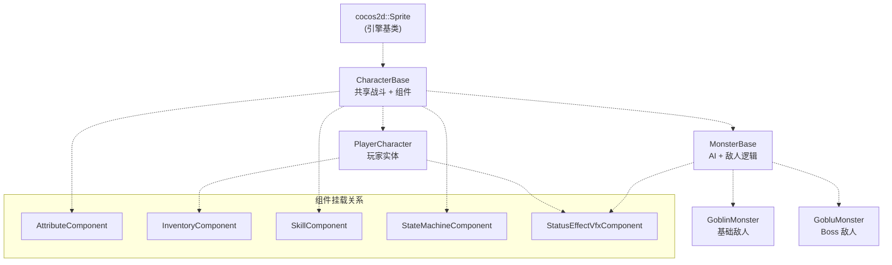
```mermaid
flowchart TD

Sprite["cocos2d::Sprite<br>(引擎基类)"]
CharBase["CharacterBase<br>共享战斗 + 组件"]
Player["PlayerCharacter<br>玩家实体"]
Monster["MonsterBase<br>AI + 敌人逻辑"]
Goblin["GoblinMonster<br>基础敌人"]
Goblu["GobluMonster<br>Boss 敌人"]
AttrComp["AttributeComponent"]
InvComp["InventoryComponent"]
SkillComp["SkillComponent"]
SMComp["StateMachineComponent"]
VfxComp["StatusEffectVfxComponent"]

Sprite -.-> CharBase
CharBase -.-> Player
CharBase -.-> Monster
Monster -.-> Goblin
Monster -.-> Goblu
CharBase -.-> AttrComp
CharBase -.-> SkillComp
CharBase -.-> SMComp
Player -.-> InvComp
Player -.-> VfxComp
Monster -.-> VfxComp

subgraph subGraph0 ["组件挂载关系"]
    AttrComp
    InvComp
    SkillComp
    SMComp
    VfxComp
end
```

**来源：** [CharacterBase.h L31-L201](https://github.com/lilong555/Adventure-King/blob/60df0f40/CharacterBase.h#L31-L201)

 [PlayerCharacter.h L17-L352](https://github.com/lilong555/Adventure-King/blob/60df0f40/PlayerCharacter.h#L17-L352)

### 组件系统集成

Adventure-King 使用 **Cocos2d-x 内建的组件系统**，而不是把组件作为成员变量存储。组件通过 `addComponent()` 挂到节点上，通过 `getComponent()` 取回。

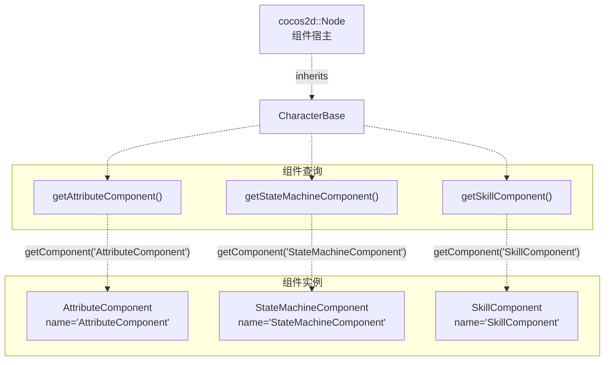
```mermaid
flowchart TD

Node["cocos2d::Node<br>组件宿主"]
CharBase["CharacterBase"]
GetAttr["getAttributeComponent()"]
GetSM["getStateMachineComponent()"]
GetSkill["getSkillComponent()"]
AC["AttributeComponent<br>name='AttributeComponent'"]
SMC["StateMachineComponent<br>name='StateMachineComponent'"]
SC["SkillComponent<br>name='SkillComponent'"]

Node -.->|"inherits"| CharBase
CharBase -.-> GetAttr
CharBase -.-> GetSM
CharBase -.-> GetSkill
GetAttr -.->|"getComponent('AttributeComponent')"| AC
GetSM -.->|"getComponent('StateMachineComponent')"| SMC
GetSkill -.->|"getComponent('SkillComponent')"| SC

subgraph subGraph1 ["组件实例"]
    AC
    SMC
    SC
end

subgraph subGraph0 ["组件查询"]
    GetAttr
    GetSM
    GetSkill
end
```

**来源：** [CharacterBase.h L31-L62](https://github.com/lilong555/Adventure-King/blob/60df0f40/CharacterBase.h#L31-L62)

 [CharacterBase.cpp L31-L62](https://github.com/lilong555/Adventure-King/blob/60df0f40/CharacterBase.cpp#L31-L62)

 [MonsterBase.cpp L82-L118](https://github.com/lilong555/Adventure-King/blob/60df0f40/MonsterBase.cpp#L82-L118)

---

## CharacterBase：共享基础

`CharacterBase` 是一个 **抽象基类**，提供：

* **战斗机制**：伤害计算、防御减伤、暴击
* **HP/MP 管理**：`_currentHP`、`_currentMP`、`setCurrentHP()`、`setCurrentMP()`
* **组件访问**：统一的 getter：`AttributeComponent`、`StateMachineComponent`、`SkillComponent`
* **视觉反馈**：伤害数字、受击特效、治疗数字
* **死亡处理**：`die()`，可选自动移除

### 核心战斗流程

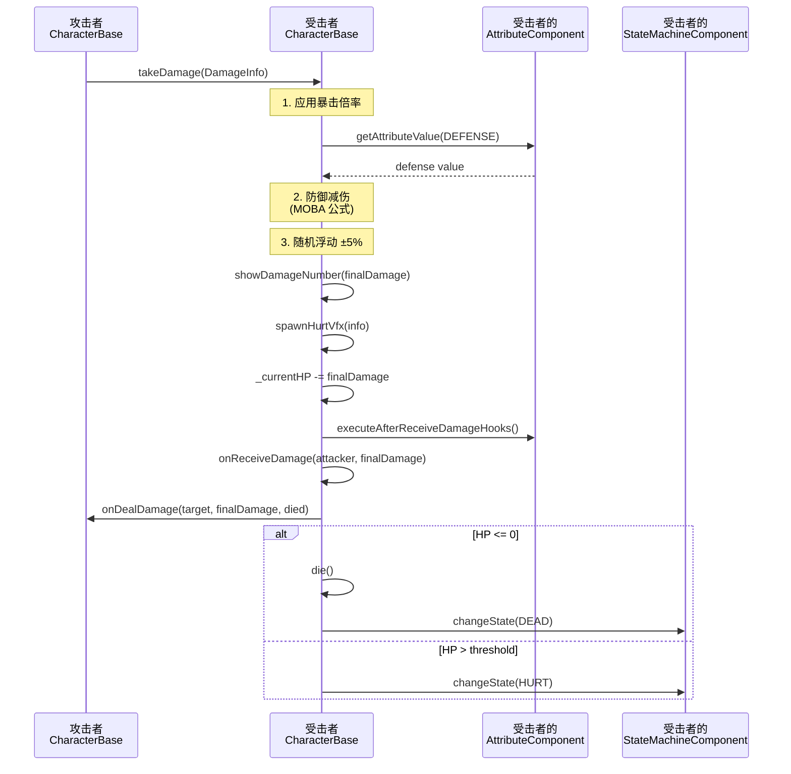
```mermaid
sequenceDiagram
  participant p1 as 攻击者<br/>CharacterBase
  participant p2 as 受击者<br/>CharacterBase
  participant p3 as 受击者的<br/>AttributeComponent
  participant p4 as 受击者的<br/>StateMachineComponent

  p1->>p2: takeDamage(DamageInfo)
  note over p2: 1. 应用暴击倍率
  p2->>p3: getAttributeValue(DEFENSE)
  p3-->>p2: defense value
  note over p2: 2. 防御减伤<br/>(MOBA 公式)
  note over p2: 3. 随机浮动 ±5%
  p2->>p2: showDamageNumber(finalDamage)
  p2->>p2: spawnHurtVfx(info)
  p2->>p2: _currentHP -= finalDamage
  p2->>p3: executeAfterReceiveDamageHooks()
  p2->>p2: onReceiveDamage(attacker, finalDamage)
  p2->>p1: onDealDamage(target, finalDamage, died)
  alt HP <= 0
    p2->>p2: die()
    p2->>p4: changeState(DEAD)
  else HP > threshold
    p2->>p4: changeState(HURT)
  end
```

**来源：** [CharacterBase.cpp L148-L248](https://github.com/lilong555/Adventure-King/blob/60df0f40/CharacterBase.cpp#L148-L248)

 [CharacterBase.h L57-L72](https://github.com/lilong555/Adventure-King/blob/60df0f40/CharacterBase.h#L57-L72)

### 防御计算

减伤采用 **MOBA 风格护甲公式**：

```
effectiveDefense = max(0, defense - penetration)
reductionFactor = ARMOR_CONST / (ARMOR_CONST + effectiveDefense)
finalDamage = baseDamage * critMultiplier * reductionFactor * randomVariance
```

其中 `ARMOR_CONST` 定义在 `GameConfig::Combat::ARMOR_CONST`。

**来源：** [CharacterBase.cpp L162-L178](https://github.com/lilong555/Adventure-King/blob/60df0f40/CharacterBase.cpp#L162-L178)

 [GameConfig.h](https://github.com/lilong555/Adventure-King/blob/60df0f40/GameConfig.h#LNaN-LNaN)

### 组件生命周期

组件 **不会** 被 `CharacterBase` 手动 update。组件一旦通过 `addComponent()` 挂载，Cocos2d-x 的 `Scheduler` 会在每帧自动调用每个组件的 `update(float dt)`。

| 方法 | 目的 | 调用时机 |
| --- | --- | --- |
| `addComponent()` | 把组件挂到节点上 | 初始化阶段（例如 `init()`） |
| `getComponent()` | 按 name 取回组件 | 任何需要访问组件的时刻 |
| `Component::update(dt)` | 每帧逻辑 | 由 Scheduler 自动调用 |
| `Component::onEnter()` | 组件激活 | 节点进入场景时 |
| `Component::onExit()` | 组件停用 | 节点移出场景时 |

**来源：** [CharacterBase.cpp L130-L145](https://github.com/lilong555/Adventure-King/blob/60df0f40/CharacterBase.cpp#L130-L145)

 [MonsterBase.cpp L82-L118](https://github.com/lilong555/Adventure-King/blob/60df0f40/MonsterBase.cpp#L82-L118)

### 伤害数字显示

`showDamageNumber()` 会创建浮动 Label：向上飘并渐隐，最终移除。

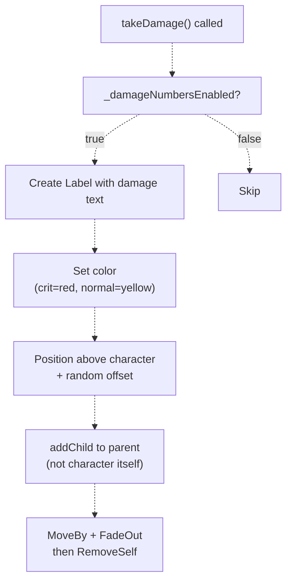
```mermaid
flowchart TD

Trigger["takeDamage() called"]
Check["_damageNumbersEnabled?"]
Create["Create Label with damage text"]
Style["Set color<br>(crit=red, normal=yellow)"]
Position["Position above character<br>+ random offset"]
AddToParent["addChild to parent<br>(not character itself)"]
Animate["MoveBy + FadeOut<br>then RemoveSelf"]
End["Skip"]

Trigger -.-> Check
Check -.->|"true"| Create
Check -.->|"false"| End
Create -.-> Style
Style -.-> Position
Position -.-> AddToParent
AddToParent -.-> Animate
```

将伤害数字加到 **父节点**（GameLayer）而不是角色本身，可以避免 Label 跟随角色移动/旋转。

**来源：** [CharacterBase.cpp L378-L429](https://github.com/lilong555/Adventure-King/blob/60df0f40/CharacterBase.cpp#L378-L429)

---

## PlayerCharacter：组件化的玩家实体

`PlayerCharacter` 在 `CharacterBase` 基础上扩展：

* **按职业初始化**：`WARRIOR`、`MAGE`、`ASSASSIN`、`TANK` 的基础属性不同
* **成长系统**：经验、等级、属性点、技能点
* **装备系统**：通过 `InventoryComponent` 的背包/装备位
* **技能系统**：通过 `SkillComponent` 管理主动/被动技能
* **职业专属能力**：`WarriorSkillSet`、`AssassinSkillSet`、`MageSkillSet`

### 组件架构

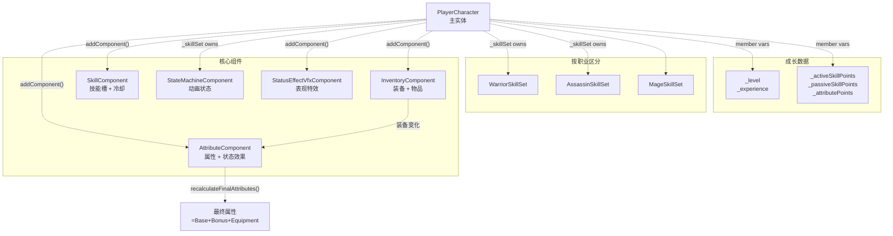
```mermaid
flowchart TD

PC["PlayerCharacter<br>主实体"]
AC["AttributeComponent<br>属性 + 状态效果"]
IC["InventoryComponent<br>装备 + 物品"]
SC["SkillComponent<br>技能槽 + 冷却"]
SMC["StateMachineComponent<br>动画状态"]
SEVFX["StatusEffectVfxComponent<br>表现特效"]
WSS["WarriorSkillSet"]
ASS["AssassinSkillSet"]
MSS["MageSkillSet"]
Level["_level<br>_experience"]
Points["_activeSkillPoints<br>_passiveSkillPoints<br>_attributePoints"]
FinalStats["最终属性<br>=Base+Bonus+Equipment"]

PC -.->|"addComponent()"| AC
PC -.->|"addComponent()"| IC
PC -.->|"addComponent()"| SC
PC -.->|"_skillSet owns"| SMC
PC -.->|"addComponent()"| SEVFX
PC -.->|"_skillSet owns"| WSS
PC -.->|"_skillSet owns"| ASS
PC -.-> MSS
PC -.->|"member vars"| Level
PC -.->|"member vars"| Points
AC -.->|"recalculateFinalAttributes()"| FinalStats

subgraph subGraph2 ["成长数据"]
    Level
    Points
end

subgraph Role-Specific ["按职业区分"]
    WSS
    ASS
    MSS
end

subgraph subGraph0 ["核心组件"]
    AC
    IC
    SC
    SMC
    SEVFX
    IC -.->|"装备变化"| AC
end
```

**来源：** [PlayerCharacter.h L17-L352](https://github.com/lilong555/Adventure-King/blob/60df0f40/PlayerCharacter.h#L17-L352)

 [PlayerCharacter.cpp L180-L277](https://github.com/lilong555/Adventure-King/blob/60df0f40/PlayerCharacter.cpp#L180-L277)

### 初始化流水线

`init()` 会按固定顺序执行，以保证组件先于依赖逻辑可用：

| 步骤 | 动作 | 目的 |
| --- | --- | --- |
| 1 | `initWithSpriteFrameName()` | 加载可视 sprite |
| 2 | 对每个组件调用 `addComponent()` | 挂载 AttributeComponent、InventoryComponent、SkillComponent 等 |
| 3 | `initAttributesByRole()` | 按职业设置基础属性 |
| 4 | `refreshHpMpFromAttributes()` | 将 HP/MP 同步到 MAX_HP/MAX_MP |
| 5 | `helperSetupPhysicsBody()` | 创建碰撞盒 |
| 6 | `ensureMoveAnimations()` | 缓存走/跑动画 |
| 7 | `createSkillSet()` | 创建职业技能集 |
| 8 | `ensureDefaultInventory()` | 添加初始装备 |

**来源：** [PlayerCharacter.cpp L180-L277](https://github.com/lilong555/Adventure-King/blob/60df0f40/PlayerCharacter.cpp#L180-L277)

### 按职业区分的基础属性

每种 `CharacterRole` 都有不同的起始属性：

| 职业 | Strength | Defense | Crit Rate | Move Speed | Max HP | Max MP |
| --- | --- | --- | --- | --- | --- | --- |
| WARRIOR | 10 | 5 | 0.10 | 200 | 100 | 50 |
| MAGE | 4 | 2 | 0.15 | 180 | 70 | 80 |
| ASSASSIN | 7 | 3 | 0.25 | 240 | 80 | 40 |
| TANK | 6 | 8 | 0.05 | 160 | 150 | 20 |

**来源：** [PlayerCharacter.cpp L664-L707](https://github.com/lilong555/Adventure-King/blob/60df0f40/PlayerCharacter.cpp#L664-L707)

### 升级系统

经验累积与升级流程：

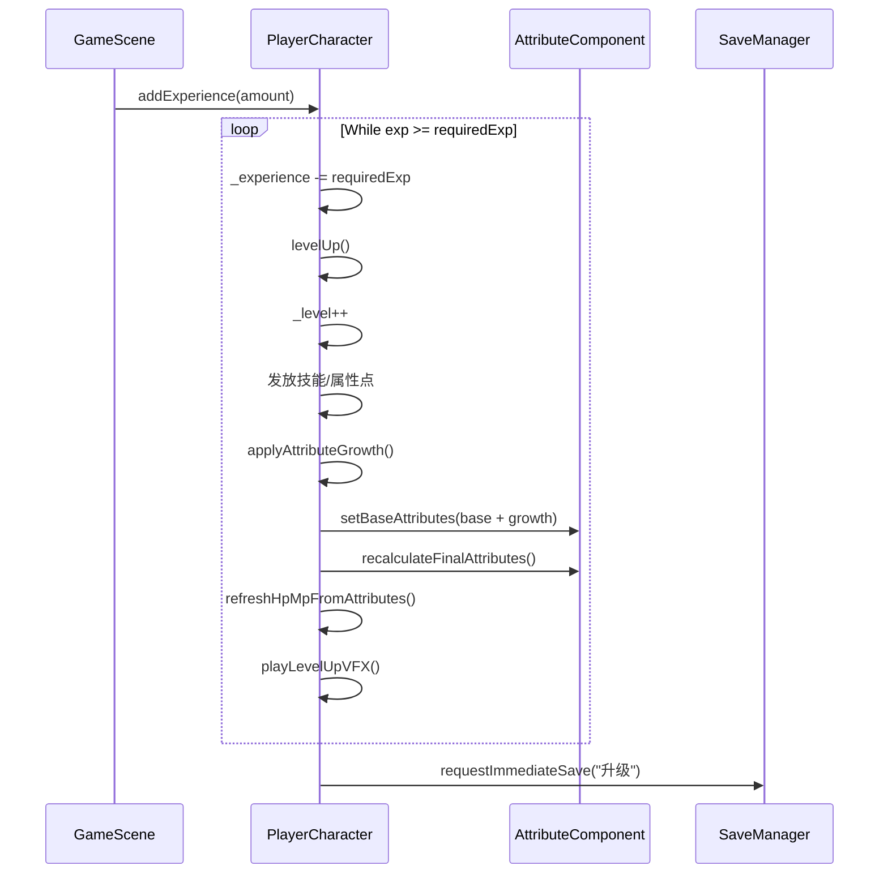
```mermaid
sequenceDiagram
  participant p1 as GameScene
  participant p2 as PlayerCharacter
  participant p3 as AttributeComponent
  participant p4 as SaveManager

  p1->>p2: addExperience(amount)
  loop While exp >= requiredExp
    p2->>p2: _experience -= requiredExp
    p2->>p2: levelUp()
    p2->>p2: _level++
    p2->>p2: 发放技能/属性点
    p2->>p2: applyAttributeGrowth()
    p2->>p3: setBaseAttributes(base + growth)
    p2->>p3: recalculateFinalAttributes()
    p2->>p2: refreshHpMpFromAttributes()
    p2->>p2: playLevelUpVFX()
  end
  p2->>p4: requestImmediateSave("升级")
```

**来源：** [PlayerCharacter.cpp L537-L578](https://github.com/lilong555/Adventure-King/blob/60df0f40/PlayerCharacter.cpp#L537-L578)

### 装备系统集成

装备通过 `InventoryComponent` 修改属性：

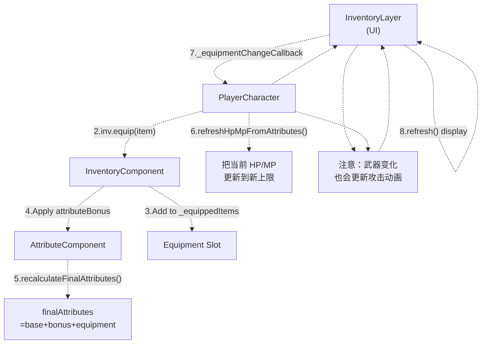
```mermaid
flowchart TD

UI["InventoryLayer<br>(UI)"]
PC["PlayerCharacter"]
IC["InventoryComponent"]
AC["AttributeComponent"]
Slot["Equipment Slot"]
FinalStats["finalAttributes<br>=base+bonus+equipment"]
HPUpdate["把当前 HP/MP<br>更新到新上限"]
Note["注意：武器变化<br>也会更新攻击动画"]

UI -.->|"7._equipmentChangeCallback"| PC
PC -.->|"2.inv.equip(item)"| IC
IC -.->|"3.Add to _equippedItems"| Slot
IC -.->|"4.Apply attributeBonus"| AC
AC -.->|"5.recalculateFinalAttributes()"| FinalStats
PC -.->|"6.refreshHpMpFromAttributes()"| HPUpdate
PC -.-> UI
UI -.->|"8.refresh() display"| UI
UI -.-> Note
Note -.-> UI
PC -.-> Note
```

**来源：** [PlayerCharacter.cpp L805-L869](https://github.com/lilong555/Adventure-King/blob/60df0f40/PlayerCharacter.cpp#L805-L869)

 [InventoryComponent（InventoryLayer.cpp 中引用）](https://github.com/lilong555/Adventure-King/blob/60df0f40/Adventure-King/Classes/Character/components/InventoryComponent.h)

### 技能集模式

技能按 **职业技能集（skill set）** 组织：各职业实现继承自 `PlayerSkillSet`：

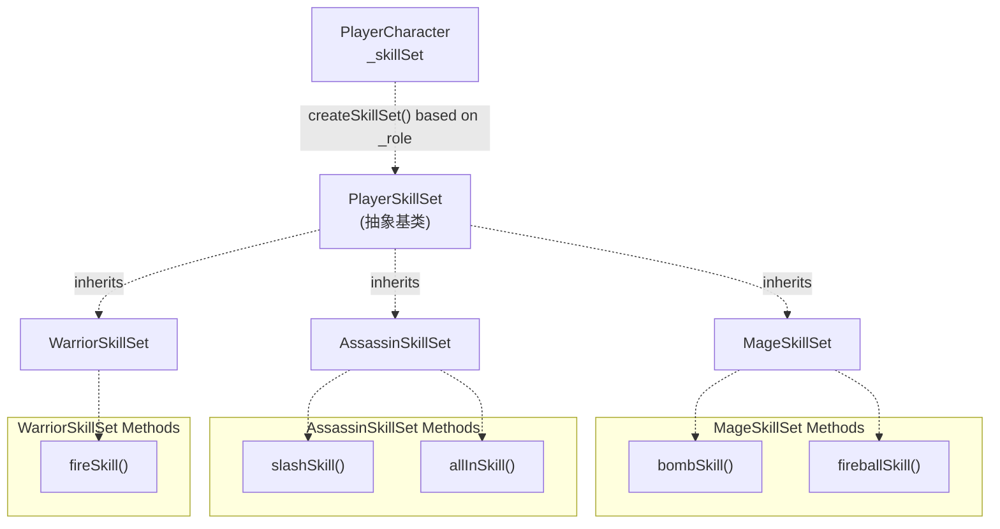
```mermaid
flowchart TD

PSS["PlayerSkillSet<br>(抽象基类)"]
WSS["WarriorSkillSet"]
ASS["AssassinSkillSet"]
MSS["MageSkillSet"]
PC["PlayerCharacter<br>_skillSet"]
WFire["fireSkill()"]
ASlash["slashSkill()"]
AAllIn["allInSkill()"]
MBomb["bombSkill()"]
MFireball["fireballSkill()"]

PSS -.->|"inherits"| WSS
PSS -.->|"inherits"| ASS
PSS -.->|"inherits"| MSS
PC -.->|"createSkillSet() based on _role"| PSS
WSS -.-> WFire
ASS -.-> ASlash
ASS -.-> AAllIn
MSS -.-> MBomb
MSS -.-> MFireball

subgraph subGraph2 ["MageSkillSet Methods"]
    MBomb
    MFireball
end

subgraph subGraph1 ["AssassinSkillSet Methods"]
    ASlash
    AAllIn
end

subgraph subGraph0 ["WarriorSkillSet Methods"]
    WFire
end
```

skill set 会在 `createSkillSet()` 中创建，技能通过 `initSkills(PlayerCharacter&)` 初始化。

**来源：** [PlayerCharacter.cpp L2-L269](https://github.com/lilong555/Adventure-King/blob/60df0f40/PlayerCharacter.cpp#L2-L269)

### 属性点与升级

玩家可消耗 `_attributePoints` 永久提升基础属性：

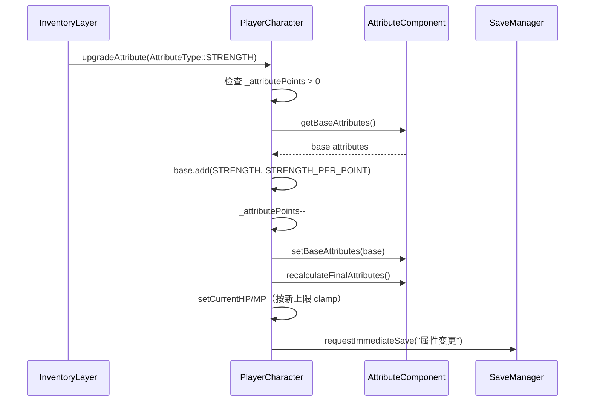
```mermaid
sequenceDiagram
  participant p1 as InventoryLayer
  participant p2 as PlayerCharacter
  participant p3 as AttributeComponent
  participant p4 as SaveManager

  p1->>p2: upgradeAttribute(AttributeType::STRENGTH)
  p2->>p2: 检查 _attributePoints > 0
  p2->>p3: getBaseAttributes()
  p3-->>p2: base attributes
  p2->>p2: base.add(STRENGTH, STRENGTH_PER_POINT)
  p2->>p2: _attributePoints--
  p2->>p3: setBaseAttributes(base)
  p2->>p3: recalculateFinalAttributes()
  p2->>p2: setCurrentHP/MP（按新上限 clamp）
  p2->>p4: requestImmediateSave("属性变更")
```

**来源：** [PlayerCharacter.cpp L606-L662](https://github.com/lilong555/Adventure-King/blob/60df0f40/PlayerCharacter.cpp#L606-L662)

### 出站伤害倍率（Outgoing Damage Multiplier）

`_outgoingDamageMultiplier` 支持临时伤害增益（例如刺客的 “All In” 技能）：

```
baseAttack = weaponDamage + strength * STRENGTH_DAMAGE_MULTIPLIER
finalAttack = baseAttack * max(0, _outgoingDamageMultiplier)
```

当带持续时间激活时：

1. `activateOutgoingDamageMultiplier(2.5f, 5.0f)` 设置倍率与倒计时
2. 每帧 `updateTriggerEffects()` 递减 `_outgoingDamageMultiplierRemainingSeconds`
3. 倒计时归零后倍率重置为 1.0
4. 生效期间显示表现特效（`ensureExpertKeepVfx()`）

**来源：** [PlayerCharacter.cpp L370-L1119](https://github.com/lilong555/Adventure-King/blob/60df0f40/PlayerCharacter.cpp#L370-L1119)

---

## MonsterBase：AI 驱动的敌人系统

`MonsterBase` 提供一套 **完整的 AI 框架**，包含：

* **状态机**：待机、行走、攻击、受击、死亡、巡逻等
* **AI 行为**：仇恨检测、追击、牵引（回家/回归出生点）、巡逻
* **战斗**：近战命中框生成、攻击间隔、伤害计算
* **性能**：屏幕外敌人的更新节流
* **血量缩放**：通过 `applyHpScalingForPlayerLevel()` 按玩家等级调整 HP

### AI 状态机

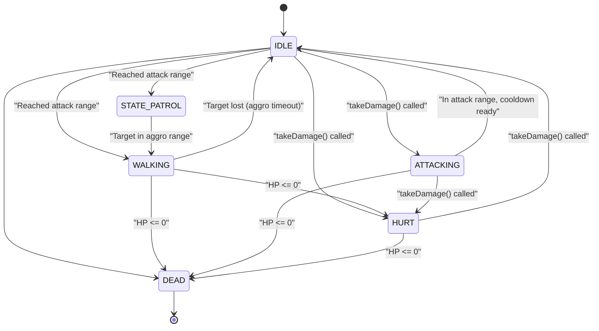
```mermaid
stateDiagram-v2
    [*] --> IDLE
    IDLE --> WALKING : "Reached attack range"
    IDLE --> STATE_PATROL : "Reached attack range"
    WALKING --> IDLE : "Target lost (aggro timeout)"
    IDLE --> ATTACKING : "takeDamage() called"
    ATTACKING --> IDLE : "In attack range, cooldown ready"
    IDLE --> HURT : "takeDamage() called"
    WALKING --> HURT : "HP <= 0"
    ATTACKING --> HURT : "takeDamage() called"
    HURT --> IDLE : "takeDamage() called"
    IDLE --> DEAD
    WALKING --> DEAD : "HP <= 0"
    ATTACKING --> DEAD : "HP <= 0"
    HURT --> DEAD : "HP <= 0"
    DEAD --> [*]
    STATE_PATROL --> WALKING : "Target in aggro range"
```

**来源：** [MonsterBase.cpp L281-L560](https://github.com/lilong555/Adventure-King/blob/60df0f40/MonsterBase.cpp#L281-L560)

### AI 配置

怪物通过多个距离参数控制行为：

| 参数 | 作用 | 配置方式 |
| --- | --- | --- |
| `_aggroRadius` | 发现/追击玩家的距离 | `setAggroRadius()` 或 `setAIConfig()` |
| `_leashRadius` | 离开出生点多远会回家 | `setLeashRadius()` 或 `setAIConfig()` |
| `_attackRange` | 触发攻击的距离 | 在 `initAttributes()` 内通过 `ATTACK_RANGE` 设置 |
| `_patrolLeft`, `_patrolRight` | 巡逻边界 | `enablePatrol()` |

**来源：** [MonsterBase.h L47-L162](https://github.com/lilong555/Adventure-King/blob/60df0f40/MonsterBase.h#L47-L162)

 [MonsterBase.cpp L418-L424](https://github.com/lilong555/Adventure-King/blob/60df0f40/MonsterBase.cpp#L418-L424)

### 更新节流（Update Throttling）

为了优化性能，怪物 AI/移动/攻击使用 **时间累积** 的方式，以低于帧率的频率更新：

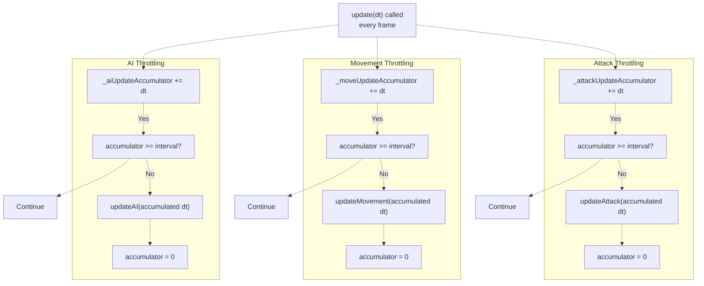
```mermaid
flowchart TD

FrameUpdate["update(dt) called<br>every frame"]
AIAccum["_aiUpdateAccumulator += dt"]
AICheck["accumulator >= interval?"]
AIUpdate["updateAI(accumulated dt)"]
AIReset["accumulator = 0"]
MoveAccum["_moveUpdateAccumulator += dt"]
MoveCheck["accumulator >= interval?"]
MoveUpdate["updateMovement(accumulated dt)"]
MoveReset["accumulator = 0"]
AttackAccum["_attackUpdateAccumulator += dt"]
AttackCheck["accumulator >= interval?"]
AttackUpdate["updateAttack(accumulated dt)"]
AttackReset["accumulator = 0"]
Next1["Continue"]
Next2["Continue"]
Next3["Continue"]

FrameUpdate -.-> AIAccum
AICheck -.-> Next1
FrameUpdate -.-> MoveAccum
MoveCheck -.-> Next2
FrameUpdate -.-> AttackAccum
AttackCheck -.-> Next3

subgraph subGraph2 ["Attack Throttling"]
    AttackAccum
    AttackCheck
    AttackUpdate
    AttackReset
    AttackAccum -.->|"Yes"| AttackCheck
    AttackCheck -.->|"No"| AttackUpdate
    AttackUpdate -.-> AttackReset
end

subgraph subGraph1 ["Movement Throttling"]
    MoveAccum
    MoveCheck
    MoveUpdate
    MoveReset
    MoveAccum -.->|"Yes"| MoveCheck
    MoveCheck -.->|"No"| MoveUpdate
    MoveUpdate -.-> MoveReset
end

subgraph subGraph0 ["AI Throttling"]
    AIAccum
    AICheck
    AIUpdate
    AIReset
    AIAccum -.->|"Yes"| AICheck
    AICheck -.->|"No"| AIUpdate
    AIUpdate -.-> AIReset
end
```

默认更新间隔：

* `_aiUpdateInterval = 0.1f`（每秒 10 次）
* `_moveUpdateInterval = 0.033f`（约每秒 30 次）
* `_attackUpdateInterval = 0.05f`（每秒 20 次）

对于 **屏幕外敌人**，AI 会切换到 `_inactiveAiUpdateInterval = 0.3f`（每秒 3.33 次）进一步降低 CPU 开销。

**来源：** [MonsterBase.cpp L152-L414](https://github.com/lilong555/Adventure-King/blob/60df0f40/MonsterBase.cpp#L152-L414)

### HP 缩放

`applyHpScalingForPlayerLevel()` 会按玩家等级调整怪物血量，以保持难度平衡：

```
baseHp = getBaseAttributes().MAX_HP
baseHp *= baseMultiplier  (BOSS_BASE_MULTIPLIER or NORMAL_BASE_MULTIPLIER)

multiplier = 1.0 + (playerLevel - 1) * perLevel
multiplier = clamp(multiplier, 1.0, maxMultiplier)

finalMaxHP = baseHp * multiplier
```

这样可避免：

* 回到前期区域时对低级怪“一刀秒”
* 高等级时 HP 无限膨胀（通过 `maxMultiplier` 上限限制）

**来源：** [MonsterBase.cpp L225-L279](https://github.com/lilong555/Adventure-King/blob/60df0f40/MonsterBase.cpp#L225-L279)

### 攻击命中框生成

怪物通过临时的 PhysicsBody 表示攻击命中框：

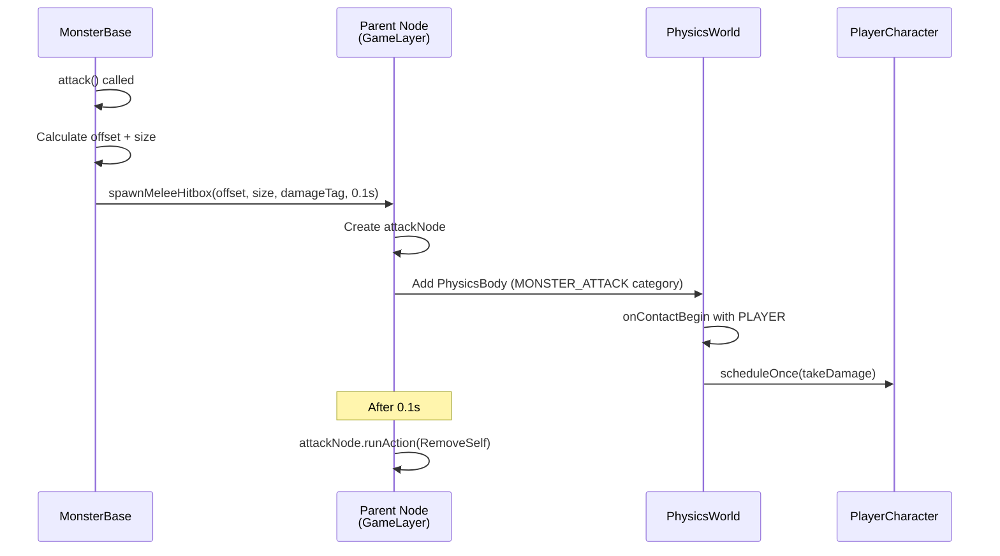
```mermaid
sequenceDiagram
  participant p1 as MonsterBase
  participant p2 as Parent Node<br/>(GameLayer)
  participant p3 as PhysicsWorld
  participant p4 as PlayerCharacter

  p1->>p1: attack() called
  p1->>p1: Calculate offset + size
  p1->>p2: spawnMeleeHitbox(offset, size, damageTag, 0.1s)
  p2->>p2: Create attackNode
  p2->>p3: Add PhysicsBody (MONSTER_ATTACK category)
  p3->>p3: onContactBegin with PLAYER
  p3->>p4: scheduleOnce(takeDamage)
  note over p2: After 0.1s
  p2->>p2: attackNode.runAction(RemoveSelf)
```

`damageTag` 会存进 `PhysicsBody::setTag()`，并由 `CombatContactHelper` 读取并施加伤害。

**来源：** [MonsterBase.cpp L986-L1028](https://github.com/lilong555/Adventure-King/blob/60df0f40/MonsterBase.cpp#L986-L1028)

 [GoblinMonster.cpp L254-L355](https://github.com/lilong555/Adventure-King/blob/60df0f40/GoblinMonster.cpp#L254-L355)

### 属性初始化模式

怪物通常遵循 **三步初始化**：

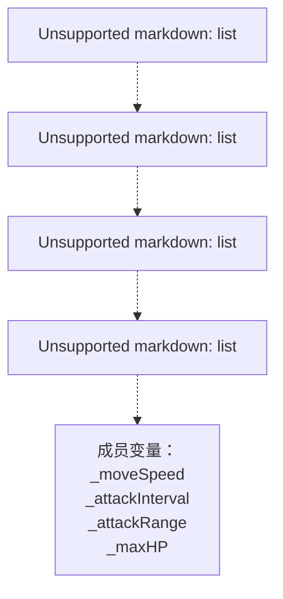
```mermaid
flowchart TD

A["Unsupported markdown: list"]
B["Unsupported markdown: list"]
C["Unsupported markdown: list"]
D["Unsupported markdown: list"]
Note["成员变量：<br>_moveSpeed<br>_attackInterval<br>_attackRange<br>_maxHP"]

A -.-> B
B -.-> C
C -.-> D
D -.-> Note
```

这保证：

* 基础属性存放在 `AttributeComponent` 中（便于支持状态效果、未来也可支持装备等）
* 缓存成员变量（`_moveSpeed` 等）避免重复查询组件
* 任意属性变化后可调用 `refreshCacheAttributes()` 重新同步缓存

**来源：** [MonsterBase.cpp L184-L221](https://github.com/lilong555/Adventure-King/blob/60df0f40/MonsterBase.cpp#L184-L221)

 [GoblinMonster.cpp L181-L208](https://github.com/lilong555/Adventure-King/blob/60df0f40/GoblinMonster.cpp#L181-L208)

---

## 具体怪物类型

### GoblinMonster：基础敌人

`GoblinMonster` 是 **最简单** 的怪物实现，用来演示最小必要的 override：

| 方法 | 目的 | 实现 |
| --- | --- | --- |
| `init()` | 设置属性、AI、动画 | 设置仇恨半径、巡逻，调用 `initAttributes()` |
| `initAttributes()` | 定义基础属性 | 从 `GameConfig::Monster::Goblin` 命名空间读取 |
| `initStateAnimations()` | 注册动画 | 将 `CharacterState` 映射到动画缓存 key |
| `attack()` | 在攻击帧生成命中框 | 计算命中时刻并调用 `spawnMeleeHitbox()` |
| `getExpReward()` | 死亡后掉落经验 | 基础值 + 按等级缩放 |

**攻击时机：** Goblin 的攻击使用 `ATTACK_HIT_FRAME_INDEX`，在攻击动画的特定帧生成命中框，从而形成“前摇”效果：

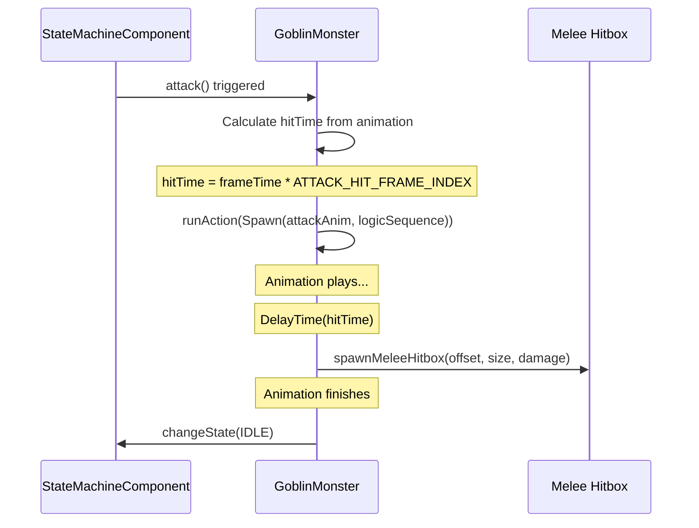
```mermaid
sequenceDiagram
  participant p1 as StateMachineComponent
  participant p2 as GoblinMonster
  participant p3 as Melee Hitbox

  p1->>p2: attack() triggered
  p2->>p2: Calculate hitTime from animation
  note over p2: hitTime = frameTime * ATTACK_HIT_FRAME_INDEX
  p2->>p2: runAction(Spawn(attackAnim, logicSequence))
  note over p2: Animation plays...
  note over p2: DelayTime(hitTime)
  p2->>p3: spawnMeleeHitbox(offset, size, damage)
  note over p2: Animation finishes
  p2->>p1: changeState(IDLE)
```

**来源：** [GoblinMonster.cpp L139-L356](https://github.com/lilong555/Adventure-King/blob/60df0f40/GoblinMonster.cpp#L139-L356)

### GobluMonster：带破防条（Break Meter）的 Boss

`GobluMonster` 在 `MonsterBase` 基础上增加 **Boss 特有机制**：

#### Break Meter 系统

Goblu 不使用传统硬直，而是使用 **破防条（break meter）**：

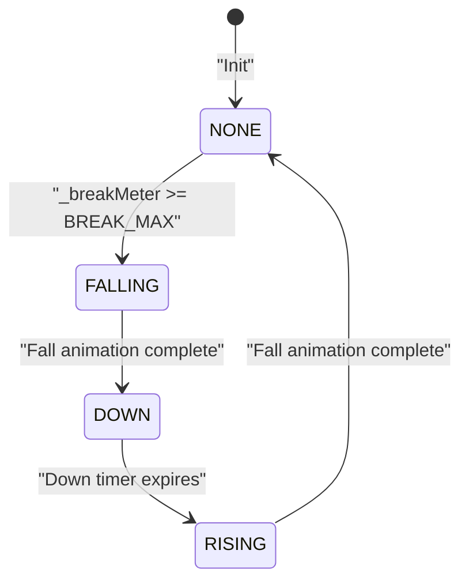
```mermaid
stateDiagram-v2
    [*] --> NONE : "Init"
    NONE --> FALLING : "_breakMeter >= BREAK_MAX"
    FALLING --> DOWN : "Fall animation complete"
    DOWN --> RISING : "Down timer expires"
    RISING --> NONE : "Fall animation complete"
```

**来源：** [GobluMonster.cpp L430-L554](https://github.com/lilong555/Adventure-King/blob/60df0f40/GobluMonster.cpp#L430-L554)

#### 双攻击模式

Goblu 会基于距离使用 **两种攻击**：

| 攻击类型 | 条件 | 命中框 | 帧范围 |
| --- | --- | --- | --- |
| 近距攻击 | 玩家距离在攻击范围的 80% 内 | 窄（0.8x 宽） | 攻击动画第 1–4 帧 |
| 远距攻击 | 玩家距离超过攻击范围的 80% | 宽（2.8x 宽，向前延伸） | 攻击动画第 5–8 帧 |

`canHitTarget(bool useNear)` 用于判定玩家是否在可触达范围内：

```
attackReachX = _attackRange (near) or _attackRange * 1.8 (far)
gapX = abs(target.worldX - self.worldX) - (selfHalfWidth + targetHalfWidth)
return gapX <= attackReachX
```

**来源：** [GobluMonster.cpp L642-L784](https://github.com/lilong555/Adventure-King/blob/60df0f40/GobluMonster.cpp#L642-L784)

#### Boss 专属覆写点

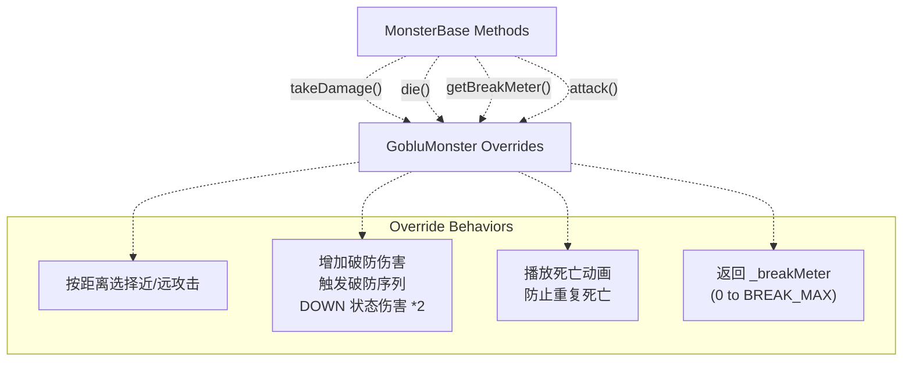
```mermaid
flowchart TD

Base["MonsterBase Methods"]
Goblu["GobluMonster Overrides"]
Attack["按距离选择近/远攻击"]
TakeDmg["增加破防伤害<br>触发破防序列<br>DOWN 状态伤害 *2"]
Die["播放死亡动画<br>防止重复死亡"]
Break["返回 _breakMeter<br>(0 to BREAK_MAX)"]

Base -.->|"takeDamage()"| Goblu
Base -.->|"die()"| Goblu
Base -.->|"getBreakMeter()"| Goblu
Base -.->|"attack()"| Goblu
Goblu -.-> Attack
Goblu -.-> TakeDmg
Goblu -.-> Die
Goblu -.-> Break

subgraph subGraph0 ["Override Behaviors"]
    Attack
    TakeDmg
    Die
    Break
end
```

**来源：** [GobluMonster.h L20-L68](https://github.com/lilong555/Adventure-King/blob/60df0f40/GobluMonster.h#L20-L68)

 [GobluMonster.cpp L642-L916](https://github.com/lilong555/Adventure-King/blob/60df0f40/GobluMonster.cpp#L642-L916)

---

## 组件集成模式

### AttributeComponent 查询

角色会频繁从 `AttributeComponent` 取属性：

```
auto attr = getAttributeComponent();
float strength = attr->getAttributeValue(AttributeType::STRENGTH);
float maxHP = attr->getAttributeValue(AttributeType::MAX_HP);
```

该组件维护：

* **基础属性**：通过 `setBaseAttributes()` 设置
* **装备加成**：由 `InventoryComponent` 装备/卸下时叠加
* **状态效果**：有持续时间的临时增益/减益
* **最终属性**：通过 `recalculateFinalAttributes()` 计算

**来源：** [PlayerCharacter.cpp L703-L1091](https://github.com/lilong555/Adventure-King/blob/60df0f40/PlayerCharacter.cpp#L703-L1091)

### SkillComponent 回调链路

当调用 `SkillComponent::useActiveSkill(slotIndex)` 时，会触发：

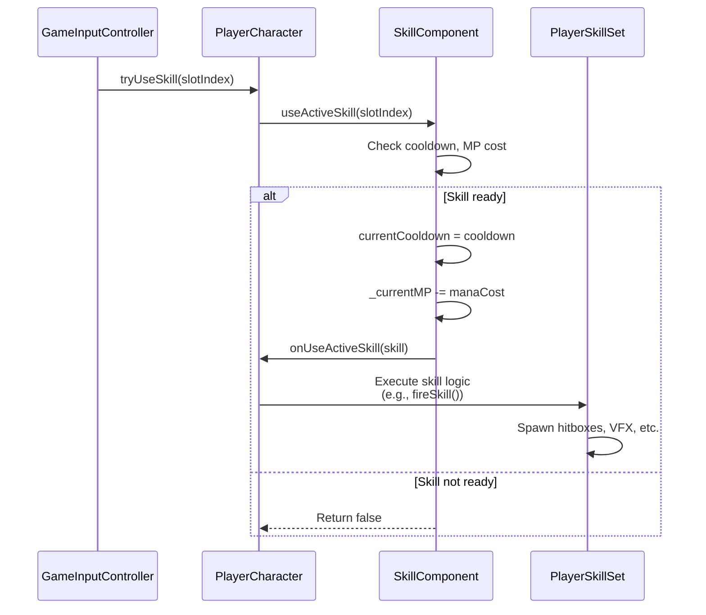
```mermaid
sequenceDiagram
  participant p1 as GameInputController
  participant p2 as PlayerCharacter
  participant p3 as SkillComponent
  participant p4 as PlayerSkillSet

  p1->>p2: tryUseSkill(slotIndex)
  p2->>p3: useActiveSkill(slotIndex)
  p3->>p3: Check cooldown, MP cost
  alt Skill ready
    p3->>p3: currentCooldown = cooldown
    p3->>p3: _currentMP -= manaCost
    p3->>p2: onUseActiveSkill(skill)
    p2->>p4: Execute skill logic<br/>(e.g., fireSkill())
    p4->>p4: Spawn hitboxes, VFX, etc.
  else Skill not ready
    p3-->>p2: Return false
  end
```

**来源：** [PlayerCharacter.cpp L1542-L1580](https://github.com/lilong555/Adventure-King/blob/60df0f40/PlayerCharacter.cpp#L1542-L1580)

 [SkillComponent L209-L212](https://github.com/lilong555/Adventure-King/blob/60df0f40/SkillComponent (referenced in PlayerCharacter.h#L209-L212)

### StateMachineComponent 状态切换

状态机负责：

* 播放各 `CharacterState` 对应的动画
* 计时动画结束后自动回到 `IDLE`（例如 `HURT`）
* 基于状态阻断输入（例如 `ATTACKING` 时禁止移动）

**来源：** [PlayerCharacter.cpp L254-L262](https://github.com/lilong555/Adventure-King/blob/60df0f40/PlayerCharacter.cpp#L254-L262)

 [MonsterBase.cpp L222-L228](https://github.com/lilong555/Adventure-King/blob/60df0f40/MonsterBase.cpp#L222-L228)

---

## 数据结构

### DamageInfo（伤害信息）

`DamageInfo` 结构体封装所有伤害相关数据：

```
struct DamageInfo {
    float amount;                 // Base damage
    float penetration = 0;        // Armor penetration
    bool isCritical = false;      // Crit flag
    float critMultiplier = 1.5f;  // Crit multiplier
    CharacterBase* attacker;      // Source (for lifesteal, counters)
    bool hasHitWorldPos = false;  // For directional VFX
    Vec2 hitWorldPos;             // Hit location
    bool causesHitStun = true;    // DOT = false
    int breakDamage = 0;          // Boss break meter
};
```

**用法要点：**

* 对 DOT 效果设置 `causesHitStun = false`，可以避免受击动画刷屏
* `breakDamage` 只对带破防机制的 Boss 生效
* `hitWorldPos` 用于决定受击特效方向（左右喷溅粒子）

**来源：** [CharacterBase.h L17-L28](https://github.com/lilong555/Adventure-King/blob/60df0f40/CharacterBase.h#L17-L28)

### Attributes（属性）

`Attributes` 是一个类型安全的映射结构，支持算术运算符：

```
Attributes base;
base.set(AttributeType::STRENGTH, 10.0f);
base.add(AttributeType::MAX_HP, 50.0f);

Attributes bonus;
bonus.set(AttributeType::STRENGTH, 5.0f);

Attributes final = base + bonus;  // Operator overload
```

**来源：** [CharacterData.h L94-L142](https://github.com/lilong555/Adventure-King/blob/60df0f40/CharacterData.h#L94-L142)

### CharacterRole 枚举

```python
enum class CharacterRole : uint8_t {
    WARRIOR,
    MAGE,
    ASSASSIN,
    TANK
};
```

用于：

* 在 `initAttributesByRole()` 决定基础属性
* 在 `createSkillSet()` 选择技能集
* 通过 `PlayerRoleConfig::getDisplayName()` 在 UI 显示职业名

**来源：** [CharacterData.h L11-L17](https://github.com/lilong555/Adventure-King/blob/60df0f40/CharacterData.h#L11-L17)

---

## 视觉反馈系统

### 伤害数字

浮动伤害数字在 `CharacterBase::showDamageNumber()` 中实现：

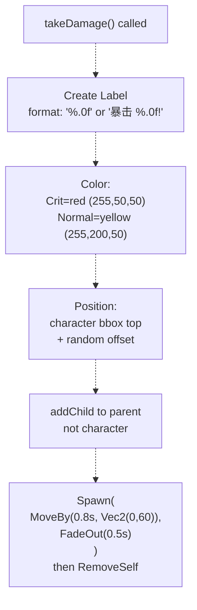
```mermaid
flowchart TD

Trigger["takeDamage() called"]
Create["Create Label<br>format: '%.0f' or '暴击 %.0f!'"]
Style["Color:<br>Crit=red (255,50,50)<br>Normal=yellow (255,200,50)"]
Position["Position:<br>character bbox top<br>+ random offset"]
Parent["addChild to parent<br>not character"]
Animate["Spawn(<br>  MoveBy(0.8s, Vec2(0,60)),<br>  FadeOut(0.5s)<br>)<br>then RemoveSelf"]

Trigger -.-> Create
Create -.-> Style
Style -.-> Position
Position -.-> Parent
Parent -.-> Animate
```

**为什么要 add 到父节点？** 如果 add 到角色自身，Label 会跟随角色移动/旋转。加到 `GameLayer` 能让它在世界坐标里稳定显示。

**来源：** [CharacterBase.cpp L378-L429](https://github.com/lilong555/Adventure-King/blob/60df0f40/CharacterBase.cpp#L378-L429)

### 受击特效（Hurt VFX）

`spawnHurtVfx()` 会生成带方向性的粒子特效：

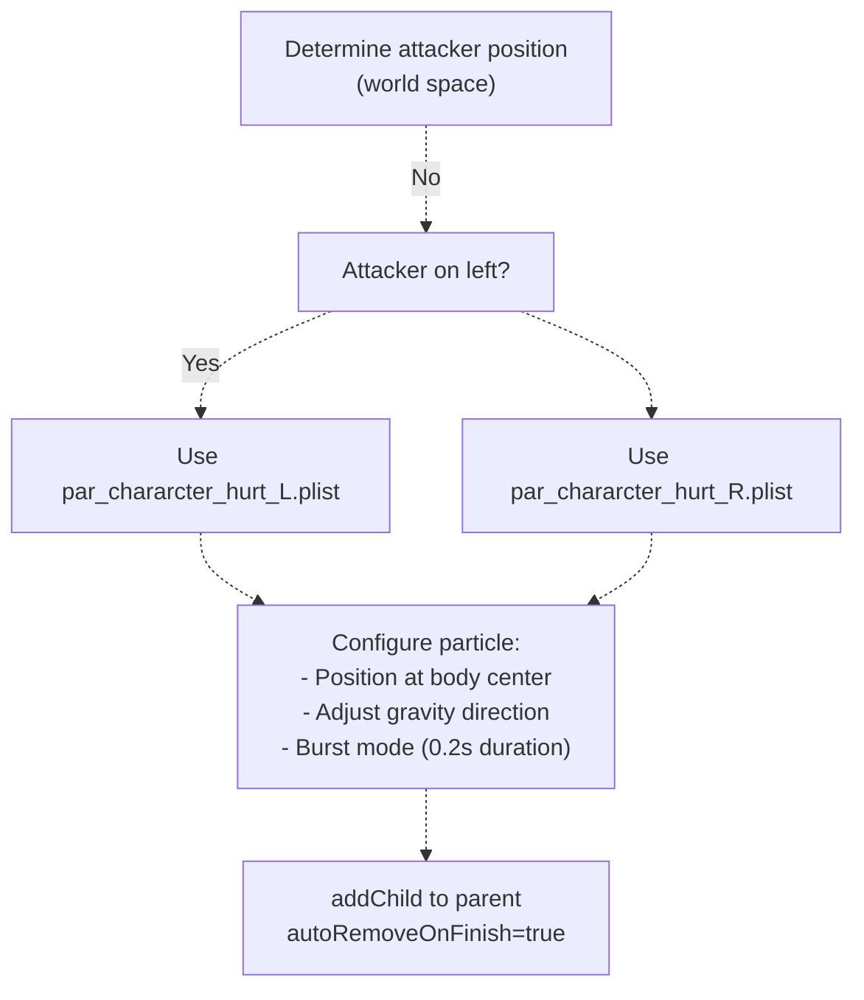
```mermaid
flowchart TD

AttackerPos["Determine attacker position<br>(world space)"]
Direction["Attacker on left?"]
Left["Use par_chararcter_hurt_L.plist"]
Right["Use par_chararcter_hurt_R.plist"]
Configure["Configure particle:<br>- Position at body center<br>- Adjust gravity direction<br>- Burst mode (0.2s duration)"]
Spawn["addChild to parent<br>autoRemoveOnFinish=true"]

AttackerPos -.->|"No"| Direction
Direction -.->|"Yes"| Left
Direction -.-> Right
Left -.-> Configure
Right -.-> Configure
Configure -.-> Spawn
```

粒子角度与重力方向会被 **强制** 修正以匹配攻击方向，确保视觉一致性，不受 `.plist` 默认值影响。

**来源：** [CharacterBase.cpp L293-L376](https://github.com/lilong555/Adventure-King/blob/60df0f40/CharacterBase.cpp#L293-L376)

### Boss 血条集成

`BossHealthBar` 通过 `recordUiNonDotDamage()` 记录“非 DOT 伤害”，用于连击显示：

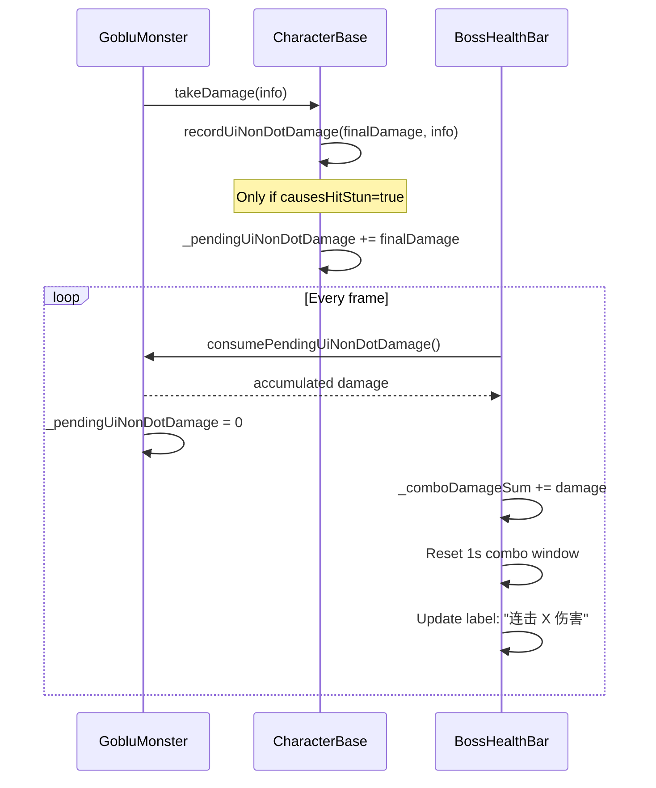
```mermaid
sequenceDiagram
  participant p1 as GobluMonster
  participant p2 as CharacterBase
  participant p3 as BossHealthBar

  p1->>p2: takeDamage(info)
  p2->>p2: recordUiNonDotDamage(finalDamage, info)
  note over p2: Only if causesHitStun=true
  p2->>p2: _pendingUiNonDotDamage += finalDamage
  loop Every frame
    p3->>p1: consumePendingUiNonDotDamage()
    p1-->>p3: accumulated damage
    p1->>p1: _pendingUiNonDotDamage = 0
    p3->>p3: _comboDamageSum += damage
    p3->>p3: Reset 1s combo window
    p3->>p3: Update label: "连击 X 伤害"
  end
```

这样可以避免 DOT 跳伤把连击计数“刷爆”，同时仍能显示真实的命中伤害。

**来源：** [CharacterBase.cpp L250-L271](https://github.com/lilong555/Adventure-King/blob/60df0f40/CharacterBase.cpp#L250-L271)

 [BossHealthBar.cpp L258-L346](https://github.com/lilong555/Adventure-King/blob/60df0f40/BossHealthBar.cpp#L258-L346)

---

## 性能注意事项

### 缓存组件访问

`PlayerCharacter` 会缓存 `InventoryComponent*`，避免反复调用 `getComponent()`：

```
// In init():
_inventoryComponent = dynamic_cast<InventoryComponent*>(getComponent("InventoryComponent"));

// Later usage:
auto inv = getInventoryComponent();  // Returns cached pointer
```

**为什么？** `getComponent()` 会对组件数组做 **线性查找**；缓存可把 O(n) 的查找降为 O(1)。

**来源：** [PlayerCharacter.cpp L236-L240](https://github.com/lilong555/Adventure-King/blob/60df0f40/PlayerCharacter.cpp#L236-L240)

### 怪物屏幕外优化

远离玩家的怪物会使用：

* 更慢的 AI 更新（`_inactiveAiUpdateInterval = 0.3f`）
* 冻结水平速度
* 跳过移动/攻击计算
* 仍保留在场景中（不裁剪），以保持状态

```javascript
bool isWithinActiveUpdateRange() const {
    if (_activeUpdateDistanceX <= 0.0f) return true;
    return horizontalDistanceTo(_primaryTarget) <= _activeUpdateDistanceX;
}
```

**来源：** [MonsterBase.cpp L346-L453](https://github.com/lilong555/Adventure-King/blob/60df0f40/MonsterBase.cpp#L346-L453)

### 动画缓存

所有动画在怪物生成前会先缓存到 `AnimationCache`：

```
// Preload:
GoblinMonster::preloadResources();  // Static method

// Later:
auto anim = AnimationCache::getInstance()->getAnimation("goblin_attack");
```

这样可以避免每个实例重复加载贴图、重复创建动画对象。

**来源：** [GoblinMonster.cpp L168-L179](https://github.com/lilong555/Adventure-King/blob/60df0f40/GoblinMonster.cpp#L168-L179)

---

## 总结

Adventure-King 的角色系统采用 **三层架构**：

1. **CharacterBase**：共享战斗/生命/组件
2. **PlayerCharacter** / **MonsterBase**：实体类型特有行为
3. **具体怪物**（Goblin、Goblu）：具体属性与攻击方式

关键设计模式：

* 基于 Cocos2d-x 组件系统的 **组件化组合**
* 基于 `GameConfig` 命名空间的 **数据驱动配置**
* 针对屏幕外敌人的 **性能节流**
* 通过 `DamageInfo` 与 hooks 实现的 **事件驱动伤害**
* **表现与逻辑分离**（伤害数字、VFX 由父节点承载）

该体系在清晰的职责划分（继承 + 组件）下，支持 Boss 破防条、职业成长、装备加成、AI 行为等复杂机制。
