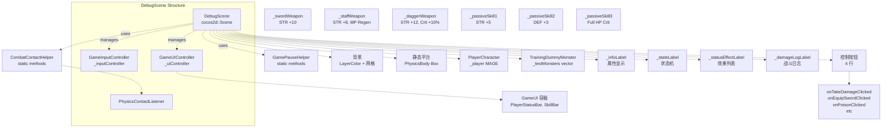
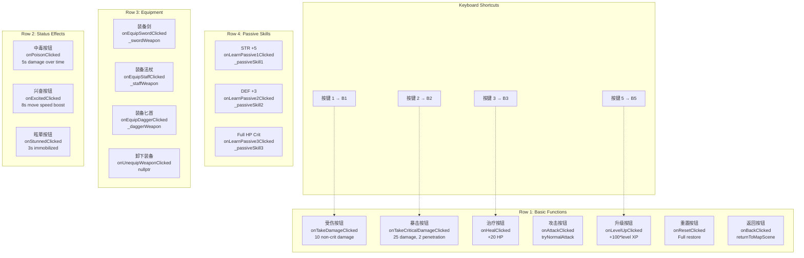
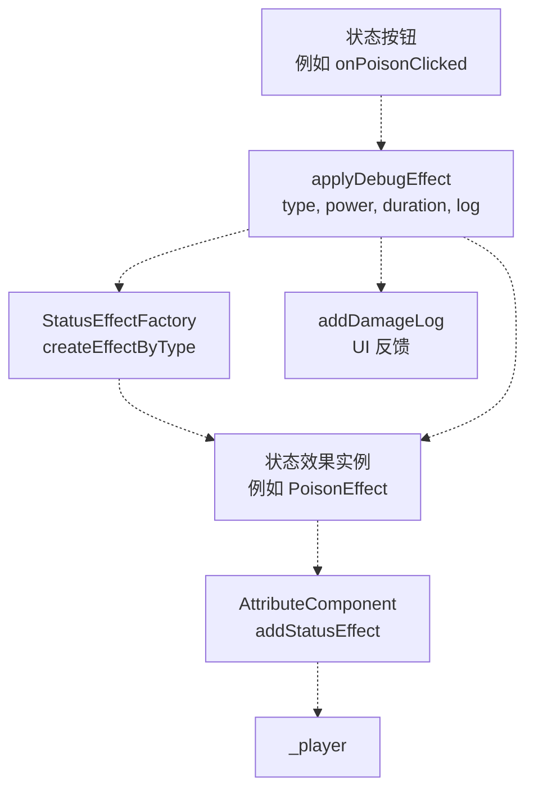
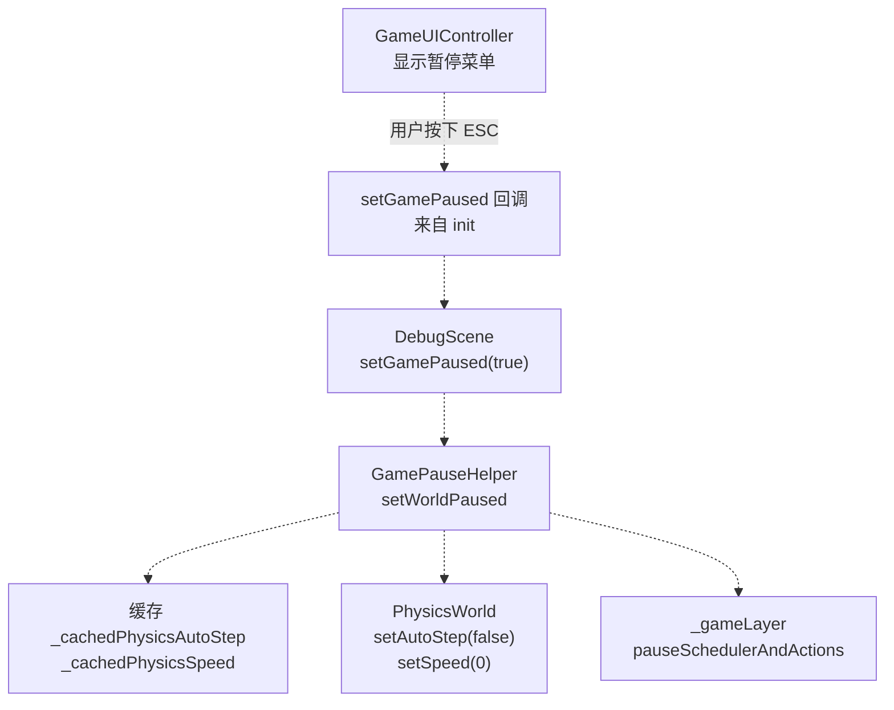

# 调试场景（DebugScene）

> **相关源文件**
> * [Adventure-King/Classes/Scenes/DebugScene.cpp](https://github.com/lilong555/Adventure-King/blob/60df0f40/Adventure-King/Classes/Scenes/DebugScene.cpp)
> * [Adventure-King/Classes/Scenes/DebugScene.h](https://github.com/lilong555/Adventure-King/blob/60df0f40/Adventure-King/Classes/Scenes/DebugScene.h)
> * [Adventure-King/Classes/Scenes/GameScene.cpp](https://github.com/lilong555/Adventure-King/blob/60df0f40/Adventure-King/Classes/Scenes/GameScene.cpp)
> * [Adventure-King/Classes/Scenes/GameScene.h](https://github.com/lilong555/Adventure-King/blob/60df0f40/Adventure-King/Classes/Scenes/GameScene.h)
> * [Adventure-King/proj.win32/Adventure-King.vcxproj](https://github.com/lilong555/Adventure-King/blob/60df0f40/Adventure-King/proj.win32/Adventure-King.vcxproj)
> * [Adventure-King/proj.win32/Adventure-King.vcxproj.filters](https://github.com/lilong555/Adventure-King/blob/60df0f40/Adventure-King/proj.win32/Adventure-King.vcxproj.filters)

## 目的与范围

`DebugScene` 是一个隔离的测试环境，用于在开发期间验证角色机制、战斗系统、装备与状态效果。它提供了一个尽量“最小化”的场景：包含物理世界、玩家角色、测试怪物与调试控制，但不引入完整关卡逻辑的复杂度。该场景不属于正常游戏流程，通常在开发者模式下从主菜单直接进入。

关于主玩法场景请参见 [GameScene](<GameScene（游戏场景）.md>)。关于场景切换与注册表系统请参见 [Scene Transitions](<场景切换.md>)。

**来源：** [Classes/Scenes/DebugScene.h L1-L16](https://github.com/lilong555/Adventure-King/blob/60df0f40/Classes/Scenes/DebugScene.h#L1-L16)

 [Classes/Scenes/DebugScene.cpp L1-L16](https://github.com/lilong555/Adventure-King/blob/60df0f40/Classes/Scenes/DebugScene.cpp#L1-L16)

---

## 概览

`DebugScene` 实现了一套完整的“测试支架”（test harness）：整体结构尽量贴近正式场景架构，同时增加调试能力。它复用 `GameScene` 的核心系统（`GameInputController`、`GameUIController`、`CombatContactHelper`）以保证功能一致性；同时提供额外的 UI 按钮与快捷键，便于快速迭代战斗机制、装备效果与状态系统。

### 关键特性

| 方面 | 实现 |
| --- | --- |
| **继承关系** | 直接继承 `cocos2d::Scene`（并非 `GameScene`） |
| **物理** | 通过 `Scene::initWithPhysics()` 创建完整物理世界，含重力与平台 |
| **玩家创建** | 默认职业为 `MAGE`（Klee 贴图）[Classes/Scenes/DebugScene.cpp L306](https://github.com/lilong555/Adventure-King/blob/60df0f40/Classes/Scenes/DebugScene.cpp#L306-L306) |
| **测试目标** | `TrainingDummyMonster`（21 亿 HP），便于长时间压测 [Classes/Scenes/DebugScene.cpp L403-L411](https://github.com/lilong555/Adventure-King/blob/60df0f40/Classes/Scenes/DebugScene.cpp#L403-L411) |
| **世界暂停** | 与 `GameScene` 一样使用 `GamePauseHelper::setWorldPaused()` [Classes/Scenes/DebugScene.cpp L753](https://github.com/lilong555/Adventure-King/blob/60df0f40/Classes/Scenes/DebugScene.cpp#L753-L753) |
| **场景注册** | 注册为 `SceneID::DEBUG`，只做最小化的资源预加载 [Classes/Scenes/DebugScene.cpp L63-L75](https://github.com/lilong555/Adventure-King/blob/60df0f40/Classes/Scenes/DebugScene.cpp#L63-L75) |

**来源：** [Classes/Scenes/DebugScene.h L38-L78](https://github.com/lilong555/Adventure-King/blob/60df0f40/Classes/Scenes/DebugScene.h#L38-L78)

 [Classes/Scenes/DebugScene.cpp L54-L144](https://github.com/lilong555/Adventure-King/blob/60df0f40/Classes/Scenes/DebugScene.cpp#L54-L144)

---

## 架构与组件图



**DebugScene 初始化流程**：该顺序用于确保每个组件的依赖都已就绪。必须先初始化物理世界，才能创建任何 `PhysicsBody`。必须先创建玩家对象，输入/UI 控制器才能绑定到玩家。

**来源：** [Classes/Scenes/DebugScene.cpp L90-L144](https://github.com/lilong555/Adventure-King/blob/60df0f40/Classes/Scenes/DebugScene.cpp#L90-L144)

> 说明：原文在该图后半段出现生成器截断并混入其它 Mermaid 语法段落，会导致渲染报错；已清理为可渲染版本。

 [Classes/Scenes/DebugScene.cpp L169-L385](https://github.com/lilong555/Adventure-King/blob/60df0f40/Classes/Scenes/DebugScene.cpp#L169-L385)

### 初始化方法

| 方法 | 目的 | 关键动作 |
| --- | --- | --- |
| `initBackground()` | 创建视觉背景 | `LayerColor(40,40,50)`，50px 网格线用于对齐定位 [Classes/Scenes/DebugScene.cpp L169-L201](https://github.com/lilong555/Adventure-King/blob/60df0f40/Classes/Scenes/DebugScene.cpp#L169-L201) |
| `initPlatforms()` | 创建静态碰撞几何体 | 地面平台在 `GROUND_Y=150`，`PhysicsMaterial(1.0, 0.0, 0.8)` [Classes/Scenes/DebugScene.cpp L217-L282](https://github.com/lilong555/Adventure-King/blob/60df0f40/Classes/Scenes/DebugScene.cpp#L217-L282) |
| `initPlayer()` | 创建玩家角色 | `PlayerCharacter::create(MAGE)`，自定义碰撞盒，位置为地面 + 半个高度 [Classes/Scenes/DebugScene.cpp L295-L385](https://github.com/lilong555/Adventure-King/blob/60df0f40/Classes/Scenes/DebugScene.cpp#L295-L385) |
| `initGameUIController()` | 初始化正式 UI | 使用回调初始化 `GameUIController::init()`，返回 `MapScene` [Classes/Scenes/DebugScene.cpp L607-L706](https://github.com/lilong555/Adventure-King/blob/60df0f40/Classes/Scenes/DebugScene.cpp#L607-L706) |
| `initInputController()` | 初始化键盘输入 | `GameInputController`：绑定玩家、暂停切换，但不处理闸门交互 [Classes/Scenes/DebugScene.cpp L708-L720](https://github.com/lilong555/Adventure-King/blob/60df0f40/Classes/Scenes/DebugScene.cpp#L708-L720) |
| `initEquipments()` | 创建测试武器 | 创建 `Weapon` 实例，写死属性（STR、暴击率、MP 回复等）[Classes/Scenes/DebugScene.cpp L1343-L1387](https://github.com/lilong555/Adventure-King/blob/60df0f40/Classes/Scenes/DebugScene.cpp#L1343-L1387) |
| `initPassiveSkills()` | 创建测试被动 | 创建 `PassiveSkill` 实例，提供属性加成 [Classes/Scenes/DebugScene.cpp L1389-L1446](https://github.com/lilong555/Adventure-King/blob/60df0f40/Classes/Scenes/DebugScene.cpp#L1389-L1446) |
| `initTestMonsters()` | 生成训练假人 | 在屏幕宽度 75% 处创建 `TrainingDummyMonster::create()` [Classes/Scenes/DebugScene.cpp L387-L412](https://github.com/lilong555/Adventure-King/blob/60df0f40/Classes/Scenes/DebugScene.cpp#L387-L412) |
| `initDebugUI()` | 创建信息标签 | `_infoLabel`、`_stateLabel`、`_statusEffectLabel`、`_damageLogLabel` [Classes/Scenes/DebugScene.cpp L424-L484](https://github.com/lilong555/Adventure-King/blob/60df0f40/Classes/Scenes/DebugScene.cpp#L424-L484) |
| `initControlButtons()` | 创建按钮网格 | 4 行：基础、状态、装备、被动 [Classes/Scenes/DebugScene.cpp L497-L605](https://github.com/lilong555/Adventure-King/blob/60df0f40/Classes/Scenes/DebugScene.cpp#L497-L605) |

**来源：** [Classes/Scenes/DebugScene.cpp L169-L605](https://github.com/lilong555/Adventure-King/blob/60df0f40/Classes/Scenes/DebugScene.cpp#L169-L605)

---

## 调试功能

`DebugScene` 提供了一套比较完整的测试控制，按四个类别组织，同时支持 UI 按钮与键盘快捷键。

### 调试控制布局



**调试控制的组织方式**：四行按钮分别映射到不同的测试功能。第 1 行（基础）与第 2 行（状态）支持键盘快捷键，便于快速测试。所有回调都会修改 `_player` 的状态，并把结果写入 `_damageLogLabel`。

**来源：** [Classes/Scenes/DebugScene.cpp L497-L605](https://github.com/lilong555/Adventure-King/blob/60df0f40/Classes/Scenes/DebugScene.cpp#L497-L605)

 [Classes/Scenes/DebugScene.h L150-L168](https://github.com/lilong555/Adventure-King/blob/60df0f40/Classes/Scenes/DebugScene.h#L150-L168)

### 测试装备规格

该场景创建三把测试武器，属性配置各不相同，用于验证装备效果与属性计算。

| 武器 | 代码符号 | 属性 | 特殊说明 |
| --- | --- | --- | --- |
| **Sword（剑）** | `_swordWeapon` | STR +10 | 基础近战武器 [Classes/Scenes/DebugScene.cpp L1354-L1362](https://github.com/lilong555/Adventure-King/blob/60df0f40/Classes/Scenes/DebugScene.cpp#L1354-L1362) |
| **Staff（法杖）** | `_staffWeapon` | STR +8, MP Regen +5/sec | 法师武器，偏资源续航 [Classes/Scenes/DebugScene.cpp L1365-L1374](https://github.com/lilong555/Adventure-King/blob/60df0f40/Classes/Scenes/DebugScene.cpp#L1365-L1374) |
| **Dagger（匕首）** | `_daggerWeapon` | STR +12, Crit +10% | 高伤害、高暴击 [Classes/Scenes/DebugScene.cpp L1377-L1386](https://github.com/lilong555/Adventure-King/blob/60df0f40/Classes/Scenes/DebugScene.cpp#L1377-L1386) |

装备变化会触发 `onEquipmentChanged()` 回调，用于更新 `_equipmentLabel`，展示当前武器属性 [Classes/Scenes/DebugScene.cpp L1448-L1489](https://github.com/lilong555/Adventure-King/blob/60df0f40/Classes/Scenes/DebugScene.cpp#L1448-L1489)

**来源：** [Classes/Scenes/DebugScene.cpp L1343-L1489](https://github.com/lilong555/Adventure-King/blob/60df0f40/Classes/Scenes/DebugScene.cpp#L1343-L1489)

### 状态效果测试

状态效果通过辅助函数 `applyDebugEffect()` 施加；该函数使用 `StatusEffectFactory`，按配置的持续时间与强度创建对应的效果实例。



**状态效果施加流程**：统一的 helper 用于减少重复代码；工厂模式保证每种效果类型（Poison、Excited、Stunned 等）都能创建到正确的子类实现。

**来源：** [Classes/Scenes/DebugScene.cpp L1192-L1243](https://github.com/lilong555/Adventure-King/blob/60df0f40/Classes/Scenes/DebugScene.cpp#L1192-L1243)

---

## 输入处理

`DebugScene` 与正式场景复用同一个 `GameInputController`，以保证输入行为与真实玩法一致。额外的调试快捷键在 `onKeyPressed()` 中单独处理。

### 输入架构

| 输入类型 | 处理者 | 用途 |
| --- | --- | --- |
| **移动/战斗** | `GameInputController::onKeyPressed()` | WASD、Space、Shift；J/K/Q/E/R/F 用于技能 [Classes/Scenes/DebugScene.cpp L1269-L1271](https://github.com/lilong555/Adventure-King/blob/60df0f40/Classes/Scenes/DebugScene.cpp#L1269-L1271) |
| **暂停菜单** | `GameInputController` → `togglePauseMenu()` 回调 | ESC 打开 `GameUIController` 的暂停菜单 [Classes/Scenes/DebugScene.cpp L712-L713](https://github.com/lilong555/Adventure-King/blob/60df0f40/Classes/Scenes/DebugScene.cpp#L712-L713) |
| **调试快捷键** | `DebugScene::onKeyPressed()` 直接处理 | 1/2/3/5 用于伤害/治疗/等级测试 [Classes/Scenes/DebugScene.cpp L1279-L1294](https://github.com/lilong555/Adventure-King/blob/60df0f40/Classes/Scenes/DebugScene.cpp#L1279-L1294) |

当处于暂停状态（`_isPaused == true`）时，调试快捷键会被阻止；但 `GameInputController` 仍会处理 ESC/暂停相关指令 [Classes/Scenes/DebugScene.cpp L1274-L1277](https://github.com/lilong555/Adventure-King/blob/60df0f40/Classes/Scenes/DebugScene.cpp#L1274-L1277)

**来源：** [Classes/Scenes/DebugScene.cpp L1265-L1323](https://github.com/lilong555/Adventure-King/blob/60df0f40/Classes/Scenes/DebugScene.cpp#L1265-L1323)

 [Classes/Scenes/DebugScene.cpp L708-L720](https://github.com/lilong555/Adventure-King/blob/60df0f40/Classes/Scenes/DebugScene.cpp#L7…3420 chars truncated…ax 10 lines) 并显示在 `_damageLogLabel` 中。`addDamageLog()` 同时也会注册到 `PlayerCharacter` 的回调上 [Classes/Scenes/DebugScene.cpp L379-L382](https://github.com/lilong555/Adventure-King/blob/60df0f40/Classes/Scenes/DebugScene.cpp#L379-L382)

因此角色内部事件（例如装备效果触发）也会被自动记录。

```xml
// Callback registration in initPlayer()
_player->setDamageLogCallback(<FileRef file-url="https://github.com/lilong555/Adventure-King/blob/60df0f40/this" undefined  file-path="this">Hii</FileRef> {
    this->addDamageLog(log);
});
```

**来源：** [Classes/Scenes/DebugScene.cpp L1491-L1511](https://github.com/lilong555/Adventure-King/blob/60df0f40/Classes/Scenes/DebugScene.cpp#L1491-L1511)

 [Classes/Scenes/DebugScene.cpp L379-L382](https://github.com/lilong555/Adventure-King/blob/60df0f40/Classes/Scenes/DebugScene.cpp#L379-L382)

---

## 物理与战斗集成

`DebugScene` 与 `GameScene` 使用相同的物理碰撞处理逻辑：把处理委托给 `CombatContactHelper` 的静态方法。

### 物理接触处理

| 方法 | 目的 | 委托给 |
| --- | --- | --- |
| `initPhysicsContactListener()` | 设置碰撞回调 | [Classes/Scenes/DebugScene.cpp L1325-L1341](https://github.com/lilong555/Adventure-King/blob/60df0f40/Classes/Scenes/DebugScene.cpp#L1325-L1341) |
| `onContactBegin()` | 处理攻击命中框 | `CombatContactHelper::handleContactBegin()` [Classes/Scenes/DebugScene.cpp L1513-L1516](https://github.com/lilong555/Adventure-King/blob/60df0f40/Classes/Scenes/DebugScene.cpp#L1513-L1516) |
| `onContactSeparate()` | 处理地面接触/离开 | `CombatContactHelper::handleContactSeparate()` [Classes/Scenes/DebugScene.cpp L1518-L1521](https://github.com/lilong555/Adventure-King/blob/60df0f40/Classes/Scenes/DebugScene.cpp#L1518-L1521) |

该架构确保：技能命中框、伤害计算与地面检测的行为与正式玩法保持一致。也因此，`DebugScene` 中发现的问题通常能直接反映 `GameScene` 的真实问题。

**来源：** [Classes/Scenes/DebugScene.cpp L1325-L1341](https://github.com/lilong555/Adventure-King/blob/60df0f40/Classes/Scenes/DebugScene.cpp#L1325-L1341)

 [Classes/Scenes/DebugScene.cpp L1513-L1521](https://github.com/lilong555/Adventure-King/blob/60df0f40/Classes/Scenes/DebugScene.cpp#L1513-L1521)

---

## 场景注册表集成

`DebugScene::setupRegistry()` 会把该场景注册到 `SceneRegistry`，以便 `LoadingScene` 能发现并加载。因为调试资产通常是按需懒加载的，所以这里采用最小化资源预加载。

```markdown
// Classes/Scenes/DebugScene.cpp:63-75
void DebugScene::setupRegistry()
{
    SceneInfo info;
    info.creator = []() { return DebugScene::createScene(); };
    info.sceneName = "调试场景";
    info.imagePaths = {}; // 调试场景最小预加载
    
    SceneRegistry::getInstance()->registerScene(SceneID::DEBUG, info);
}
```

该方法应在应用启动时调用一次（通常在 `AppDelegate` 中），并且需要发生任何场景切换之前完成注册。

**来源：** [Classes/Scenes/DebugScene.cpp L63-L75](https://github.com/lilong555/Adventure-King/blob/60df0f40/Classes/Scenes/DebugScene.cpp#L63-L75)

---

## 与 GameScene 的主要差异

尽管 `DebugScene` 复用了不少 `GameScene` 的组件，但它们在架构上仍存在若干关键差异：

| 方面 | DebugScene | GameScene |
| --- | --- | --- |
| **基类** | 直接继承 `cocos2d::Scene` | 直接继承 `cocos2d::Scene`（与 DebugScene 为同级，不是父子） |
| **关卡加载** | 不加载 TMX，手动创建平台 | 使用 `LevelMap` 解析 TMX [Classes/Scenes/GameScene.cpp L391-L423](https://github.com/lilong555/Adventure-King/blob/60df0f40/Classes/Scenes/GameScene.cpp#L391-L423) |
| **敌人生成** | 手动创建测试怪物 | `LevelMap::updateEnemySpawns()` 距离触发系统 |
| **存档系统** | 不支持（返回 false） | 完整集成 `SaveManager` [Classes/Scenes/GameScene.cpp L937-L973](https://github.com/lilong555/Adventure-King/blob/60df0f40/Classes/Scenes/GameScene.cpp#L937-L973) |
| **死亡处理** | 3 秒后自动重置 | `GameUIController` 显示死亡菜单 |
| **摄像机** | 静态（不跟随） | 对玩家使用 `Follow` action [Classes/Scenes/GameScene.cpp L648-L664](https://github.com/lilong555/Adventure-King/blob/60df0f40/Classes/Scenes/GameScene.cpp#L648-L664) |

**来源：** [Classes/Scenes/DebugScene.cpp L618-L629](https://github.com/lilong555/Adventure-King/blob/60df0f40/Classes/Scenes/DebugScene.cpp#L618-L629)

 [Classes/Scenes/GameScene.cpp L391-L423](https://github.com/lilong555/Adventure-King/blob/60df0f40/Classes/Scenes/GameScene.cpp#L391-L423)

 [Classes/Scenes/GameScene.cpp L648-L664](https://github.com/lilong555/Adventure-King/blob/60df0f40/Classes/Scenes/GameScene.cpp#L648-L664)

---

## 暂停系统实现

`DebugScene` 使用 `GamePauseHelper::setWorldPaused()` 冻结游戏层，同时保持 UI 可交互，行为与 `GameScene` 一致。



**暂停系统流程**：暂停时物理会停止、`_gameLayer` 的 action/调度会冻结，但 UI 仍持续更新。这样就能在游戏世界冻结的情况下，继续操作背包、技能树与调试按钮。

**来源：** [Classes/Scenes/DebugScene.cpp L745-L754](https://github.com/lilong555/Adventure-King/blob/60df0f40/Classes/Scenes/DebugScene.cpp#L745-L754)

 [Classes/Scenes/DebugScene.cpp L772-L850](https://github.com/lilong555/Adventure-King/blob/60df0f40/Classes/Scenes/DebugScene.cpp#L772-L850)

---

## 使用工作流

在 `DebugScene` 中，典型的开发者使用流程如下：

1. **启动场景：** 在 `HelloWorldScene`（dev mode）中选择调试选项，或通过注册表加载 `SceneID::DEBUG`
2. **测试战斗：** 用键盘移动/攻击，观察伤害数字与动画
3. **验证装备：** 点击装备按钮，查看 `_infoLabel` 是否体现属性变化
4. **施加状态效果：** 点击状态按钮，观察 `_statusEffectLabel` 与角色行为变化
5. **测试技能：** 使用 E/K/Q/R 等按键测试 `SkillComponent` 的主动技能
6. **查看日志：** 从 `_damageLogLabel` 回看战斗事件顺序
7. **快速迭代：** 使用快捷键（1/2/3/5）快速进行伤害/治疗/升级测试
8. **暂停检查：** 按 ESC 打开背包/技能树（此时游戏世界冻结）
9. **重置再测：** 点击 Reset 按钮，或在死亡后等待 3 秒自动重置

该流程让开发者无需承担关卡加载、敌人 AI、存取档系统的开销，也能快速迭代与验证战斗相关内容。

**来源：** [Classes/Scenes/DebugScene.h L70-L77](https://github.com/lilong555/Adventure-King/blob/60df0f40/Classes/Scenes/DebugScene.h#L70-L77)

 [Classes/Scenes/DebugScene.cpp L497-L605](https://github.com/lilong555/Adventure-King/blob/60df0f40/Classes/Scenes/DebugScene.cpp#L497-L605)
