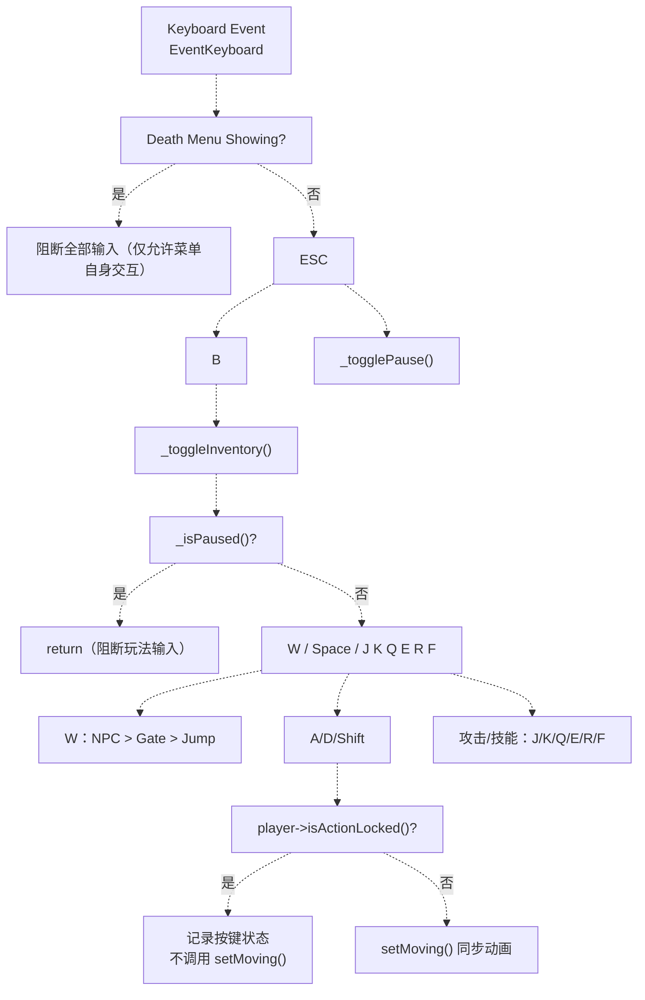
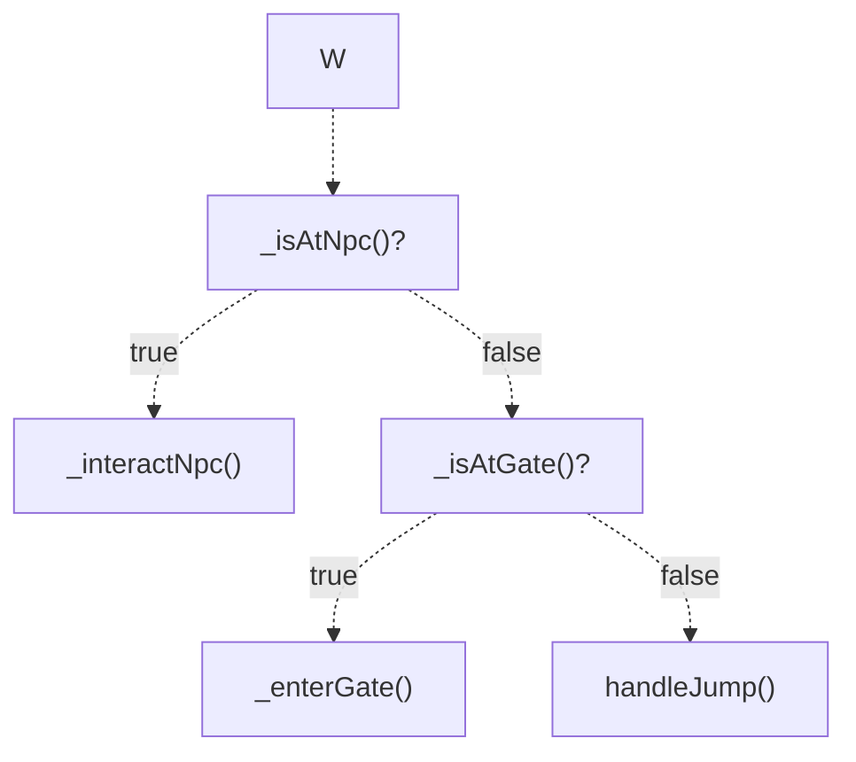

# 输入优先级与上下文

> **相关源文件**
> * [Adventure-King/Classes/Configs/GameSceneConfig.h](https://github.com/lilong555/Adventure-King/blob/60df0f40/Adventure-King/Classes/Configs/GameSceneConfig.h)
> * [Adventure-King/Classes/GameUI.cpp](https://github.com/lilong555/Adventure-King/blob/60df0f40/Adventure-King/Classes/GameUI.cpp)
> * [Adventure-King/Classes/GameUI.h](https://github.com/lilong555/Adventure-King/blob/60df0f40/Adventure-King/Classes/GameUI.h)
> * [Adventure-King/Classes/Scenes/GameInputController.cpp](https://github.com/lilong555/Adventure-King/blob/60df0f40/Adventure-King/Classes/Scenes/GameInputController.cpp)
> * [Adventure-King/Classes/Scenes/GameInputController.h](https://github.com/lilong555/Adventure-King/blob/60df0f40/Adventure-King/Classes/Scenes/GameInputController.h)
> * [Adventure-King/Classes/Scenes/GameUIController.cpp](https://github.com/lilong555/Adventure-King/blob/60df0f40/Adventure-King/Classes/Scenes/GameUIController.cpp)
> * [Adventure-King/Classes/Scenes/GameUIController.h](https://github.com/lilong555/Adventure-King/blob/60df0f40/Adventure-King/Classes/Scenes/GameUIController.h)
> * [Adventure-King/Resources/Scene/UI/bag.png](https://github.com/lilong555/Adventure-King/blob/60df0f40/Adventure-King/Resources/Scene/UI/bag.png)
> * [Adventure-King/Resources/Scene/UI/bagSelected.png](https://github.com/lilong555/Adventure-King/blob/60df0f40/Adventure-King/Resources/Scene/UI/bagSelected.png)

## 目的与范围

本文说明 Adventure-King 的输入优先级体系与上下文敏感输入处理：同一个按键会在不同 UI/游戏状态下执行不同语义，并且高优先级 UI 会阻断低优先级的玩法输入，避免 UI 叠层与状态错乱。

系统主要由两部分协作完成：

* `GameInputController`：处理键盘事件并驱动玩家移动/跳跃/攻击/技能（ESC/B 等 UI 快捷键也在这里先行分流）
* `GameUIController`：管理 UI 状态（暂停/背包/死亡/赐福）并提供“当前是否暂停/是否显示死亡菜单”等上下文信息

相关内容：UI 状态机请参见 [UI 状态管理](<UI 状态管理.md>)，具体按键到动作映射请参见 [游戏输入控制器（GameInputController）](<游戏输入控制器（GameInputController）.md>) 与 [游戏 UI 控制器（GameUIController）](<游戏 UI 控制器（GameUIController）.md>)。

---

## 输入优先级层级

系统采用“从高到低逐层判定”的优先级模型：越靠前的状态越先被检查，一旦命中就会短路返回，后续输入不会再下发到更低层。



**来源：** [Adventure-King/Classes/Scenes/GameInputController.cpp L24-L137](https://github.com/lilong555/Adventure-King/blob/60df0f40/Adventure-King/Classes/Scenes/GameInputController.cpp#L24-L137)

 [Adventure-King/Classes/Scenes/GameUIController.cpp L401-L532](https://github.com/lilong555/Adventure-King/blob/60df0f40/Adventure-King/Classes/Scenes/GameUIController.cpp#L401-L532)

---

## 优先级规则表

| 优先级 | 条件/状态 | 主要影响 | 代码落点 |
| --- | --- | --- | --- |
| 1 | 死亡菜单显示 | 阻断一切 ESC/B 行为与玩法输入 | `GameUIController::togglePauseMenu()` / `toggleInventory()` 先判 `isDeathMenuShowing()` |
| 2 | UI 快捷键（ESC/B） | 无论是否暂停，优先处理（用于“暂停/背包”的开关语义） | `GameInputController::onKeyPressed()` 前置分支 |
| 3 | 暂停状态 | 阻断玩法输入（移动/跳跃/战斗）；但不阻断 ESC/B | `if (_isPaused && _isPaused()) return;` |
| 4 | 上下文按键 | `W` 按键按“NPC > Gate > Jump”的优先级路由 | `case KEY_W:` |
| 5 | 动作锁 | 攻击/技能动画期间不更新移动动画；输入状态仍会被记录 | `if (!_player->isActionLocked()) setMoving(...)` |
| 6 | 正常玩法 | 处理移动/跳跃/攻击/技能 | `switch (keyCode)` 其它分支 |

---

## 上下文敏感输入

### W 键：NPC > 传送门 > 跳跃

`W` 的语义会根据玩家所处位置变化：优先触发 NPC 交互，其次进入传送门，最后才执行默认跳跃。



**来源：** [Adventure-King/Classes/Scenes/GameInputController.cpp L81-L101](https://github.com/lilong555/Adventure-King/blob/60df0f40/Adventure-King/Classes/Scenes/GameInputController.cpp#L81-L101)

### ESC：暂停/返回语义（由 UIController 决定）

ESC 的语义更像“返回/关闭/暂停键”而非单纯 toggle：背包打开时先关背包并进入暂停；赐福 UI 打开时先关闭赐福并恢复；否则在“暂停菜单 ↔ 正常玩法”之间切换。

**来源：** [Adventure-King/Classes/Scenes/GameUIController.cpp L401-L445](https://github.com/lilong555/Adventure-King/blob/60df0f40/Adventure-King/Classes/Scenes/GameUIController.cpp#L401-L445)

### B：背包开关与返回上下文

`toggleInventory()` 会记录 `_inventoryReturnToPauseOnClose`：从暂停菜单进入背包则关闭后回到暂停；从正常玩法进入背包则关闭后回到玩法。

**来源：** [Adventure-King/Classes/Scenes/GameUIController.cpp L447-L507](https://github.com/lilong555/Adventure-King/blob/60df0f40/Adventure-King/Classes/Scenes/GameUIController.cpp#L447-L507)

---

## 动作锁与动画同步

### 动作锁的输入处理

移动键（A/D/Shift）会始终更新“按键状态”，但只有在 `!player->isActionLocked()` 时才会调用 `player->setMoving(...)` 更新移动动画。攻击/技能则通过回调在动画结束后执行一次“动画对齐”：

```cpp
case EventKeyboard::KeyCode::KEY_J:
    _player->tryNormalAttack([this]() { resumeMoveAnimationIfIdle(); });
    break;
```

**来源：** [Adventure-King/Classes/Scenes/GameInputController.cpp L52-L132](https://github.com/lilong555/Adventure-King/blob/60df0f40/Adventure-King/Classes/Scenes/GameInputController.cpp#L52-L132)

### 逐帧对齐：避免“人在跑但播放 idle”

受击结束后状态机可能回到 IDLE，但玩家仍按住移动键，此时不会再次触发 `onKeyPressed()`；因此在 `update(dt)` 里会持续用当前输入状态对齐移动动画（避开 HURT/DEAD）。

**来源：** [Adventure-King/Classes/Scenes/GameInputController.cpp L175-L229](https://github.com/lilong555/Adventure-King/blob/60df0f40/Adventure-King/Classes/Scenes/GameInputController.cpp#L175-L229)

---

## 回调注册：GameScene 作为中介

`GameScene` 在初始化时把“UI 状态切换”“暂停状态查询”“传送门判定/进入”等回调注入到 `GameInputController`，从而让 Input/UI 两个控制器保持职责分离。

```cpp
_inputController->setPauseToggle([this]() { togglePauseMenu(); });
_inputController->setInventoryToggle([this]()
                                     {
                                         if (_uiController)
                                         {
                                             _uiController->toggleInventory();
                                         }
                                     });
_inputController->setIsPausedGetter([this]() { return _isPaused; });
_inputController->setGateQuery([this]()
                               {
                                   return _levelMap && _player && _levelMap->isPointAtGate(_player->getPosition());
                               });
_inputController->setGateEnter([this]() { returnToMapScene(); });
```

**来源：** [Adventure-King/Classes/Scenes/GameScene.cpp L537-L558](https://github.com/lilong555/Adventure-King/blob/60df0f40/Adventure-King/Classes/Scenes/GameScene.cpp#L537-L558)

---

## 总结

输入系统通过“优先级短路 + 上下文路由 + 动作锁同步”实现稳定一致的按键语义：死亡/模态 UI 永远优先；ESC/B 永远可用；玩法输入只在未暂停时进入，且 `W` 会根据 NPC/传送门上下文切换语义。
