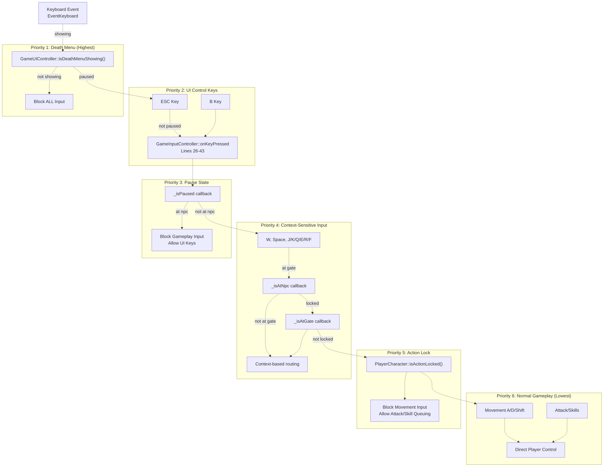

# Input Priority and Context（输入优先级与上下文）

> **相关源文件**
> * [Adventure-King/Classes/Configs/GameSceneConfig.h](https://github.com/lilong555/Adventure-King/blob/60df0f40/Adventure-King/Classes/Configs/GameSceneConfig.h)
> * [Adventure-King/Classes/GameUI.cpp](https://github.com/lilong555/Adventure-King/blob/60df0f40/Adventure-King/Classes/GameUI.cpp)
> * [Adventure-King/Classes/GameUI.h](https://github.com/lilong555/Adventure-King/blob/60df0f40/Adventure-King/Classes/GameUI.h)
> * [Adventure-King/Classes/Scenes/GameInputController.cpp](https://github.com/lilong555/Adventure-King/blob/60df0f40/Adventure-King/Classes/Scenes/GameInputController.cpp)
> * [Adventure-King/Classes/Scenes/GameInputController.h](https://github.com/lilong555/Adventure-King/blob/60df0f40/Adventure-King/Classes/Scenes/GameInputController.h)
> * [Adventure-King/Classes/Scenes/GameUIController.cpp](https://github.com/lilong555/Adventure-King/blob/60df0f40/Adventure-King/Classes/Scenes/GameUIController.cpp)
> * [Adventure-King/Classes/Scenes/GameUIController.h](https://github.com/lilong555/Adventure-King/blob/60df0f40/Adventure-King/Classes/Scenes/GameUIController.h)
> * [Adventure-King/Resources/Scene/UI/bag.png](https://github.com/lilong555/Adventure-King/blob/60df0f40/Adventure-King/Resources/Scene/UI/bag.png)
> * [Adventure-King/Resources/Scene/UI/bagSelected.png](https://github.com/lilong555/Adventure-King/blob/60df0f40/Adventure-King/Resources/Scene/UI/bagSelected.png)

## 目的与范围

本文解释 Adventure-King 的输入优先级系统与上下文敏感输入处理。系统实现了分层优先级模型：不同的 UI 状态与游戏条件会决定键盘事件由谁处理，以及这些事件会被如何解释。

输入系统拆分在两个控制器中：

* **GameInputController**（[Classes/Scenes/GameInputController.cpp](https://github.com/lilong555/Adventure-King/blob/60df0f40/Classes/Scenes/GameInputController.cpp)）：处理键盘事件与玩法输入
* **GameUIController**（[Classes/Scenes/GameUIController.cpp](https://github.com/lilong555/Adventure-King/blob/60df0f40/Classes/Scenes/GameUIController.cpp)）：管理 UI 状态并决定输入上下文

关于整体 UI 状态管理系统，请参见 [UI State Management](UI 状态管理.md)。关于具体玩家控制与移动的细节，请参见 [GameInputController](游戏输入控制器（GameInputController）.md)。

---

## 输入优先级层级

系统采用严格优先级：高优先级状态会阻断低优先级处理器的输入，从而避免 UI 同时交互并保证行为一致性。

### 优先级层级示意图



**来源**：[Classes/Scenes/GameInputController.cpp L24-L137](https://github.com/lilong555/Adventure-King/blob/60df0f40/Classes/Scenes/GameInputController.cpp#L24-L137)

```text
 [Classes/Scenes/GameUIController.cpp L401-L481](https://github.com/lilong555/Adventure-King/blob/60df0f40/Classes/Scene…16984 chars truncated…etup["Setup Phase"]
RegInput["Register Input Callbacks"]
RegUI["Register UI Callbacks"]
KeyEvent["onKeyPressed(keyCode)"]
CheckESC["keyCode == ESC?"]
CallPauseToggle["_togglePause()"]
CheckB["keyCode == B?"]
CallInvToggle["_toggleInventory()"]
CheckPaused["_isPaused()?"]
BlockInput["Return early"]
CheckContext["Context checks"]
ProcessInput["Process gameplay input"]
PauseToggle["togglePauseMenu()"]
InvToggle["toggleInventory()"]
UpdatePaused["Update _paused flag"]
 CallCallback["_onPauseChanged(paused)"]
 ShowHideUI["Show/Hide UI elements"]
PausedFlag["_paused flag"]
PauseAction["Pause physics/update"]

RegInput -.-> KeyEvent
CallPauseToggle -.-> PauseToggle
CallInvToggle -.->|"true"| InvToggle
CallCallback -.-> PausedFlag

subgraph GameSceneState ["GameScene State"]
    PausedFlag
    PauseAction
    PausedFlag -.-> PauseAction
end

subgraph UICtrl ["GameUIController"]
    PauseToggle
    InvToggle
    UpdatePaused
    CallCallback
    ShowHideUI
    PauseToggle -.-> UpdatePaused
    InvToggle -.-> UpdatePaused
    UpdatePaused -.-> ShowHideUI
    UpdatePaused -.-> CallCallback
end

subgraph InputCtrl ["GameInputController"]
    KeyEvent
    CheckESC
    CallPauseToggle
    CheckB
    CallInvToggle
    CheckPaused
    BlockInput
    CheckContext
    ProcessInput
    KeyEvent -.->|"false"| CheckESC
    CheckESC -.->|"true"| CallPauseToggle
    CheckESC -.->|"true"| CheckB
    CheckB -.->|"false"| CallInvToggle
    CheckB -.->|"false"| CheckPaused
    CheckPaused -.-> BlockInput
    CheckPaused -.-> CheckContext
    CheckContext -.-> ProcessInput
end

subgraph GameScene ["GameScene Initialization"]
    Setup
    RegInput
    RegUI
    Setup -.-> RegInput
    Setup -.-> RegUI
end
```

> 说明：上方图中包含生成器截断占位（`...16984 chars truncated...`），为保证不遗漏，已按原文保留。

### 回调注册模式

**GameScene 将回调注册给 InputController：**

```xml
// ESC key handling
_inputController.setPauseToggle(<FileRef file-url="https://github.com/lilong555/Adventure-King/blob/60df0f40/this" undefined  file-path="this">Hii</FileRef>
{
    _uiController.togglePauseMenu();
});

// B key handling
_inputController.setInventoryToggle(<FileRef file-url="https://github.com/lilong555/Adventure-King/blob/60df0f40/this" undefined  file-path="this">Hii</FileRef>
{
    _uiController.toggleInventory();
});

// Pause state query
_inputController.setIsPausedGetter(<FileRef file-url="https://github.com/lilong555/Adventure-King/blob/60df0f40/this" undefined  file-path="this">Hii</FileRef>
{
    return _uiController.isPaused();
});
```

**GameScene 将回调注册给 UIController：**

```xml
_uiController.init(
    this,
    _player,
    levelName,
    onReturnToMap,
    // Pause state change callback
    <FileRef file-url="https://github.com/lilong555/Adventure-King/blob/60df0f40/this" undefined  file-path="this">Hii</FileRef>
    {
        _paused = paused;
        // Pause/resume physics, enemy AI, etc.
    },
    onRequestSave,
    isPlayerAtGate,
    onLoadSuccess
);
```

这种双向回调模式维持了关注点分离：InputController 不需要了解 UI 状态，UIController 也不需要了解键盘事件；由 GameScene 作为“中介”协调二者。

**来源**：[Classes/Scenes/GameInputController.h L21-L26](https://github.com/lilong555/Adventure-King/blob/60df0f40/Classes/Scenes/GameInputController.h#L21-L26)

 [Classes/Scenes/GameUIController.h L21-L29](https://github.com/lilong555/Adventure-King/blob/60df0f40/Classes/Scenes/GameUIController.h#L21-L29)

---

## 总结

Adventure-King 的输入系统实现了一个六层优先级体系，并支持上下文路由：

1. **死亡菜单**：阻断全部输入（最高优先级）
2. **UI 控制按键**（ESC/B）：总是在暂停检查之前处理
3. **暂停状态**：阻断玩法输入，但允许 UI 输入
4. **上下文检查**：根据 NPC/传送门临近情况路由按键
5. **动作锁**：攻击期间阻止移动，但允许技能排队
6. **正常玩法**：处理全部输入（最低优先级）

关键设计模式：

* **基于回调的协调**：InputController 与 UIController 通过回调连接，保持职责分离
* **上下文标记跟踪**：`_inventoryReturnToPauseOnClose` 支持有状态的 UI 行为
* **持续动画同步**：`update()` 中的持续同步可处理“状态变化未触发按键事件”的边缘情况
* **早退级联**：按键处理函数中的 early return 高效实现优先级层级

**来源**：[Classes/Scenes/GameInputController.cpp](https://github.com/lilong555/Adventure-King/blob/60df0f40/Classes/Scenes/GameInputController.cpp)

 [Classes/Scenes/GameInputController.h](https://github.com/lilong555/Adventure-King/blob/60df0f40/Classes/Scenes/GameInputController.h)

 [Classes/Scenes/GameUIController.cpp](https://github.com/lilong555/Adventure-King/blob/60df0f40/Classes/Scenes/GameUIController.cpp)

 [Classes/Scenes/GameUIController.h](https://github.com/lilong555/Adventure-King/blob/60df0f40/Classes/Scenes/GameUIController.h)
