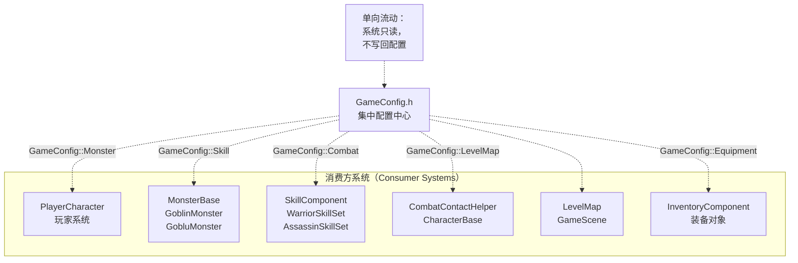
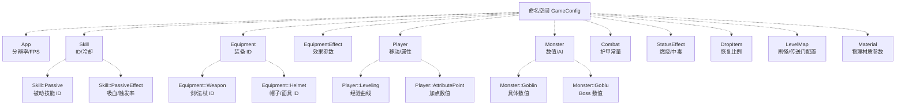
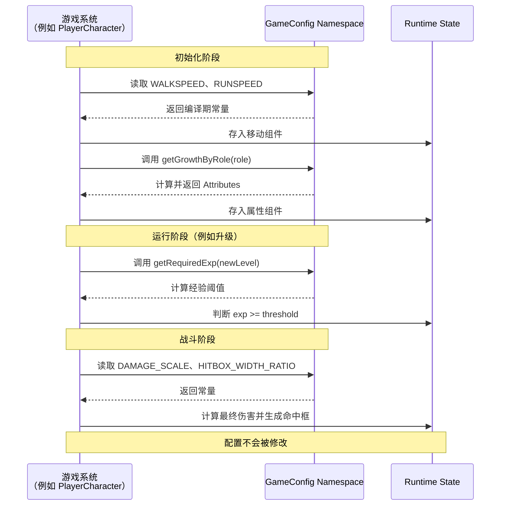
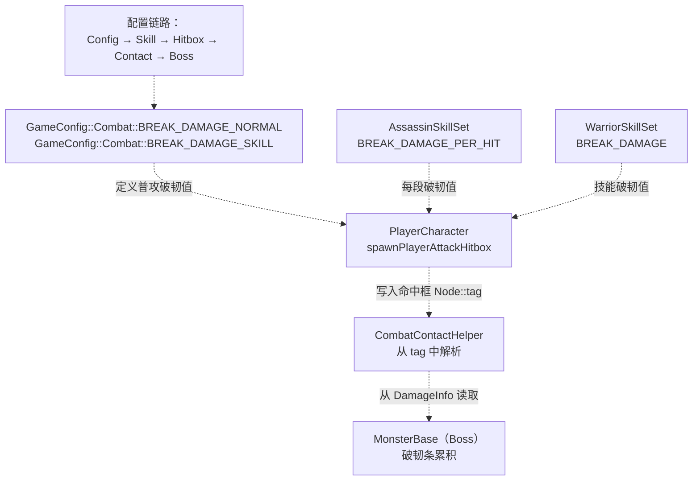

# 配置系统（Configuration System）

> **相关源文件**
> * [Adventure-King/Classes/Character/Player/SkillSets/AssassinSkillSet.cpp](https://github.com/lilong555/Adventure-King/blob/60df0f40/Adventure-King/Classes/Character/Player/SkillSets/AssassinSkillSet.cpp)
> * [Adventure-King/Classes/Character/Player/SkillSets/WarriorSkillSet.cpp](https://github.com/lilong555/Adventure-King/blob/60df0f40/Adventure-King/Classes/Character/Player/SkillSets/WarriorSkillSet.cpp)
> * [Adventure-King/Classes/Configs/GameConfig.h](https://github.com/lilong555/Adventure-King/blob/60df0f40/Adventure-King/Classes/Configs/GameConfig.h)
> * [Adventure-King/Classes/Scenes/CombatContactHelper.cpp](https://github.com/lilong555/Adventure-King/blob/60df0f40/Adventure-King/Classes/Scenes/CombatContactHelper.cpp)

## 目的与范围

配置系统为 Adventure-King 的所有游戏参数提供了集中化、编译期（compile-time）的“单一来源”。该系统完全实现于 [GameConfig.h L1-L717](https://github.com/lilong555/Adventure-King/blob/60df0f40/GameConfig.h#L1-L717)

，并使用 C++ 命名空间组织常量与辅助函数。本文档记录配置系统的结构、组织方式与使用模式。

关于配置值如何被具体系统使用，请参见 [玩家与怪物配置](玩家与怪物配置.md)、[技能与装备配置](技能与装备配置.md) 与 [战斗与世界配置](战斗与世界配置.md)。

**来源：** [GameConfig.h L1-L717](https://github.com/lilong555/Adventure-King/blob/60df0f40/GameConfig.h#L1-L717)

---

## 系统架构

### 集中式配置模型

`GameConfig.h` 实现了一个“被动、只读”的配置源，供所有玩法系统直接读取与消费。该文件不包含任何运行时状态：只包含编译期常量（`inline constexpr`）、`const` 对象，以及用于计算派生值的纯函数。



**关键特性（Key Characteristics）：**

* **单向数据流**：系统从 GameConfig 读取，但永远不会修改它
* **编译期耦合**：任何配置改动都需要完整重新编译
* **零运行时开销**：数值要么在编译期确定，要么仅通过简单算术在运行时计算
* **单一事实来源**：避免魔法数字散落在各处代码中

**来源：** [GameConfig.h L1-L717](https://github.com/lilong555/Adventure-King/blob/60df0f40/GameConfig.h#L1-L717)

（系统架构图中的图 7）

---

## 命名空间组织

GameConfig 使用嵌套命名空间构建逻辑层级，把配置参数按子系统归类组织；每个命名空间聚合某一类系统相关的常量与辅助函数。



**主要命名空间（Major Namespaces）：**

| 命名空间 | 行号 | 用途 |
| --- | --- | --- |
| `App` | [14-26](https://github.com/lilong555/Adventure-King/blob/60df0f40/14-26) | 引擎级配置（分辨率、FPS） |
| `Skill` | [29-69](https://github.com/lilong555/Adventure-King/blob/60df0f40/29-69) | 技能 ID、槽位索引、被动效果参数 |
| `Equipment` | [72-99](https://github.com/lilong555/Adventure-King/blob/60df0f40/72-99) | 装备物品 ID（按槽位类型组织） |
| `EquipmentEffect` | [102-153](https://github.com/lilong555/Adventure-King/blob/60df0f40/102-153) | 装备触发效果的参数与公式 |
| `Player` | [187-282](https://github.com/lilong555/Adventure-King/blob/60df0f40/187-282) | 玩家移动、升级曲线、属性成长 |
| `Monster` | [398-592](https://github.com/lilong555/Adventure-King/blob/60df0f40/398-592) | 怪物数值、AI 参数、按类型配置 |
| `Combat` | [659-665](https://github.com/lilong555/Adventure-King/blob/60df0f40/659-665) | 战斗公式（护甲常量、破韧伤害） |
| `StatusEffect` | [594-618](https://github.com/lilong555/Adventure-King/blob/60df0f40/594-618) | DOT 参数（持续时间、tick 频率、伤害倍率） |
| `DropItem` | [624-646](https://github.com/lilong555/Adventure-King/blob/60df0f40/624-646) | 掉落概率、恢复比例、贴图路径 |
| `LevelMap` | [648-657](https://github.com/lilong555/Adventure-King/blob/60df0f40/648-657) | 刷怪距离、传送门交互范围 |
| `Material` | [707-715](https://github.com/lilong555/Adventure-King/blob/60df0f40/707-715) | 物理材质预设（摩擦、弹性等） |

**来源：** [GameConfig.h L11-L716](https://github.com/lilong555/Adventure-King/blob/60df0f40/GameConfig.h#L11-L716)

---

## 配置数据类型

### `inline constexpr` 常量

最常见的写法：编译期常量，运行时零开销。

```python
// Example from Player namespace
inline constexpr float WALKSPEED = 220.0f;
inline constexpr float RUNSPEED = 350.0f;
inline constexpr int MAX_JUMP_COUNT = 2;
```

适用于：运行时永不变化的数值常量。

**来源：** [GameConfig.h L189-L192](https://github.com/lilong555/Adventure-King/blob/60df0f40/GameConfig.h#L189-L192)

### `const` 对象

适用于：无法写成 `constexpr` 的复杂类型（例如 Cocos2d-x 的类型）。

```javascript
// Example from App namespace
const cocos2d::Size DESIGN_RESOLUTION_SIZE(1520, 840);

// Example from Material namespace
const cocos2d::PhysicsMaterial DEFAULT(0.1f, 0.5f, 0.5f);
```

**来源：** [GameConfig.h L17](https://github.com/lilong555/Adventure-King/blob/60df0f40/GameConfig.h#L17-L17)

 [GameConfig.h L709](https://github.com/lilong555/Adventure-King/blob/60df0f40/GameConfig.h#L709-L709)

### `const char*` 指针

适用于：资源路径与字符串标识等。

```javascript
// Example from DropItem namespace
inline constexpr const char* HP_SPRITE_PATH = "Sprites/Item/Red.png";
inline constexpr const char* MP_SPRITE_PATH = "Sprites/Item/Bule.png";
```

**来源：** [GameConfig.h L635-L636](https://github.com/lilong555/Adventure-King/blob/60df0f40/GameConfig.h#L635-L636)

### `inline` 函数

适用于：依赖运行时参数的派生值计算（例如按等级缩放）。

```
// Example: Experience required for next level
inline int getRequiredExp(int level)
{
    if (level < 1)
    {
        level = 1;
    }
    return level * REQUIRED_EXP_PER_LEVEL;
}
```

**来源：** [GameConfig.h L226-L233](https://github.com/lilong555/Adventure-King/blob/60df0f40/GameConfig.h#L226-L233)

```cpp
// Example: Equipment effect scaling with level
inline float getReflectRate(int level)
{
    level = std::max(1, level);
    float rate = REFLECT_RATE_BASE + REFLECT_RATE_PER_LEVEL * static_cast<float>(level - 1);
    return std::max(0.0f, std::min(rate, REFLECT_RATE_MAX));
}
```

**模式：** 函数封装公式与 clamp（边界约束）逻辑，保证所有调用点的计算一致。

**来源：** [GameConfig.h L112-L117](https://github.com/lilong555/Adventure-King/blob/60df0f40/GameConfig.h#L112-L117)

---

## 在消费方系统中的使用模式

### 直接访问常量

大多数系统会直接读取常量，不再额外引入抽象层。

**示例（来自 WarriorSkillSet）：**

```javascript
// Reading combat parameters
const float damage = player.getAttackPower() * GameConfig::Warrior::FireSkill::DAMAGE_SCALE;

// Reading hitbox timing
const float triggerDelay = GameConfig::Warrior::FireSkill::CAST_ANIM_FRAME_DELAY *
                           static_cast<float>(GameConfig::Warrior::FireSkill::HIT_TRIGGER_FRAME_INDEX - 1);
```

**来源：** [WarriorSkillSet.cpp L437](https://github.com/lilong555/Adventure-King/blob/60df0f40/WarriorSkillSet.cpp#L437-L437)

 [WarriorSkillSet.cpp L400-L401](https://github.com/lilong555/Adventure-King/blob/60df0f40/WarriorSkillSet.cpp#L400-L401)

**示例（来自 AssassinSkillSet）：**

```javascript
// Reading skill configuration
slashSkill->cooldown = GameConfig::Assassin::SlashSkill::SLASH_CD;
slashSkill->breakDamage = GameConfig::Assassin::SlashSkill::BREAK_DAMAGE_PER_HIT;

// Reading hitbox parameters
const float w = std::max(10.0f, box.size.width * GameConfig::Assassin::SlashSkill::HITBOX_WIDTH_RATIO);
```

**来源：** [AssassinSkillSet.cpp L60-L61](https://github.com/lilong555/Adventure-King/blob/60df0f40/AssassinSkillSet.cpp#L60-L61)

 [AssassinSkillSet.cpp L271](https://github.com/lilong555/Adventure-King/blob/60df0f40/AssassinSkillSet.cpp#L271-L271)

### 基于函数的缩放/派生值

当需要“缩放/派生值”时，系统会调用 GameConfig 的函数来计算。

**示例：按等级计算所需经验（Level-based experience requirement）：**

```
// In PlayerCharacter or AttributeComponent
int requiredExp = GameConfig::Player::Leveling::getRequiredExp(currentLevel);
```

**示例：装备效果随等级缩放（Equipment effect scaling）：**

```
// In Equipment effect processing
float reflectRate = GameConfig::EquipmentEffect::ThornsArmor::getReflectRate(equipmentLevel);
```

**来源：** [GameConfig.h L226-L233](https://github.com/lilong555/Adventure-King/blob/60df0f40/GameConfig.h#L226-L233)

 [GameConfig.h L112-L117](https://github.com/lilong555/Adventure-King/blob/60df0f40/GameConfig.h#L112-L117)

### 物理材质选择

创建物理体时通常会使用预定义的物理材质常量。

```javascript
// Example: Creating player physics body
auto body = PhysicsBody::createBox(size, GameConfig::Material::PLAYER);

// Example: Creating collision geometry
const cocos2d::PhysicsMaterial COLLISION_PHYSICS_MATERIAL(1.0f, 0.0f, 0.8f);
```

**来源：** [GameConfig.h L711](https://github.com/lilong555/Adventure-King/blob/60df0f40/GameConfig.h#L711-L711)

 [GameConfig.h L651](https://github.com/lilong555/Adventure-King/blob/60df0f40/GameConfig.h#L651-L651)

---

## 配置消费流程

下图展示一个典型系统在初始化与运行时如何读取并应用配置。



**要点（Key Points）：**

* 配置读取发生在初始化、状态变化与战斗事件等多个时机
* 数值从 GameConfig 单向流向运行时状态
* 没有反馈回路：运行时状态不会写回 GameConfig

**来源：** [WarriorSkillSet.cpp L400-L444](https://github.com/lilong555/Adventure-King/blob/60df0f40/WarriorSkillSet.cpp#L400-L444)

 [AssassinSkillSet.cpp L258-L289](https://github.com/lilong555/Adventure-King/blob/60df0f40/AssassinSkillSet.cpp#L258-L289)

---

## 跨系统配置依赖

有些配置会被多个系统同时使用，从而形成“隐式协作点”。



**破韧伤害流转示例（Break Damage Flow Example）：**

1. `GameConfig::Combat::BREAK_DAMAGE_NORMAL` 定义普攻基础破韧值 [GameConfig.h L663](https://github.com/lilong555/Adventure-King/blob/60df0f40/GameConfig.h#L663-L663)
2. 技能配置会用“技能专属破韧值”进行覆盖/替换 [GameConfig.h L328](https://github.com/lilong555/Adventure-King/blob/60df0f40/GameConfig.h#L328-L328)
3. `PlayerCharacter::spawnPlayerAttackHitbox` 将破韧值写入命中框节点的 tag
4. `CombatContactHelper` 解析破韧值并写入 `DamageInfo` [CombatContactHelper.cpp L190](https://github.com/lilong555/Adventure-King/blob/60df0f40/CombatContactHelper.cpp#L190-L190)
5. Boss 将破韧伤害累积到破韧条

**来源：** [GameConfig.h L659-L665](https://github.com/lilong555/Adventure-King/blob/60df0f40/GameConfig.h#L659-L665)

 [WarriorSkillSet.cpp L440-L444](https://github.com/lilong555/Adventure-King/blob/60df0f40/WarriorSkillSet.cpp#L440-L444)

 [CombatContactHelper.cpp L186-L191](https://github.com/lilong555/Adventure-King/blob/60df0f40/CombatContactHelper.cpp#L186-L191)

---

## 配置分类索引

### App 与引擎配置

控制引擎核心参数与屏幕分辨率相关配置。

| 常量 | 值 | 用途 |
| --- | --- | --- |
| `DESIGN_RESOLUTION_SIZE` | (1520, 840) | 基础设计分辨率 |
| `DEFAULT_FPS` | 144.0f | 目标帧率 |
| `MAX_FPS` | 300 | 帧率上限 |
| `SHOW_FPS` | true | 是否显示 FPS 计数器 |

**来源：** [GameConfig.h L14-L26](https://github.com/lilong555/Adventure-King/blob/60df0f40/GameConfig.h#L14-L26)

### 技能系统配置

#### 技能 ID 与槽位（Skill IDs and Slots）

```csharp
namespace Skill {
    inline constexpr size_t SLOT_BOMB = 0;     // 法师技能槽
    inline constexpr size_t SLOT_FIREBALL = 0; // Klee 技能槽
}

namespace Passive {
    inline constexpr int TOUGHNESS = 2001;
    inline constexpr int SWIFTNESS = 2002;
    inline constexpr int BLOODTHIRST = 2004;  // 吸血被动
}
```

**来源：** [GameConfig.h L31-L45](https://github.com/lilong555/Adventure-King/blob/60df0f40/GameConfig.h#L31-L45)

#### 被动效果参数（Passive Effect Parameters）

```csharp
namespace PassiveEffect {
    inline constexpr float BLOODTHIRST_LIFESTEAL = 0.05f;  // 5% 吸血
    inline constexpr float LIFESTEAL_TOTAL_MAX = 0.20f;    // 20% 上限
    
    inline constexpr float EMBER_MARK_PROC_CHANCE = 0.20f;
    inline constexpr float EMBER_MARK_PROC_COOLDOWN = 0.25f;
    
    inline constexpr float CRIT_ECHO_REDUCE_SECONDS = 0.35f;
    inline constexpr float CRIT_ECHO_PROC_COOLDOWN = 0.25f;
}
```

**设计模式：** 基于触发（proc）的效果通常包含两个参数：`PROC_CHANCE`（触发概率）与 `PROC_COOLDOWN`（内部冷却，用于防止过度触发）。

**来源：** [GameConfig.h L48-L68](https://github.com/lilong555/Adventure-King/blob/60df0f40/GameConfig.h#L48-L68)

#### 角色/职业特定技能配置（Character-Specific Skill Configuration）

每个职业（Warrior、Assassin、Mage）都会为自己的技能提供对应的嵌套命名空间。

**Warrior 的 Fire 技能（Warrior Fire Skill）：**

```javascript
namespace Warrior::FireSkill {
    const int FIRE_ID = 1004;
    const float FIRE_CD = 1.0f;
    const float FIRE_MP = 0.0f;
    inline constexpr float DAMAGE_SCALE = 1.0f;
    inline constexpr int BREAK_DAMAGE = 3;
    inline constexpr float HITBOX_WIDTH_MULTIPLIER = 2.0f;
    inline constexpr int HIT_TRIGGER_FRAME_INDEX = 3;  // 第 3 帧触发伤害
}
```

**来源：** [GameConfig.h L378-L395](https://github.com/lilong555/Adventure-King/blob/60df0f40/GameConfig.h#L378-L395)

**Assassin 的 Slash 技能（Assassin Slash Skill）：**

```javascript
namespace Assassin::SlashSkill {
    const int SLASH_ID = 1003;
    const float SLASH_CD = 0.8f;
    inline constexpr float DAMAGE_SCALE = 1.2f;
    inline constexpr int BREAK_DAMAGE_PER_HIT = 1;  // 每次释放共 4 段
    inline constexpr float HITBOX_WIDTH_RATIO = 0.60f;
    inline constexpr float HITBOX_LIFE_SECONDS = 0.10f;
}
```

**来源：** [GameConfig.h L322-L340](https://github.com/lilong555/Adventure-King/blob/60df0f40/GameConfig.h#L322-L340)

### 装备配置

#### 装备 ID 命名空间（Equipment ID Namespaces）

装备 ID 按槽位类型划分命名空间，以减少/避免 ID 冲突。

```csharp
namespace Equipment::Weapon {
    inline constexpr int STARTER_SWORD = 5001;
    inline constexpr int BLOOD_PACT_SWORD = 5004;  // 吸血武器
}

namespace Equipment::Helmet {
    inline constexpr int LEATHER_CAP = 5101;
    inline constexpr int EMERGENCY_MASK = 5104;  // 低血量紧急回血
}

namespace Equipment::Armor {
    inline constexpr int LEATHER_ARMOR = 5102;
    inline constexpr int THORNS_ARMOR = 5105;  // 反伤
}

namespace Equipment::Boots {
    inline constexpr int LIGHT_BOOTS = 5103;
    inline constexpr int HUNTER_BOOTS = 5106;  // 击杀 = 移速 Buff
}
```

**ID 范围（ID Ranges）：**

* 5001-5099：武器（Weapons）
* 5101-5199：头盔（Helmets）
* 5102-5199：护甲（Armor，因槽位区分而共享区间）
* 5103-5199：鞋子（Boots，共享区间）

**来源：** [GameConfig.h L72-L99](https://github.com/lilong555/Adventure-King/blob/60df0f40/GameConfig.h#L72-L99)

#### 装备效果公式（Equipment Effect Formulas）

装备效果通常由“基础值 + 每级增长 + 上限”三部分组成。

**Thorns Armor（反伤）（Damage Reflection）：**

```csharp
namespace EquipmentEffect::ThornsArmor {
    inline constexpr float REFLECT_RATE_BASE = 0.15f;      // 基础 15%
    inline constexpr float REFLECT_RATE_PER_LEVEL = 0.01f; // 每级 +1%
    inline constexpr float REFLECT_RATE_MAX = 0.35f;       // 上限 35%
    inline constexpr float PROC_COOLDOWN = 0.50f;
    
    inline float getReflectRate(int level) {
        level = std::max(1, level);
        float rate = REFLECT_RATE_BASE + REFLECT_RATE_PER_LEVEL * (level - 1);
        return std::max(0.0f, std::min(rate, REFLECT_RATE_MAX));
    }
}
```

**Emergency Mask（低血保命）（Low HP Save）：**

```csharp
namespace EquipmentEffect::EmergencyMask {
    inline constexpr float TRIGGER_HP_RATIO = 0.20f;     // 低于 20% HP 触发
    inline constexpr float HEAL_TARGET_HP_RATIO = 0.35f; // 回到 35% HP
    inline constexpr float PROC_COOLDOWN = 45.0f;        // 冷却 45 秒
}
```

**来源：** [GameConfig.h L102-L153](https://github.com/lilong555/Adventure-King/blob/60df0f40/GameConfig.h#L102-L153)

### 玩家配置

#### 移动与物理（Movement and Physics）

```csharp
namespace Player {
    inline constexpr float WALKSPEED = 220.0f;
    inline constexpr float RUNSPEED = 350.0f;
    inline constexpr float JUMP_FORCE = 400.0f;
    inline constexpr int MAX_JUMP_COUNT = 2;
    inline constexpr float SCALE = 0.4f;
    
    // 职业差异化精灵缩放
    inline constexpr float WARRIOR_SPRITE_SCALE_MULTIPLIER = 1.0f;
    inline constexpr float ASSASSIN_SPRITE_SCALE_MULTIPLIER = 1.8f;
}
```

**来源：** [GameConfig.h L189-L202](https://github.com/lilong555/Adventure-King/blob/60df0f40/GameConfig.h#L189-L202)

#### 升级系统（Leveling System）

```csharp
namespace Player::Leveling {
    inline constexpr int REQUIRED_EXP_PER_LEVEL = 100;
    
    inline int getRequiredExp(int level) {
        if (level < 1) level = 1;
        return level * REQUIRED_EXP_PER_LEVEL;
    }
    
    inline Attributes getGrowthByRole(CharacterRole role) {
        Attributes growth;
        switch (role) {
        case CharacterRole::WARRIOR:
            growth.set(AttributeType::MAX_HP, 15.0f);
            growth.set(AttributeType::STRENGTH, 3.0f);
            // ...
        }
        return growth;
    }
}
```

**模式：** `getGrowthByRole` 会返回完整的 `Attributes` 结构体，用于描述每级属性增长。

**来源：** [GameConfig.h L220-L260](https://github.com/lilong555/Adventure-King/blob/60df0f40/GameConfig.h#L220-L260)

#### 属性点（Attribute Points）

```csharp
namespace Player::AttributePoint {
    inline constexpr int POINTS_PER_LEVEL = 1;
    
    inline constexpr float MAX_HP_PER_POINT = 10.0f;
    inline constexpr float STRENGTH_PER_POINT = 2.0f;
    inline constexpr float MOVE_SPEED_PER_POINT = 10.0f;
    inline constexpr float DEFENSE_PER_POINT = 1.0f;
    inline constexpr float CRITICAL_RATE_PER_POINT = 0.02f;  // +2% 暴击率
}
```

**来源：** [GameConfig.h L263-L273](https://github.com/lilong555/Adventure-King/blob/60df0f40/GameConfig.h#L263-L273)

### 怪物配置

#### 怪物基础参数（Base Monster Parameters）

```csharp
namespace Monster::Base {
    inline constexpr float SCALE = 0.36f;
    inline constexpr float PHYSICS_BOX_RATIO_W = 0.35f;
    inline constexpr float PHYSICS_BOX_RATIO_H = 0.9f;
    inline constexpr float ACTIVE_UPDATE_DISTANCE_MULTIPLIER = 1.5f;
    inline constexpr float AI_UPDATE_INTERVAL = 0.1f;
    inline constexpr float AI_INACTIVE_UPDATE_INTERVAL = 0.3f;
}
```

**优化说明：** 远离玩家的怪物会使用更长的 `AI_INACTIVE_UPDATE_INTERVAL`，以降低 CPU 开销。

**来源：** [GameConfig.h L401-L419](https://github.com/lilong555/Adventure-King/blob/60df0f40/GameConfig.h#L401-L419)

#### 等级缩放（Level Scaling）

```csharp
namespace Monster::LevelScaling {
    inline constexpr float NORMAL_BASE_MULTIPLIER = 0.5f;   // 普通怪：基础 0.5x
    inline constexpr float BOSS_BASE_MULTIPLIER = 1.5f;     // Boss：基础 1.5x
    
    inline constexpr float NORMAL_HP_PER_LEVEL = 0.05f;     // 每级玩家等级 +5% HP
    inline constexpr float NORMAL_HP_MAX_MULTIPLIER = 3.0f; // 上限 3x
    
    inline constexpr float BOSS_HP_PER_LEVEL = 0.06f;
    inline constexpr float BOSS_HP_MAX_MULTIPLIER = 4.0f;   // 上限 4x
}
```

**用法：** `GameScene::createMonsterByType` 会在怪物完成初始化后再应用等级缩放，以保持怪物类与玩家等级解耦。

**来源：** [GameConfig.h L427-L442](https://github.com/lilong555/Adventure-King/blob/60df0f40/GameConfig.h#L427-L442)

#### 具体怪物类型（Specific Monster Types）

每种怪物类型都有自己独立的命名空间，用于定义数值、AI 参数与动画节奏等。

**Goblin（普通怪物）（Normal Monster）：**

```csharp
namespace Monster::Goblin {
    inline constexpr float MAX_HP = 700.0f;
    inline constexpr float STRENGTH = 10.0f;
    inline constexpr float DEFENSE = 2.0f;
    inline constexpr float MOVE_SPEED = 200.0f;
    inline constexpr float ATTACK_INTERVAL = 2.0f;
    inline constexpr float ATTACK_RANGE = 150.0f;
    inline constexpr float VISION_RANGE = 700.0f;
    
    inline constexpr int EXP_REWARD_BASE = 20;
    inline constexpr int EXP_REWARD_PER_LEVEL = 3;
}
```

**Goblu（Boss）：**

```csharp
namespace Monster::Goblu {
    inline constexpr float MAX_HP = 1000.0f;
    inline constexpr float SCALE = 0.72f;
    inline constexpr float SCALE_MULTIPLIER = 2.0f;  // Boss 体型更大
    
    // 破韧条配置
    inline constexpr int BREAK_MAX = 16;
    inline constexpr float BREAK_DOWN_HOLD_SECONDS = 3.0f;
}
```

**来源：** [GameConfig.h L445-L534](https://github.com/lilong555/Adventure-King/blob/60df0f40/GameConfig.h#L445-L534)

### 战斗配置

```csharp
namespace Combat {
    inline constexpr float ARMOR_CONST = 100.0f;
    inline constexpr int BREAK_DAMAGE_NORMAL = 1;
    inline constexpr int BREAK_DAMAGE_SKILL = 3;
}
```

**护甲公式：** 伤害减免按 `defense / (defense + ARMOR_CONST)` 计算，从而保证收益递减（diminishing returns）。

**来源：** [GameConfig.h L659-L665](https://github.com/lilong555/Adventure-King/blob/60df0f40/GameConfig.h#L659-L665)

### 状态效果配置

```csharp
namespace StatusEffect::Burning {
    inline constexpr float DURATION_SECONDS = 5.0f;
    inline constexpr float TICK_INTERVAL_SECONDS = 0.5f;
    inline constexpr float BASE_DAMAGE_SCALE = 0.1f;
    inline constexpr float PER_STACK_DAMAGE_SCALE = 0.1f;
}

namespace StatusEffect::Poisoned {
    inline constexpr float DURATION_SECONDS = 6.0f;
    inline constexpr float TICK_INTERVAL_SECONDS = 1.0f;
    inline constexpr float BASE_DAMAGE_SCALE = 0.07f;
    inline constexpr float PER_STACK_DAMAGE_SCALE = 0.05f;
}
```

**模式：** 状态效果使用 `BASE_DAMAGE_SCALE` 作为首层倍率，叠层时用 `PER_STACK_DAMAGE_SCALE` 作为额外层的倍率。

**来源：** [GameConfig.h L594-L618](https://github.com/lilong555/Adventure-King/blob/60df0f40/GameConfig.h#L594-L618)

### 掉落物配置

```javascript
namespace DropItem {
    inline constexpr float DROP_CHANCE = 0.30f;       // 30% 掉落率
    inline constexpr float HP_DROP_RATIO = 0.50f;     // 50% 掉 HP，50% 掉 MP
    
    inline constexpr float HP_RESTORE_RATIO = 0.25f;  // 恢复 25% 最大 HP
    inline constexpr float MP_RESTORE_RATIO = 0.25f;
    
    inline constexpr const char* HP_SPRITE_PATH = "Sprites/Item/Red.png";
    inline constexpr const char* MP_SPRITE_PATH = "Sprites/Item/Bule.png";
}
```

**来源：** [GameConfig.h L624-L646](https://github.com/lilong555/Adventure-King/blob/60df0f40/GameConfig.h#L624-L646)

### LevelMap 配置

```javascript
namespace LevelMap {
    const cocos2d::Vec2 DEFAULT_SPAWN_POINT(100.0f, 200.0f);
    const cocos2d::PhysicsMaterial COLLISION_PHYSICS_MATERIAL(1.0f, 0.0f, 0.8f);
    inline constexpr float DEFAULT_GATE_INTERACT_DISTANCE = 100.0f;
    inline constexpr float SPAWN_SPACING_X = 80.0f;
    inline constexpr float ENEMY_SPAWN_CHECK_INTERVAL_SECONDS = 0.1f;
}
```

**来源：** [GameConfig.h L648-L657](https://github.com/lilong555/Adventure-King/blob/60df0f40/GameConfig.h#L648-L657)

### 物理材质

为不同实体类型预定义的物理材质参数。

```javascript
namespace Material {
    const cocos2d::PhysicsMaterial DEFAULT(0.1f, 0.5f, 0.5f);
    const cocos2d::PhysicsMaterial COLLISION(1.0f, 0.0f, 0.0f);
    const cocos2d::PhysicsMaterial PLAYER(1.0f, 0.0f, 0.0f);   // 无摩擦
    const cocos2d::PhysicsMaterial BOMB(0.5f, 0.3f, 0.2f);     // 更弹
    const cocos2d::PhysicsMaterial MONSTER(1.0f, 0.0f, 0.0f);
}
```

**参数（Parameters）：** `PhysicsMaterial(density, restitution, friction)`

**来源：** [GameConfig.h L707-L715](https://github.com/lilong555/Adventure-King/blob/60df0f40/GameConfig.h#L707-L715)

---

## 设计理念与权衡

### 集中式配置的优点

1. **单一事实来源**：平衡调整只需要改一个文件
2. **编译期校验**：类型错误与缺失常量可在编译期发现
3. **零运行时开销**：无需字典查找或文件解析
4. **依赖清晰**：通过 include 可以清楚看到所有配置消费方
5. **组织清晰**：命名空间层级让相关常量更易定位

### 缺点与限制

1. **编译期耦合**：任何配置改动都会迫使所有依赖该头文件的编译单元重新编译
2. **不支持热更新**：无法在不重新构建与重启的情况下调整数值
3. **需要人工同步**：新增配置后，消费方代码需要手动接入读取
4. **表达能力有限**：不适合复杂数据结构（例如多层表、跨配置引用等）

### 何时使用 GameConfig

**适合用 GameConfig 的场景（Use GameConfig for）：**

* 数值调参参数（伤害倍率、冷却、速度等）
* 固定资源路径
* 物理常量
* 枚举与物品类型的 ID 常量
* 用 inline 函数表达的简单公式

**不适合用 GameConfig 的场景（Do not use GameConfig for）：**

* 运行时会变化的数据（玩家背包、存档状态等）
* 大型数据集（例如从 TMX 读取的刷怪点数据）
* 需要复杂结构的数据（技能树、任务链等）
* 需要本地化的字符串（应改用资源包/多语言资源）

**来源：** 基于系统架构图与文件结构的分析总结

---

## 扩展配置系统

### 添加新的配置命名空间

1. 在 [GameConfig.h](https://github.com/lilong555/Adventure-King/blob/60df0f40/GameConfig.h) 中选择合适的父命名空间
2. 添加语义清晰的嵌套命名空间
3. 原始类型优先用 `inline constexpr`，复杂类型用 `const`
4. 用注释说明用途与合理取值范围
5. 更新消费方系统，从新命名空间读取配置

**示例：新增一个状态效果（Example: Adding a new status effect）**

```csharp
namespace StatusEffect::Frozen {
    inline constexpr float DURATION_SECONDS = 3.0f;
    inline constexpr float MOVE_SPEED_REDUCTION = 0.50f;  // 减速 50%
    inline constexpr float TICK_INTERVAL_SECONDS = 0.5f;
}
```

### 添加辅助函数

对于需要计算的派生值，建议在对应命名空间内定义 inline 函数。

**模式：带 clamp 的缩放函数（Pattern: Clamped scaling function）**

```cpp
inline float getScaledValue(int level) {
    level = std::max(1, level);  // 最低为 1 级
    float value = BASE_VALUE + PER_LEVEL_VALUE * static_cast<float>(level - 1);
    return std::max(MIN_VALUE, std::min(value, MAX_VALUE));  // clamp 到范围内
}
```

**来源：** [GameConfig.h L112-L117](https://github.com/lilong555/Adventure-King/blob/60df0f40/GameConfig.h#L112-L117)

 [GameConfig.h L146-L151](https://github.com/lilong555/Adventure-King/blob/60df0f40/GameConfig.h#L146-L151)

---

## 总结

Adventure-King 的配置系统为所有游戏参数提供了集中、类型安全的“单一仓库”。其关键特性包括：

* **架构**：单一头文件，以命名空间组织常量
* **数据类型**：`inline constexpr` 常量、`const` 对象、inline 函数
* **用法**：各玩法系统通过命名空间路径直接读取
* **权衡**：编译期耦合 vs. 运行时灵活性

该系统优先追求简单、类型安全与零运行时开销，而不是灵活性与热更新能力。对于需要运行时可修改的数据，请参见 [存档与持久化](存档与持久化.md)。

**来源：** [GameConfig.h L1-L717](https://github.com/lilong555/Adventure-King/blob/60df0f40/GameConfig.h#L1-L717)

 [WarriorSkillSet.cpp L1-L469](https://github.com/lilong555/Adventure-King/blob/60df0f40/WarriorSkillSet.cpp#L1-L469)

 [AssassinSkillSet.cpp L1-L311](https://github.com/lilong555/Adventure-King/blob/60df0f40/AssassinSkillSet.cpp#L1-L311)

 [CombatContactHelper.cpp L1-L296](https://github.com/lilong555/Adventure-King/blob/60df0f40/CombatContactHelper.cpp#L1-L296)
