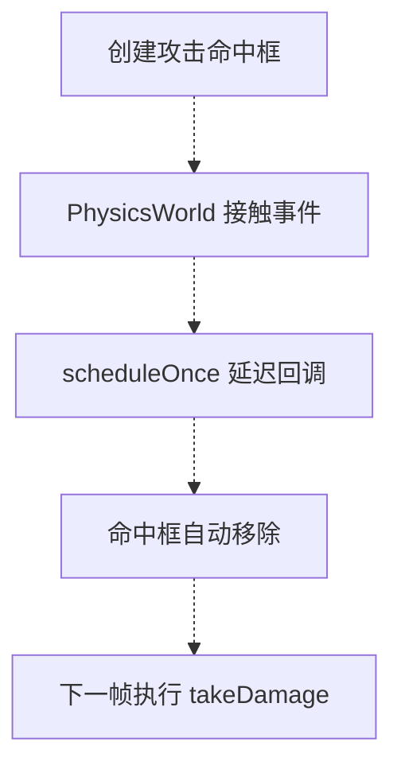
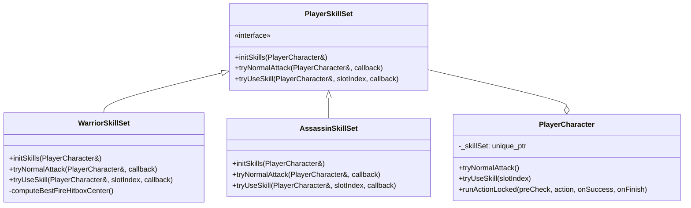
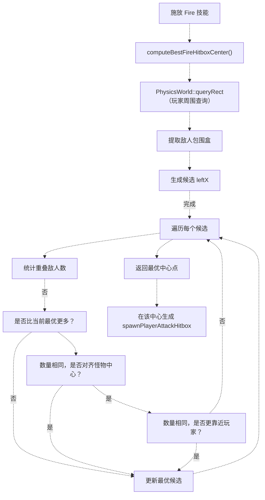
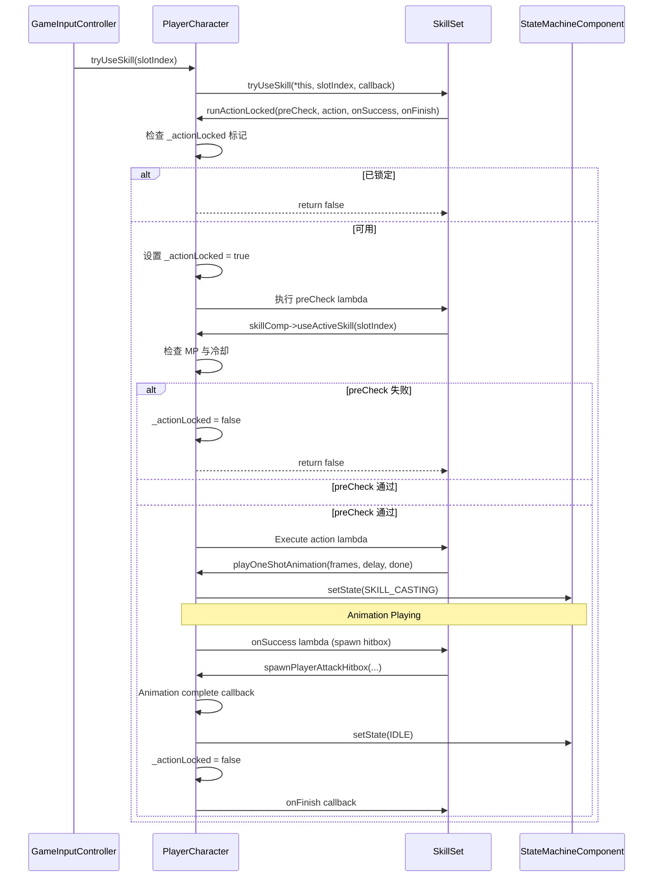
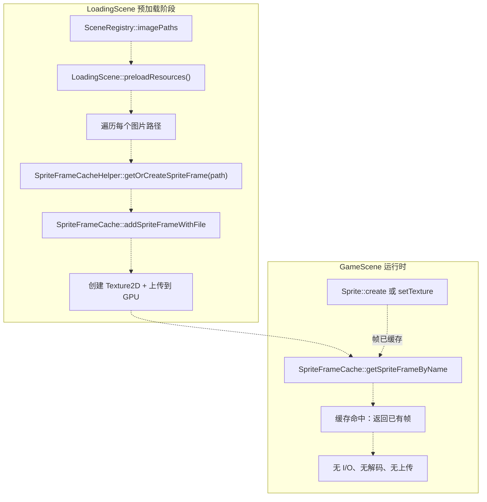
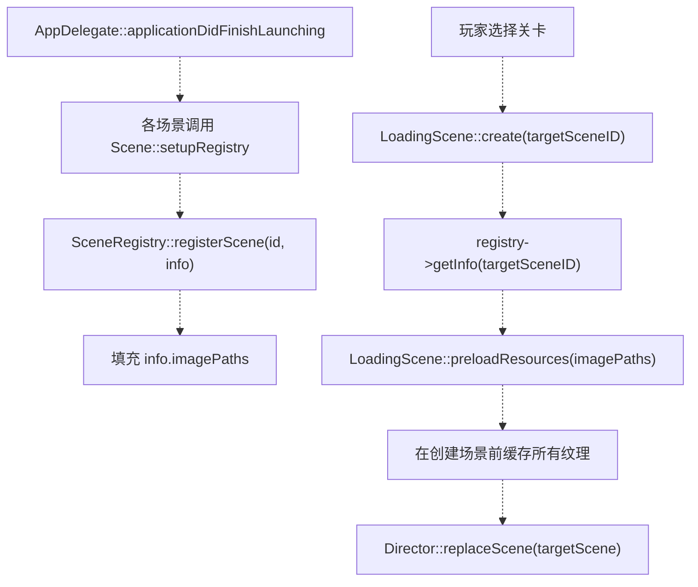
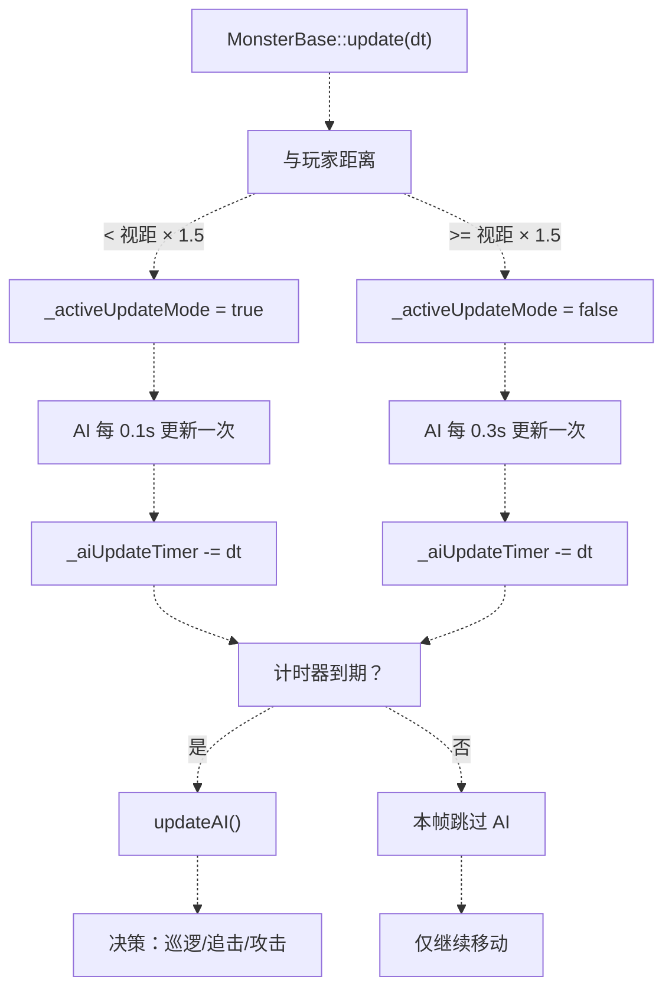
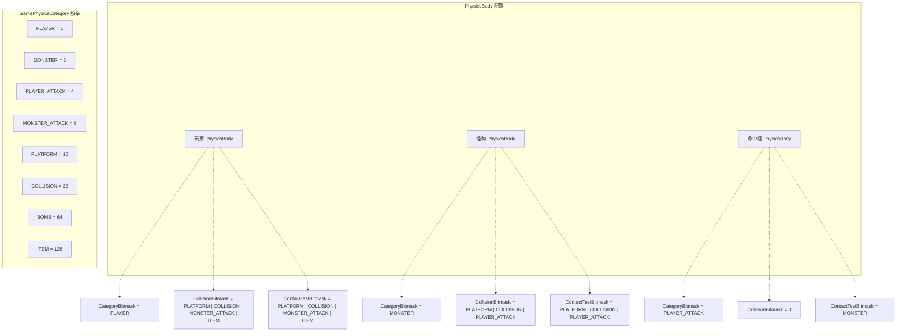
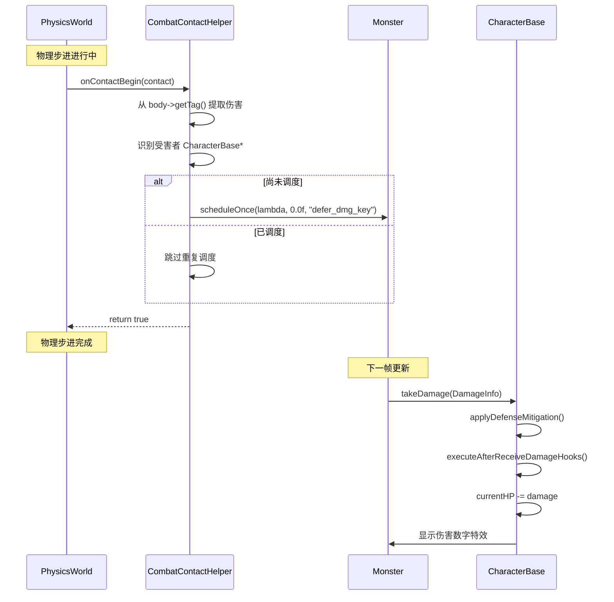
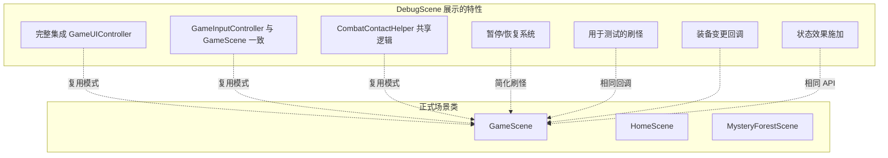

# 高级主题

> **相关源文件**
> * [Adventure-King/Classes/Character/Player/SkillSets/AssassinSkillSet.cpp](https://github.com/lilong555/Adventure-King/blob/60df0f40/Adventure-King/Classes/Character/Player/SkillSets/AssassinSkillSet.cpp)
> * [Adventure-King/Classes/Character/Player/SkillSets/WarriorSkillSet.cpp](https://github.com/lilong555/Adventure-King/blob/60df0f40/Adventure-King/Classes/Character/Player/SkillSets/WarriorSkillSet.cpp)
> * [Adventure-King/Classes/Configs/GameConfig.h](https://github.com/lilong555/Adventure-King/blob/60df0f40/Adventure-King/Classes/Configs/GameConfig.h)
> * [Adventure-King/Classes/Scenes/CombatContactHelper.cpp](https://github.com/lilong555/Adventure-King/blob/60df0f40/Adventure-King/Classes/Scenes/CombatContactHelper.cpp)
> * [Adventure-King/Classes/Scenes/DebugScene.cpp](https://github.com/lilong555/Adventure-King/blob/60df0f40/Adventure-King/Classes/Scenes/DebugScene.cpp)
> * [Adventure-King/Classes/Scenes/DebugScene.h](https://github.com/lilong555/Adventure-King/blob/60df0f40/Adventure-King/Classes/Scenes/DebugScene.h)
> * [Adventure-King/Classes/Scenes/GameScene.cpp](https://github.com/lilong555/Adventure-King/blob/60df0f40/Adventure-King/Classes/Scenes/GameScene.cpp)
> * [Adventure-King/Classes/Scenes/GameScene.h](https://github.com/lilong555/Adventure-King/blob/60df0f40/Adventure-King/Classes/Scenes/GameScene.h)
> * [Adventure-King/proj.win32/Adventure-King.vcxproj](https://github.com/lilong555/Adventure-King/blob/60df0f40/Adventure-King/proj.win32/Adventure-King.vcxproj)
> * [Adventure-King/proj.win32/Adventure-King.vcxproj.filters](https://github.com/lilong555/Adventure-King/blob/60df0f40/Adventure-King/proj.win32/Adventure-King.vcxproj.filters)

## 目的与范围

本页记录 Adventure-King 中一些需要更深入架构理解的高级实现细节与专用系统，主要包括：

* **技能集实现**：多态技能系统设计与命中框生成算法
* **动画系统**：帧缓存、稳定的 SpriteFrame 管理、动画状态协调
* **性能优化**：更新节流、资源预热、内存管理策略
* **物理分类系统**：基于位掩码的碰撞过滤与接触事件处理

基础角色机制请参见 [玩家角色（PlayerCharacter）](<玩家角色（PlayerCharacter）.md>)。场景级战斗集成请参见 [GameScene](<GameScene（游戏场景）.md>)。配置参数请参见 [配置系统](<配置系统.md>)。

---

## 高级系统概览

该代码库使用了多种相对“高级”的架构模式，以在多个职业与关卡类型下同时获得稳定性能与可维护的玩法逻辑：

### 技能集架构

技能系统使用 **策略模式（Strategy Pattern）** 来封装职业特定的战斗逻辑。每个职业（Warrior、Mage、Assassin）对应一个 `SkillSet` 类，负责实现：

* 普通攻击命中框生成算法
* 主动技能施放序列（精确到动画帧的时序）
* 技能初始化与技能槽位装配

这种设计把职业差异逻辑从通用的 `PlayerCharacter` 与 `SkillComponent` 中隔离出来，使得在不改动核心系统的前提下也能独立迭代“战斗手感”。

### 动画稳定性系统

动画系统主要解决 cocos2d-x 的一个关键问题：如果在战斗中按需加载帧资源，**sprite frame 的回收/释放可能导致画面闪烁或卡顿**。因此代码库采用两项关键机制：

* `SpriteFrameCacheHelper`：在加载界面提前解码 PNG 并上传 GPU 纹理
* 稳定帧驻留：对高频使用的帧保持引用计数，避免战斗中途被释放

### 性能预算管理

游戏使用 **基于时间间隔的节流（interval-based throttling）** 将 CPU 负载分摊到多个帧上：

* 怪物 AI 以 0.1-0.3 秒间隔更新（与距离相关）
* 物理查询使用空间划分，避免遍历整张场景
* 粒子系统在场景初始化阶段预加载，避免运行时卡顿

### 物理接触优化

战斗命中检测使用 **临时物理体**，并采用“延迟结算伤害”的方式：



该模式可以避免在物理回调阶段修改场景树，从而降低崩溃风险。

**来源：** [Adventure-King/Classes/Scenes/GameScene.cpp L1-L1028](https://github.com/lilong555/Adventure-King/blob/60df0f40/Adventure-King/Classes/Scenes/GameScene.cpp#L1-L1028)

 [Adventure-King/Classes/Configs/GameConfig.h L1-L760](https://github.com/lilong555/Adventure-King/blob/60df0f40/Adventure-King/Classes/Configs/GameConfig.h#L1-L760)

 [Adventure-King/Classes/Scenes/CombatContactHelper.cpp L1-L296](https://github.com/lilong555/Adventure-King/blob/60df0f40/Adventure-King/Classes/Scenes/CombatContactHelper.cpp#L1-L296)

---

## 技能集实现模式

### 类层级与委托



`PlayerCharacter` 会把战斗动作委托给其多态成员 `_skillSet`。当玩家按下攻击键时，调用链路如下：

1. 输入回调：`GameInputController::onKeyPressed` → `PlayerCharacter::tryNormalAttack`
2. 委托到技能集：`PlayerCharacter::tryNormalAttack` → `_skillSet->tryNormalAttack(*this, callback)`
3. 技能集实现执行职业特定逻辑（命中框形状、动画帧、伤害倍率等）

**来源：** [Adventure-King/Classes/Character/Player/SkillSets/WarriorSkillSet.cpp L1-L468](https://github.com/lilong555/Adventure-King/blob/60df0f40/Adventure-King/Classes/Character/Player/SkillSets/WarriorSkillSet.cpp#L1-L468)

 [Adventure-King/Classes/Character/Player/SkillSets/AssassinSkillSet.cpp L1-L311](https://github.com/lilong555/Adventure-King/blob/60df0f40/Adventure-King/Classes/Character/Player/SkillSets/AssassinSkillSet.cpp#L1-L311)

### 命中框生成算法：火焰技能

战士的 Fire 技能展示了一套较为高级的命中框选点算法：当存在多个目标时，它会尽量 **最大化覆盖敌人数量**。



**算法细节（Algorithm Details）：**

`computeBestFireHitboxCenter` 的实现见 [Adventure-King/Classes/Character/Player/SkillSets/WarriorSkillSet.cpp L99-L258](https://github.com/lilong555/Adventure-King/blob/60df0f40/Adventure-King/Classes/Character/Player/SkillSets/WarriorSkillSet.cpp#L99-L258)，其核心是一种 **一维扫描线优化（1D sweep-line optimization）**：

| 步骤 | 描述 | 复杂度 |
| --- | --- | --- |
| 1. 空间查询 | 在玩家周围 3× 命中框区域内执行 `PhysicsWorld::queryRect` | O(log n + k)，k 为附近敌人数 |
| 2. 候选生成 | 提取敌人包围盒边界，将 `[minX - width, maxX]` 加入候选 | O(k) |
| 3. 扫描评估 | 对每个候选 leftX 统计重叠敌人数量 | O(c × k)，c 为候选数（约 5k） |
| 4. 平手规则 | 优先对齐敌人中心，其次更靠近玩家 | 每候选 O(1) |

**关键点（Key Insight）：** 算法将命中框的 Y 固定在玩家中心高度，默认假设为地面战斗。对应注释在 [Adventure-King/Classes/Character/Player/SkillSets/WarriorSkillSet.cpp L166-L170](https://github.com/lilong555/Adventure-King/blob/60df0f40/Adventure-King/Classes/Character/Player/SkillSets/WarriorSkillSet.cpp#L166-L170)

明确说明了这一限制：

```
// 如果后续关卡或怪物设计引入明显的高度差（高台怪物/飞行怪物等），
// 需要重新审视这里的逻辑（例如增加 Y 方向的候选或更智能的兜底策略），
// 否则命中框可能无法覆盖到垂直方向上相距较远但水平方向在范围内的敌人。
```

**来源：** [Adventure-King/Classes/Character/Player/SkillSets/WarriorSkillSet.cpp L99-L258](https://github.com/lilong555/Adventure-King/blob/60df0f40/Adventure-King/Classes/Character/Player/SkillSets/WarriorSkillSet.cpp#L99-L258)

### 动作锁与状态机集成

所有技能集实现都会使用 `PlayerCharacter::runActionLocked` 来避免并发动作（例如在施法过程中再次触发其他技能）：



`preCheck` lambda 会在设置动作锁之前执行，从而可以在不阻塞玩家状态的情况下完成技能消耗校验；`action` lambda 则在持锁状态下运行，保证动画播放期间不会被其他动作打断。

**来源：** [Adventure-King/Classes/Character/Player/SkillSets/WarriorSkillSet.cpp L387-L461](https://github.com/lilong555/Adventure-King/blob/60df0f40/Adventure-King/Classes/Character/Player/SkillSets/WarriorSkillSet.cpp#L387-L461)

 [Adventure-King/Classes/Character/Player/SkillSets/AssassinSkillSet.cpp L241-L303](https://github.com/lilong555/Adventure-King/blob/60df0f40/Adventure-King/Classes/Character/Player/SkillSets/AssassinSkillSet.cpp#L241-L303)

---

## 动画帧缓存系统

### 问题：运行时分配帧导致卡顿

Cocos2d-x 的 `SpriteFrameCache::addSpriteFrameWithFile` 在首次加载时大致会执行以下步骤：

1. **文件 I/O**：从磁盘读取 PNG（典型角色贴图约 1-5ms）
2. **PNG 解码**：解压为 RGBA 原始位图（约 2-10ms）
3. **纹理上传**：传输到 GPU（约 3-15ms）

如果这些操作发生在战斗中（例如第一次使用某个技能），就会造成可见的 **掉帧**。另外，如果该帧没有被持有引用，cocos2d-x 可能会对其进行回收，导致下次使用时再次出现同样的卡顿。

### 方案：SpriteFrameCacheHelper



该辅助模式确保：

* **所有帧都会在加载界面期间完成解码**，此时出现卡顿是可接受的
* **只要使用这些帧的场景处于激活状态，帧就会常驻内存**
* **游戏过程中不会发生运行时文件 I/O**

**实现方式：** 该辅助函数对 `SpriteFrameCache` 的调用做了封装，但它并不是一个独立的类——更准确地说是一种使用模式。典型用法出现在技能初始化阶段：

[Adventure-King/Classes/Character/Player/SkillSets/WarriorSkillSet.cpp L289-L295](https://github.com/lilong555/Adventure-King/blob/60df0f40/Adventure-King/Classes/Character/Player/SkillSets/WarriorSkillSet.cpp#L289-L295)

```javascript
// 预加载 fire 动作帧（把首次解码/上传的卡顿挪到角色创建阶段）
const auto& skillDir = player.getSkillSpriteDir();
if (!skillDir.empty())
{
    SpriteFrameCacheHelper::getOrCreateSpriteFrame(skillDir + "/fire_1.png");
    SpriteFrameCacheHelper::getOrCreateSpriteFrame(skillDir + "/fire_2.png");
    SpriteFrameCacheHelper::getOrCreateSpriteFrame(skillDir + "/fire_3.png");
}
```

**来源：** [Adventure-King/Classes/Character/Player/SkillSets/WarriorSkillSet.cpp L288-L295](https://github.com/lilong555/Adventure-King/blob/60df0f40/Adventure-King/Classes/Character/Player/SkillSets/WarriorSkillSet.cpp#L288-L295)

### 场景级预加载策略

在 `SceneRegistry` 中，每个场景条目都会指定 `imagePaths`：



这种架构支持为每个关卡维护独立的**资源清单（manifest）**，而无需在场景类中硬编码路径。

**来源：** [Adventure-King/Classes/Scenes/DebugScene.cpp L63-L75](https://github.com/lilong555/Adventure-King/blob/60df0f40/Adventure-King/Classes/Scenes/DebugScene.cpp#L63-L75)

---

## 性能优化技巧

### 更新间隔节流

怪物会根据与玩家的距离使用**基于距离的更新间隔**，以在远离玩家时降低 CPU 负载：



**配置常量：**

| 常量 | 值 | 来源 |
| --- | --- | --- |
| `ACTIVE_UPDATE_DISTANCE_MULTIPLIER` | 1.5 | [Adventure-King/Classes/Configs/GameConfig.h L408](https://github.com/lilong555/Adventure-King/blob/60df0f40/Adventure-King/Classes/Configs/GameConfig.h#L408-L408) |
| `AI_UPDATE_INTERVAL` | 0.1s | [Adventure-King/Classes/Configs/GameConfig.h L409](https://github.com/lilong555/Adventure-King/blob/60df0f40/Adventure-King/Classes/Configs/GameConfig.h#L409-L409) |
| `AI_INACTIVE_UPDATE_INTERVAL` | 0.3s | [Adventure-King/Classes/Configs/GameConfig.h L410](https://github.com/lilong555/Adventure-King/blob/60df0f40/Adventure-King/Classes/Configs/GameConfig.h#L410-L410) |

这种模式能在怪物离屏或距离较远时将 AI 开销降低 **60-70%**，同时在进入战斗时仍保持响应灵敏。

**来源：** [Adventure-King/Classes/Configs/GameConfig.h L408-L410](https://github.com/lilong555/Adventure-King/blob/60df0f40/Adventure-King/Classes/Configs/GameConfig.h#L408-L410)

### 粒子系统预热

粒子系统（`ParticleSystemQuad`）与精灵帧类似，也会在首次创建时产生卡顿。项目使用 `ParticlePreloadHelper` 来预热：

```
	// 在场景初始化期间预热，避免运行时卡顿
ParticlePreloadHelper::preload("Particle/par_fire.plist");
ParticlePreloadHelper::preload("Particle/par_nap.plist");
```

该辅助模式会在屏幕外创建一个**临时粒子实例**，强制触发 `.plist` 解析与纹理上传，然后立刻销毁。后续的 `ParticleSystemQuad::create` 会复用已缓存的数据。

**注意：** 该技巧在代码注释中被提及，但在当前提供的文件中没有找到实际的 helper 类实现；此处作为一种优化策略模式进行说明。

---

## 物理分类与碰撞过滤

### 基于位掩码的分类系统

物理系统使用**位掩码标志（bitmask flags）**来定义实体类型，并控制哪些物体之间可以发生碰撞/接触：



**关键区别：**

| 位掩码 | 用途 |
| --- | --- |
| `CategoryBitmask` | 声明“这个 PhysicsBody 是什么” |
| `CollisionBitmask` | 声明“这个 PhysicsBody 会与什么发生实体碰撞”（产生碰撞响应） |
| `ContactTestBitmask` | 声明“这个 PhysicsBody 会检测与什么的接触”（触发 `onContactBegin` 回调） |

**关键模式：** 攻击命中框会设置 **`CollisionBitmask = 0`** 来避免实体碰撞（不产生推挤），同时设置 **`ContactTestBitmask = MONSTER`** 来触发伤害事件。

**来源：** [Adventure-King/Classes/Scenes/GameScene.cpp L486-L495](https://github.com/lilong555/Adventure-King/blob/60df0f40/Adventure-King/Classes/Scenes/GameScene.cpp#L486-L495)

 [Adventure-King/Classes/Scenes/DebugScene.cpp L356-L365](https://github.com/lilong555/Adventure-King/blob/60df0f40/Adventure-King/Classes/Scenes/DebugScene.cpp#L356-L365)

### 延迟伤害应用

`CombatContactHelper::handleContactBegin` 使用 **`scheduleOnce` 延迟回调**来避免在物理回调期间修改场景树：



**原因：** 在 `onContactBegin` 中直接调用 `takeDamage` 可能会：

1. 从场景树移除节点 → 若物理系统仍在遍历接触对，可能崩溃
2. 修改 PhysicsBody 属性 → 在模拟步进期间会产生未定义行为
3. 触发嵌套的物理查询 → 可能导致死锁

延迟回调模式确保所有修改都发生在物理步进完成**之后**。

**去重：** 在调用 `scheduleOnce` 前先检查 `isScheduled(key)`，可以避免同一“命中框-受击者”组合在短时间内触发多次接触回调时重复结算伤害：

[Adventure-King/Classes/Scenes/CombatContactHelper.cpp L108-L121](https://github.com/lilong555/Adventure-King/blob/60df0f40/Adventure-King/Classes/Scenes/CombatContactHelper.cpp#L108-L121)

**来源：** [Adventure-King/Classes/Scenes/CombatContactHelper.cpp L27-L215](https://github.com/lilong555/Adventure-King/blob/60df0f40/Adventure-King/Classes/Scenes/CombatContactHelper.cpp#L27-L215)

---

## DebugScene 作为开发模式

`DebugScene` 既是一个测试环境，也是玩法特性的**参考实现**：



**关键开发实践：**

1. **隔离式功能测试：** 无需加载完整关卡 TMX，就能测试技能动画、命中框调参或装备特效
2. **快速迭代：** 通过点击调试按钮即可立刻验证战斗手感变化（伤害数字、命中框大小、冷却等）
3. **UI 一致性：** DebugScene 复用 `GameUIController`，确保 UI 行为与正式场景一致

**示例：测试技能命中框**

DebugScene 在此处创建测试怪物：[Adventure-King/Classes/Scenes/DebugScene.cpp L387-L412](https://github.com/lilong555/Adventure-King/blob/60df0f40/Adventure-King/Classes/Scenes/DebugScene.cpp#L387-L412)

:

```sql
void DebugScene::initTestMonsters()
{
    // 测试哥布林：21 亿血，固定站立，用于测试伤害/技能/状态/粒子
    if (auto dummy = TrainingDummyMonster::create())
    {
        Vec2 pos(origin.x + visibleSize.width * 0.75f, origin.y + GROUND_Y);
        dummy->setPosition(pos);
        dummy->setAutoRemoveOnDeath(false);
        _gameLayer->addChild(dummy, 5);
        _testMonsters.push_back(dummy);
    }
}
```

开发者可以在不受 AI 或关卡机制干扰的情况下，直观验证命中框覆盖范围、伤害数字与状态效果特效。

**来源：** [Adventure-King/Classes/Scenes/DebugScene.cpp L1-L2277](https://github.com/lilong555/Adventure-King/blob/60df0f40/Adventure-King/Classes/Scenes/DebugScene.cpp#L1-L2277)

 [Adventure-King/Classes/Scenes/DebugScene.h L1-L303](https://github.com/lilong555/Adventure-King/blob/60df0f40/Adventure-King/Classes/Scenes/DebugScene.h#L1-L303)

---

## 汇总表：各子系统的高级模式

| 子系统 | 模式 | 关键类/函数 | 主要收益 |
| --- | --- | --- | --- |
| 技能系统 | 策略模式 | `PlayerSkillSet`, `WarriorSkillSet`, `AssassinSkillSet` | 职业专属逻辑隔离 |
| 技能选取 | 空间查询 + 一维扫描 | `computeBestFireHitboxCenter` | 多目标覆盖更优 |
| 动画 | 帧预缓存 | `SpriteFrameCacheHelper`, `SceneRegistry::imagePaths` | 消除战斗中途卡顿 |
| 性能 | 基于距离的节流 | `MonsterBase::_activeUpdateMode`, `AI_UPDATE_INTERVAL` | 离屏时 CPU 降低 60-70% |
| 物理 | 延迟回调 | `CombatContactHelper::handleContactBegin`, `scheduleOnce` | 安全地修改场景树 |
| 物理 | 位掩码过滤 | `GamePhysicsCategory`, `ContactTestBitmask` | 精准控制碰撞而不让层级爆炸 |
| 开发 | 参考实现 | `DebugScene` | 快速原型 + 模式一致性 |

**来源：** [Adventure-King/Classes/Character/Player/SkillSets/WarriorSkillSet.cpp L1-L468](https://github.com/lilong555/Adventure-King/blob/60df0f40/Adventure-King/Classes/Character/Player/SkillSets/WarriorSkillSet.cpp#L1-L468)

 [Adventure-King/Classes/Scenes/CombatContactHelper.cpp L1-L296](https://github.com/lilong555/Adventure-King/blob/60df0f40/Adventure-King/Classes/Scenes/CombatContactHelper.cpp#L1-L296)

 [Adventure-King/Classes/Configs/GameConfig.h L1-L760](https://github.com/lilong555/Adventure-King/blob/60df0f40/Adventure-King/Classes/Configs/GameConfig.h#L1-L760)

 [Adventure-King/Classes/Scenes/DebugScene.cpp L1-L2277](https://github.com/lilong555/Adventure-King/blob/60df0f40/Adventure-King/Classes/Scenes/DebugScene.cpp#L1-L2277)
